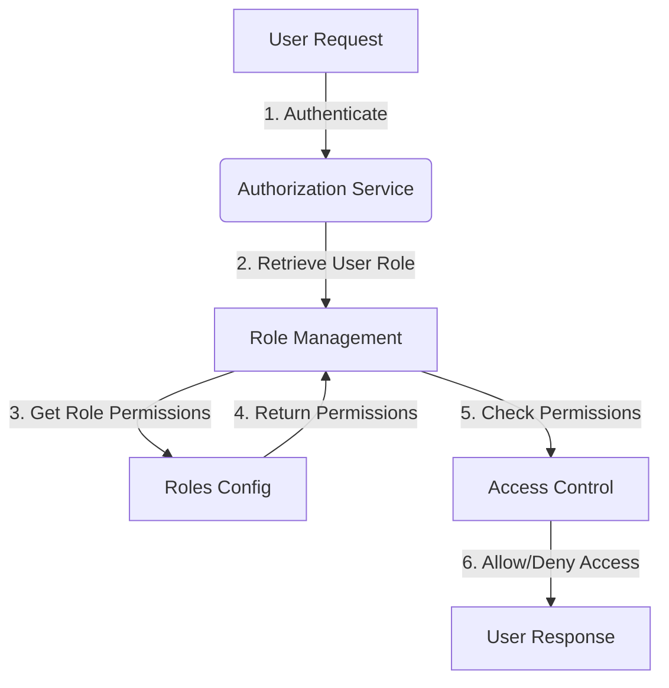
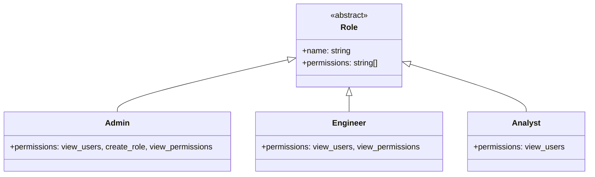

<details>
<summary>Relevant source files</summary>

The following files were used as context for generating this wiki page:

- [config/roles.json](https://github.com/aanickode/access-control-service/blob/main/config/roles.json)
- [src/models.js](https://github.com/aanickode/access-control-service/blob/main/src/models.js)
</details>

# Role Management

## Introduction

The Role Management system within this project provides a way to define and manage user roles and their associated permissions. It allows for the creation of roles with specific sets of permissions, and the assignment of these roles to individual users. This system serves as a foundational component for implementing access control and authorization mechanisms throughout the application.
Sources: [config/roles.json](), [src/models.js]()

## Data Models

### User Model

The `User` model represents an individual user within the system. It consists of the following fields:

| Field | Type    | Description                                |
|-------|---------|--------------------------------------------| 
| email | string  | The email address of the user              |
| role  | string  | The name of the role assigned to the user  |

Sources: [src/models.js:1-4]()

### Role Model

The `Role` model defines a set of permissions that can be assigned to users. It has the following fields:

| Field       | Type     | Description                                    |
|-------------|----------|------------------------------------------------|
| name        | string   | The name of the role                           |
| permissions | string[] | An array of permission names for this role     |

Sources: [src/models.js:6-9]()

## Role Configuration

The roles and their associated permissions are defined in the `config/roles.json` file. This file contains a JSON object where the keys represent role names, and the values are arrays of permission names.

```json
{
  "admin": ["view_users", "create_role", "view_permissions"],
  "engineer": ["view_users", "view_permissions"],
  "analyst": ["view_users"]
}
```

Sources: [config/roles.json]()

## Role Management Flow

The Role Management system likely follows a flow similar to the one depicted in the diagram below:



1. A user makes a request to the application.
2. The Authorization Service authenticates the user and retrieves their assigned role.
3. The Role Management component is queried to get the permissions associated with the user's role.
4. The Roles Configuration file (`config/roles.json`) is accessed to retrieve the permissions for the given role.
5. The Access Control component checks if the user's role has the required permissions for the requested action.
6. Based on the permission check, the user is either granted or denied access, and a response is sent back.

Sources: [config/roles.json](), [src/models.js]()

## Role Hierarchy (Hypothetical)

Based on the provided configuration, a hypothetical role hierarchy could be represented as follows:



In this hypothetical hierarchy, the `Admin` role has the highest level of permissions, followed by `Engineer` and `Analyst`. The `Role` class serves as an abstract base class, with each specific role inheriting its properties (`name` and `permissions`).

Note: This hierarchy is not explicitly defined in the provided source files but is inferred from the `config/roles.json` configuration.

Sources: [config/roles.json]()

## Potential Improvements

While the current implementation provides a basic Role Management system, there are several potential improvements that could be considered:

1. **Role Inheritance**: Introduce a mechanism for roles to inherit permissions from other roles, allowing for more flexible and hierarchical permission management.
2. **Dynamic Role Assignment**: Implement functionality to dynamically assign or update a user's role based on certain conditions or events within the application.
3. **Role Validation**: Add validation checks to ensure that roles and permissions are correctly defined and consistent across the system.
4. **Permission Granularity**: Consider introducing more granular permission levels or scopes to provide finer-grained access control.
5. **Role Auditing**: Implement logging or auditing mechanisms to track changes to roles and their associated permissions for security and compliance purposes.

These improvements are not directly derived from the provided source files but are suggestions based on common practices in role-based access control systems.

## Conclusion

The Role Management system in this project provides a basic foundation for managing user roles and their associated permissions. It defines a set of predefined roles (`admin`, `engineer`, and `analyst`) with specific permissions, and allows for the assignment of these roles to individual users. While functional, there is potential for further enhancements and additional features to improve flexibility, security, and maintainability of the access control mechanisms.