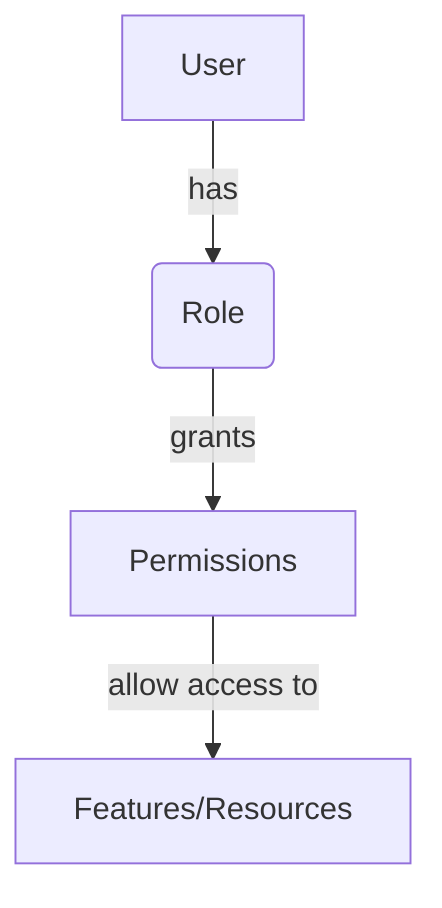
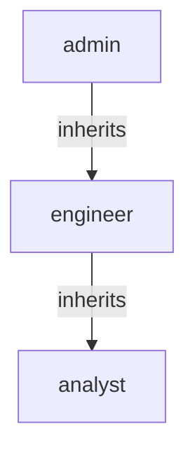

<details>
<summary>Relevant source files</summary>

The following files were used as context for generating this wiki page:

- [config/roles.json](https://github.com/aanickode/access-control-service/blob/main/config/roles.json)
- [src/models.js](https://github.com/aanickode/access-control-service/blob/main/src/models.js)

</details>

# Role Management

## Introduction

The Role Management system within this project is responsible for defining and managing user roles and their associated permissions. It provides a way to control access to various features or resources based on a user's assigned role. This system ensures that users have the appropriate level of access and privileges based on their responsibilities within the application.

## Role Definition

Roles are defined in the `config/roles.json` file, where each role is mapped to an array of permission strings. The available roles and their corresponding permissions are as follows:

```json
{
  "admin": ["view_users", "create_role", "view_permissions"],
  "engineer": ["view_users", "view_permissions"],
  "analyst": ["view_users"]
}
```

Sources: [config/roles.json](https://github.com/aanickode/access-control-service/blob/main/config/roles.json)

## Data Models

The project defines two main data models related to role management: `User` and `Role`.

### User Model

The `User` model represents a user in the system and has the following fields:

| Field | Type    | Description |
|-------|---------|-------------|
| email | string  | The user's email address. |
| role  | string  | The name of the role assigned to the user. |

Sources: [src/models.js:1-4](https://github.com/aanickode/access-control-service/blob/main/src/models.js#L1-L4)

### Role Model

The `Role` model defines a role and its associated permissions:

| Field       | Type     | Description |
|-------------|----------|-------------|
| name        | string   | The name of the role. |
| permissions | string[] | An array of permission strings granted to the role. |

Sources: [src/models.js:6-9](https://github.com/aanickode/access-control-service/blob/main/src/models.js#L6-L9)

## Role Management Flow

The following diagram illustrates the high-level flow of role management within the system:



Sources: [config/roles.json](https://github.com/aanickode/access-control-service/blob/main/config/roles.json), [src/models.js](https://github.com/aanickode/access-control-service/blob/main/src/models.js)

## Permission Hierarchy

The permissions defined in the `config/roles.json` file follow a hierarchical structure, where higher roles inherit permissions from lower roles. The hierarchy can be represented as follows:



Sources: [config/roles.json](https://github.com/aanickode/access-control-service/blob/main/config/roles.json)

## Conclusion

The Role Management system in this project provides a way to define and manage user roles and their associated permissions. It allows for granular control over access to features and resources within the application based on a user's assigned role. The system follows a hierarchical structure, where higher roles inherit permissions from lower roles, ensuring a clear separation of responsibilities and access control.