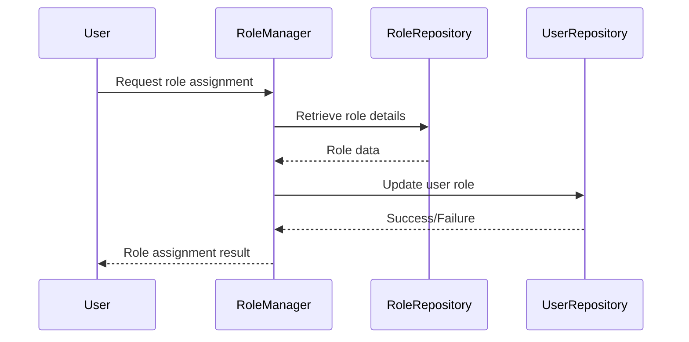
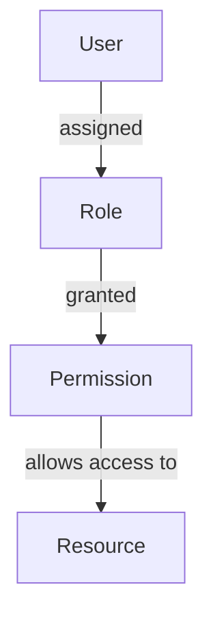

<details>
<summary>Relevant source files</summary>

The following files were used as context for generating this wiki page:

- [config/roles.json](https://github.com/aanickode/access-control-service/blob/main/config/roles.json)
- [src/models.js](https://github.com/aanickode/access-control-service/blob/main/src/models.js)
</details>

# Role Management

## Introduction

The Role Management system is a crucial component of the access control service, responsible for defining and managing user roles and their associated permissions. It provides a structured way to grant or restrict access to various features and functionalities within the application based on a user's assigned role.

By leveraging the Role Management system, administrators can efficiently control and maintain the security and access levels of different user groups, ensuring that sensitive operations are performed only by authorized individuals.

## Data Models

### User Model

The `User` model represents an individual user within the system. It consists of the following fields:

```javascript
export const User = {
  email: 'string',
  role: 'string'
};
```

- `email`: A string representing the user's email address, which serves as a unique identifier.
- `role`: A string representing the user's assigned role, which determines their access permissions.

Sources: [src/models.js:1-4]()

### Role Model

The `Role` model defines the roles available within the system and their associated permissions. It has the following structure:

```javascript
export const Role = {
  name: 'string',
  permissions: ['string']
};
```

- `name`: A string representing the name of the role (e.g., "admin", "engineer", "analyst").
- `permissions`: An array of strings, where each string represents a specific permission granted to the role.

Sources: [src/models.js:6-9]()

## Role Definitions

The `config/roles.json` file defines the roles and their corresponding permissions within the system:

```json
{
  "admin": ["view_users", "create_role", "view_permissions"],
  "engineer": ["view_users", "view_permissions"],
  "analyst": ["view_users"]
}
```

This configuration specifies three roles:

1. **admin**: Users with the "admin" role have the following permissions:
   - `view_users`: Ability to view user information.
   - `create_role`: Ability to create new roles.
   - `view_permissions`: Ability to view the permissions associated with roles.

2. **engineer**: Users with the "engineer" role have the following permissions:
   - `view_users`: Ability to view user information.
   - `view_permissions`: Ability to view the permissions associated with roles.

3. **analyst**: Users with the "analyst" role have the following permission:
   - `view_users`: Ability to view user information.

Sources: [config/roles.json]()

## Role Management Workflow

The Role Management system likely follows a workflow similar to the one depicted in the sequence diagram below:



1. A user requests role assignment or modification through the `RoleManager`.
2. The `RoleManager` retrieves the details of the requested role from the `RoleRepository`.
3. The `RoleRepository` provides the role data to the `RoleManager`.
4. The `RoleManager` updates the user's role in the `UserRepository`.
5. The `UserRepository` responds with a success or failure status.
6. The `RoleManager` communicates the result of the role assignment or modification back to the user.

Sources: [src/models.js](), [config/roles.json]()

## Role-Based Access Control (RBAC)

The Role Management system is likely part of a larger Role-Based Access Control (RBAC) implementation within the application. RBAC is a widely adopted access control model that regulates user access to resources based on their assigned roles and associated permissions.

In an RBAC system, permissions are granted to roles rather than individual users. Users are then assigned one or more roles, inheriting the permissions associated with those roles. This approach simplifies access management, as permissions can be modified at the role level without the need to update individual user permissions.



The RBAC model typically involves the following components:

- **Users**: Individuals or entities that require access to resources within the system.
- **Roles**: Logical groupings of permissions that define the level of access and operations allowed for a particular job function or responsibility.
- **Permissions**: Specific actions or operations that can be performed on resources, such as viewing, creating, updating, or deleting.
- **Resources**: The objects or data that users need to access, such as files, databases, applications, or services.

By implementing RBAC, the application can effectively manage access control, ensuring that users have the appropriate level of access based on their assigned roles and responsibilities.

Sources: [config/roles.json](), [src/models.js]()

## Conclusion

The Role Management system is a critical component of the access control service, enabling administrators to define and manage user roles and their associated permissions. By leveraging this system, the application can implement Role-Based Access Control (RBAC), ensuring that users have the appropriate level of access based on their assigned roles and responsibilities. The system's data models, role definitions, and workflow facilitate efficient access management, enhancing the overall security and access control capabilities of the application.