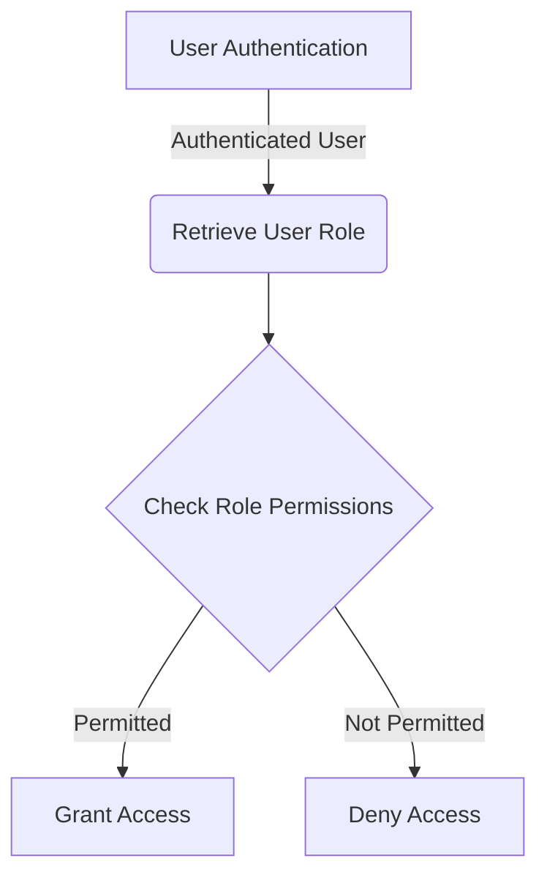
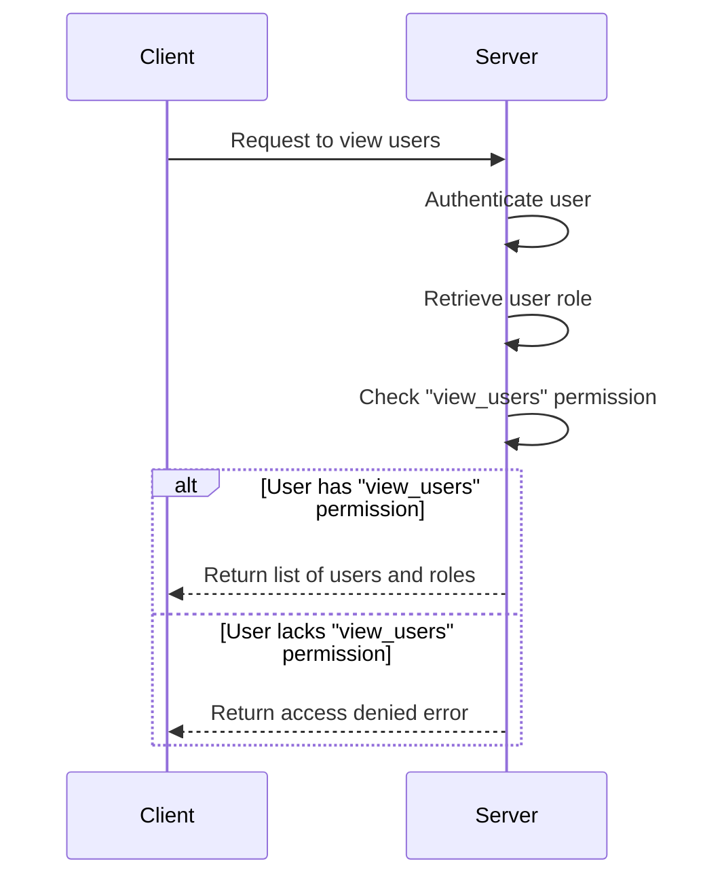
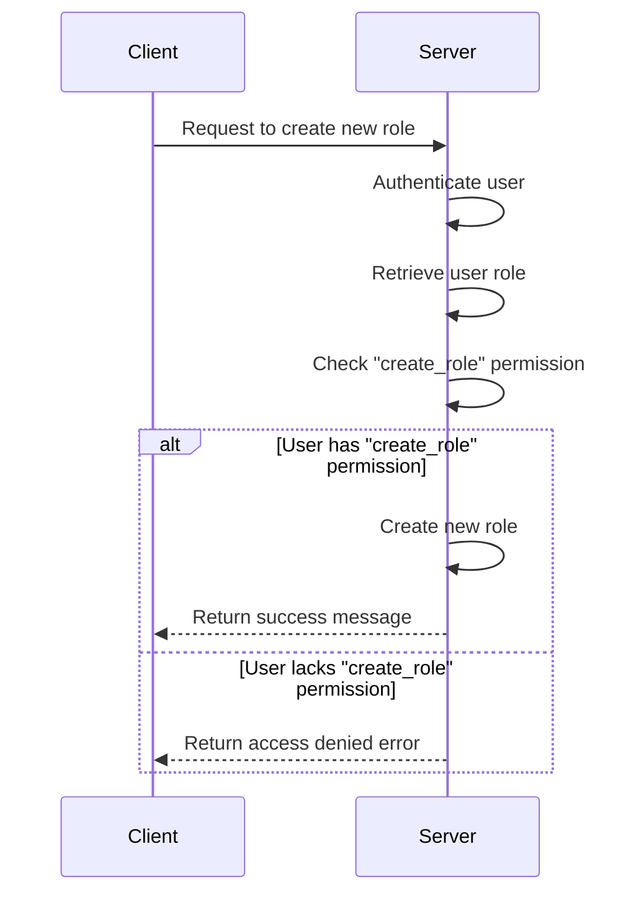
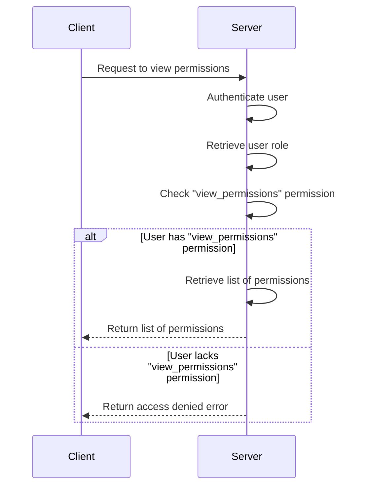

<details>
<summary>Relevant source files</summary>

The following files were used as context for generating this wiki page:

- [config/roles.json](https://github.com/aanickode/access-control-service/blob/main/config/roles.json)
- [src/models.js](https://github.com/aanickode/access-control-service/blob/main/src/models.js)
</details>

# Role Management

## Introduction

The Role Management system is a crucial component of the access control service, responsible for defining and managing user roles and their associated permissions within the application. It provides a structured way to grant or restrict access to various features and functionalities based on a user's assigned role. By leveraging this system, the application can ensure proper authorization and maintain a secure and controlled environment.

Sources: [config/roles.json](), [src/models.js]()

## Role Definition

Roles are defined in the `config/roles.json` file, where each role is represented as a key-value pair. The key represents the role name, and the value is an array of permission strings associated with that role.

```json
{
  "admin": ["view_users", "create_role", "view_permissions"],
  "engineer": ["view_users", "view_permissions"],
  "analyst": ["view_users"]
}
```

This configuration file outlines three predefined roles: `admin`, `engineer`, and `analyst`. Each role has a specific set of permissions that govern the actions and resources they can access within the application.

Sources: [config/roles.json]()

## Data Models

The application utilizes two primary data models: `User` and `Role`. These models are defined in the `src/models.js` file.

### User Model

```javascript
export const User = {
  email: 'string',
  role: 'string'
};
```

The `User` model represents a user entity within the system. It consists of the following properties:

- `email` (string): Stores the user's email address, likely used for authentication and identification purposes.
- `role` (string): Represents the user's assigned role, which determines their access permissions.

Sources: [src/models.js:1-4]()

### Role Model

```javascript
export const Role = {
  name: 'string',
  permissions: ['string']
};
```

The `Role` model defines the structure of a role within the system. It includes the following properties:

- `name` (string): The unique identifier or name of the role.
- `permissions` (array of strings): An array containing the permission strings associated with the role.

Sources: [src/models.js:6-9]()

## Role-Based Access Control (RBAC) Flow

The Role Management system follows a typical Role-Based Access Control (RBAC) flow, where users are assigned roles, and roles are granted specific permissions. The application likely implements the following high-level steps:



1. User Authentication: The user is authenticated through a separate authentication mechanism (e.g., username/password, token-based, etc.).
2. Retrieve User Role: Upon successful authentication, the user's assigned role is retrieved from the `User` model or a separate user management system.
3. Check Role Permissions: The application checks the permissions associated with the user's role by consulting the `Role` model and the role definitions in `config/roles.json`.
4. Grant or Deny Access: Based on the user's role permissions, the application either grants or denies access to the requested resource or functionality.

Sources: [config/roles.json](), [src/models.js]()

## Role Management Operations

The Role Management system likely provides the following operations:

### View Users

This operation allows authorized roles (e.g., `admin`, `engineer`, `analyst`) to view a list of users and their associated roles within the application.



Sources: [config/roles.json:2-4](), [src/models.js:1-4]()

### Create Role

This operation allows the `admin` role to create new roles within the system by defining the role name and associated permissions.



Sources: [config/roles.json:1](), [src/models.js:6-9]()

### View Permissions

This operation allows authorized roles (e.g., `admin`, `engineer`) to view the list of available permissions within the application.



Sources: [config/roles.json:1-2](), [src/models.js]()

## Role Management API (Hypothetical)

Based on the provided source files, the Role Management system might expose the following API endpoints:

| Endpoint                | Method | Description                                   |
|-------------------------|--------|-----------------------------------------------|
| `/users`                | GET    | Retrieve a list of users and their roles      |
| `/roles`                | GET    | Retrieve a list of available roles            |
| `/roles`                | POST   | Create a new role with specified permissions  |
| `/permissions`          | GET    | Retrieve a list of available permissions      |

Sources: [config/roles.json](), [src/models.js]()

## Conclusion

The Role Management system is a critical component of the access control service, enabling the application to effectively manage user roles and their associated permissions. By defining roles and their corresponding permissions in a structured manner, the system ensures that users have appropriate access to resources and functionalities based on their assigned roles. This approach promotes security, control, and maintainability within the application.