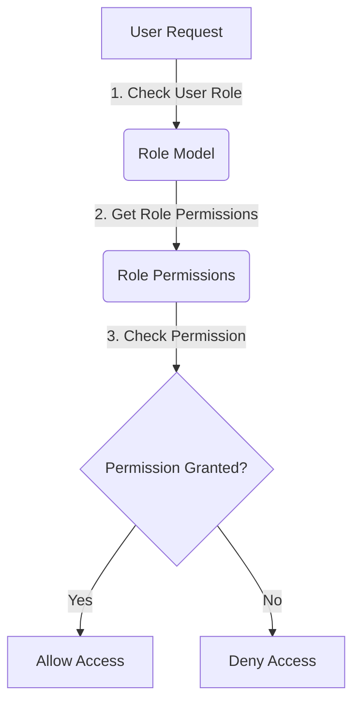
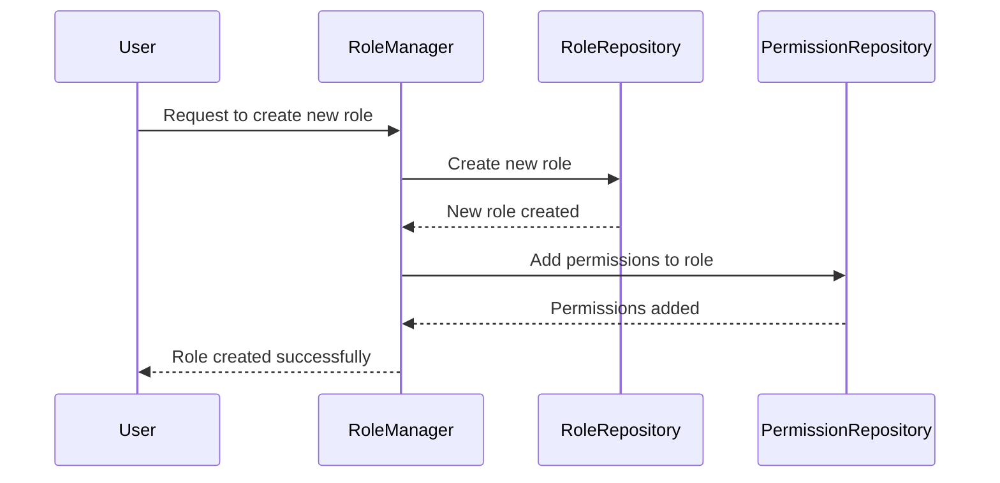

<details>
<summary>Relevant source files</summary>

The following files were used as context for generating this wiki page:

- [config/roles.json](https://github.com/aanickode/access-control-service/blob/main/config/roles.json)
- [src/models.js](https://github.com/aanickode/access-control-service/blob/main/src/models.js)

</details>

# Role Management

## Introduction

The Role Management feature within this project provides a way to define and manage user roles and their associated permissions. It allows for the creation of roles with specific sets of permissions, and the assignment of these roles to individual users. This feature is crucial for implementing access control and ensuring that users have the appropriate level of access to various parts of the system.

Sources: [config/roles.json](), [src/models.js]()

## Data Models

### User Model

The `User` model represents an individual user within the system. It consists of the following fields:

| Field | Type     | Description                      |
|-------|----------|----------------------------------|
| email | `string` | The email address of the user.   |
| role  | `string` | The name of the role assigned to the user. |

Source: [src/models.js:1-4]()

### Role Model

The `Role` model defines a role and its associated permissions. It has the following fields:

| Field       | Type       | Description                                   |
|-------------|------------|-----------------------------------------------|
| name        | `string`   | The name of the role.                         |
| permissions | `string[]` | An array of permission strings for this role. |

Source: [src/models.js:6-9]()

## Role Definitions

The project defines three roles with predefined sets of permissions:

```json
{
  "admin": ["view_users", "create_role", "view_permissions"],
  "engineer": ["view_users", "view_permissions"],
  "analyst": ["view_users"]
}
```

Source: [config/roles.json]()

- The `admin` role has permissions to view users, create new roles, and view permissions.
- The `engineer` role can view users and view permissions.
- The `analyst` role has the permission to view users.

## Role Assignment

Users are assigned roles based on their needs and access requirements within the system. The `role` field in the `User` model stores the name of the role assigned to a particular user.

```javascript
export const User = {
  email: 'string',
  role: 'string' // Stores the name of the assigned role
};
```

Source: [src/models.js:1-4]()

## Permission Checking

To determine whether a user has a specific permission, the system likely checks the user's assigned role and verifies if the associated permissions for that role include the requested permission.



Sources: [src/models.js](), [config/roles.json]()

1. The system retrieves the user's assigned role from the `User` model.
2. Using the role name, the system looks up the associated permissions in the `Role` model.
3. The requested permission is checked against the list of permissions for the user's role.
4. If the permission is found, access is granted. Otherwise, access is denied.

## Role Management Workflow

The following sequence diagram illustrates a potential workflow for managing roles and permissions:



Sources: [config/roles.json](), [src/models.js]()

1. A user (e.g., an admin) requests the creation of a new role.
2. The `RoleManager` component interacts with the `RoleRepository` to create a new role.
3. The `RoleManager` then interacts with the `PermissionRepository` to add the desired permissions to the new role.
4. The `RoleManager` confirms the successful creation of the new role with the associated permissions.

## Conclusion

The Role Management feature in this project provides a way to define and manage user roles and their associated permissions. It allows for the creation of roles with specific sets of permissions, and the assignment of these roles to individual users. This feature is crucial for implementing access control and ensuring that users have the appropriate level of access to various parts of the system.