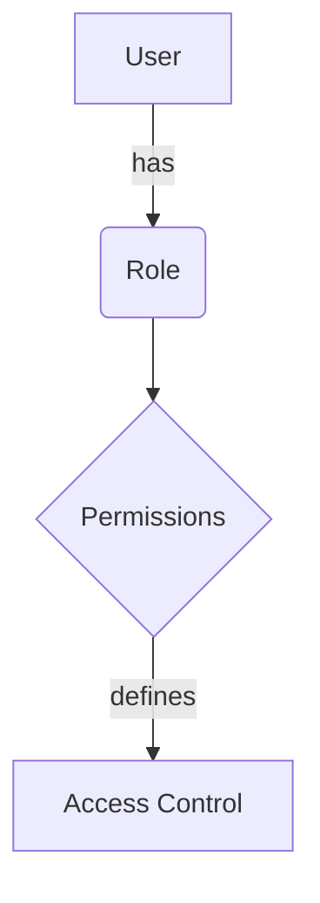
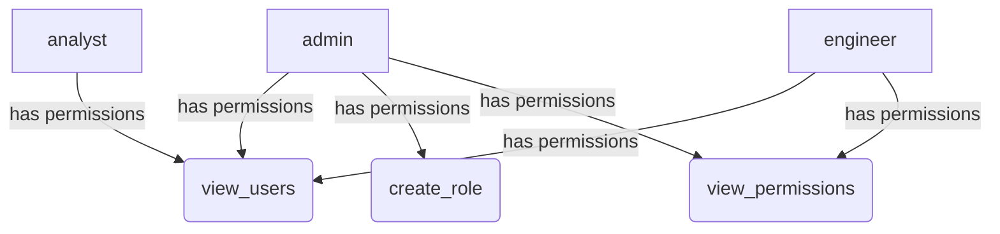

<details>
<summary>Relevant source files</summary>

The following files were used as context for generating this wiki page:

- [config/roles.json](https://github.com/aanickode/access-control-service/blob/main/config/roles.json)
- [src/models.js](https://github.com/aanickode/access-control-service/blob/main/src/models.js)

</details>

# Role Management

## Introduction

The Role Management system within this project provides a way to define and manage user roles and their associated permissions. It allows for the creation of roles with specific sets of permissions, and the assignment of these roles to users. This system is crucial for implementing access control and ensuring that users have the appropriate level of access to various features and resources within the application.

Sources: [config/roles.json](), [src/models.js]()

## Role Definition

Roles are defined in the `config/roles.json` file, where each role is represented as a key-value pair. The key represents the role name, and the value is an array of permission strings associated with that role.

```json
{
  "admin": ["view_users", "create_role", "view_permissions"],
  "engineer": ["view_users", "view_permissions"],
  "analyst": ["view_users"]
}
```

This configuration defines three roles: `admin`, `engineer`, and `analyst`. The `admin` role has permissions to view users, create roles, and view permissions. The `engineer` role can view users and permissions, while the `analyst` role can only view users.

Sources: [config/roles.json]()

## Data Models

The data models for users and roles are defined in the `src/models.js` file.

```javascript
export const User = {
  email: 'string',
  role: 'string'
};

export const Role = {
  name: 'string',
  permissions: ['string']
};
```

The `User` model has two properties: `email` (a string representing the user's email address) and `role` (a string representing the user's assigned role).

The `Role` model has two properties: `name` (a string representing the role name) and `permissions` (an array of strings representing the permissions associated with the role).

Sources: [src/models.js]()

## Role Management Flow

The overall flow for role management can be represented by the following diagram:



1. A user is assigned a specific role.
2. Each role has a set of associated permissions defined.
3. The permissions determine the user's access control within the application.

Sources: [config/roles.json](), [src/models.js]()

## Role Hierarchy

The roles defined in the `config/roles.json` file can be visualized in a hierarchy based on their permissions:



The `admin` role has the highest level of permissions, including `view_users`, `create_role`, and `view_permissions`. The `engineer` role has a subset of these permissions (`view_users` and `view_permissions`), while the `analyst` role has the most limited permissions (`view_users`).

Sources: [config/roles.json]()

## Role Assignment and Usage

While the provided source files do not include implementation details for assigning roles to users or using roles for access control, it is reasonable to assume that the application would have functionality to:

1. Assign a role to a user during user creation or profile management.
2. Check a user's role and associated permissions when attempting to access certain features or resources.
3. Potentially allow administrators to create new roles or modify existing roles and their permissions.

However, without additional source files, it is not possible to provide more specific details on the implementation of these functionalities.

Sources: [config/roles.json](), [src/models.js]()

## Conclusion

The Role Management system in this project provides a way to define and manage user roles and their associated permissions. It allows for the creation of roles with specific sets of permissions, and the assignment of these roles to users. This system is crucial for implementing access control and ensuring that users have the appropriate level of access to various features and resources within the application.