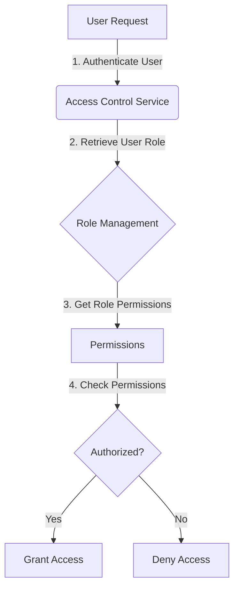

<details>
<summary>Relevant source files</summary>

The following files were used as context for generating this wiki page:

- [config/roles.json](https://github.com/aanickode/access-control-service/blob/main/config/roles.json)
- [src/models.js](https://github.com/aanickode/access-control-service/blob/main/src/models.js)
</details>

# Role Management

## Introduction

The Role Management system is a crucial component of the access control service, responsible for defining and managing user roles and their associated permissions within the application. It provides a structured way to grant or restrict access to various features and functionalities based on a user's assigned role.

By leveraging the Role Management system, administrators can efficiently control and maintain the appropriate level of access for different user groups, ensuring data security and adhering to the principle of least privilege.

## Role Definition

The roles and their corresponding permissions are defined in the `config/roles.json` file. This configuration file serves as the central repository for managing role-based access control (RBAC) within the application.

```json
{
  "admin": ["view_users", "create_role", "view_permissions"],
  "engineer": ["view_users", "view_permissions"],
  "analyst": ["view_users"]
}
```

In the above example, three roles are defined: `admin`, `engineer`, and `analyst`. Each role is associated with a list of permissions, which are represented as strings.

Sources: [config/roles.json](https://github.com/aanickode/access-control-service/blob/main/config/roles.json)

## Data Models

The `src/models.js` file defines the data models used within the application, including the `User` and `Role` models.

### User Model

```javascript
export const User = {
  email: 'string',
  role: 'string'
};
```

The `User` model represents a user entity within the system. It consists of the following properties:

- `email`: A string representing the user's email address.
- `role`: A string representing the user's assigned role.

Sources: [src/models.js:1-4](https://github.com/aanickode/access-control-service/blob/main/src/models.js#L1-L4)

### Role Model

```javascript
export const Role = {
  name: 'string',
  permissions: ['string']
};
```

The `Role` model defines the structure of a role within the system. It consists of the following properties:

- `name`: A string representing the name of the role.
- `permissions`: An array of strings, where each string represents a specific permission granted to the role.

Sources: [src/models.js:6-9](https://github.com/aanickode/access-control-service/blob/main/src/models.js#L6-L9)

## Role-Based Access Control Flow

The following diagram illustrates the high-level flow of role-based access control within the application:



1. A user initiates a request to access a specific feature or resource within the application.
2. The Access Control Service authenticates the user and retrieves their assigned role.
3. The Role Management component is consulted to fetch the permissions associated with the user's role.
4. The Access Control Service checks if the requested action or resource is permitted based on the user's role permissions.
5. If the user has the required permissions, access is granted. Otherwise, access is denied.

Sources: [config/roles.json](https://github.com/aanickode/access-control-service/blob/main/config/roles.json), [src/models.js](https://github.com/aanickode/access-control-service/blob/main/src/models.js)

## Role Hierarchy

The Role Management system may support a role hierarchy, where higher-level roles inherit permissions from lower-level roles. However, based on the provided source files, there is no explicit information about role inheritance or hierarchical relationships between roles.

If role inheritance is a desired feature, it would need to be implemented and documented separately.

## Conclusion

The Role Management system plays a pivotal role in the access control service by defining and managing user roles and their associated permissions. It enables fine-grained control over access to various features and resources within the application, ensuring data security and adherence to the principle of least privilege.

By leveraging the Role Management system, administrators can efficiently manage user access levels, streamline user onboarding and offboarding processes, and maintain a secure and organized application environment.