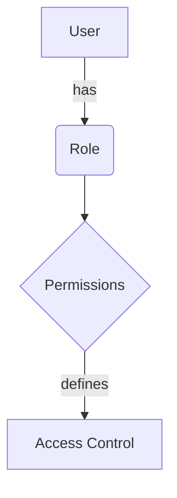

<details>
<summary>Relevant source files</summary>

The following files were used as context for generating this wiki page:

- [config/roles.json](https://github.com/aanickode/access-control-service/blob/main/config/roles.json)
- [src/models.js](https://github.com/aanickode/access-control-service/blob/main/src/models.js)
</details>

# Role Management

## Introduction

The Role Management feature within this project provides a way to define and manage user roles and their associated permissions. It allows for the creation and assignment of roles with specific sets of permissions, enabling access control and authorization within the application. This feature is crucial for ensuring that users have appropriate access levels based on their roles and responsibilities.

## Role Configuration

The roles and their corresponding permissions are defined in the `config/roles.json` file. This file serves as a central configuration point for managing roles and their associated permissions.

```json
{
  "admin": ["view_users", "create_role", "view_permissions"],
  "engineer": ["view_users", "view_permissions"],
  "analyst": ["view_users"]
}
```

In the above configuration, three roles are defined: `admin`, `engineer`, and `analyst`. Each role has a list of permissions associated with it.

Sources: [config/roles.json](https://github.com/aanickode/access-control-service/blob/main/config/roles.json)

## Data Models

The project defines two data models related to role management: `User` and `Role`.

### User Model

The `User` model represents a user in the system and has the following fields:

| Field | Type     | Description |
|-------|----------|-------------|
| email | `string` | The email address of the user. |
| role  | `string` | The role assigned to the user. |

```javascript
export const User = {
  email: 'string',
  role: 'string'
};
```

Sources: [src/models.js](https://github.com/aanickode/access-control-service/blob/main/src/models.js)

### Role Model

The `Role` model represents a role in the system and has the following fields:

| Field       | Type       | Description |
|-------------|------------|-------------|
| name        | `string`   | The name of the role. |
| permissions | `string[]` | An array of permission strings associated with the role. |

```javascript
export const Role = {
  name: 'string',
  permissions: ['string']
};
```

Sources: [src/models.js](https://github.com/aanickode/access-control-service/blob/main/src/models.js)

## Role Management Flow

The overall flow of role management can be represented by the following diagram:



1. A user is assigned a specific role.
2. Each role has a set of associated permissions defined in the `config/roles.json` file.
3. The permissions associated with a user's role determine the access control and authorization within the application.

Sources: [config/roles.json](https://github.com/aanickode/access-control-service/blob/main/config/roles.json), [src/models.js](https://github.com/aanickode/access-control-service/blob/main/src/models.js)

## Conclusion

The Role Management feature in this project provides a way to define and manage user roles and their associated permissions. It allows for the creation and assignment of roles with specific sets of permissions, enabling access control and authorization within the application. The roles and their corresponding permissions are defined in the `config/roles.json` file, while the `User` and `Role` models represent the data structures used to store user and role information.