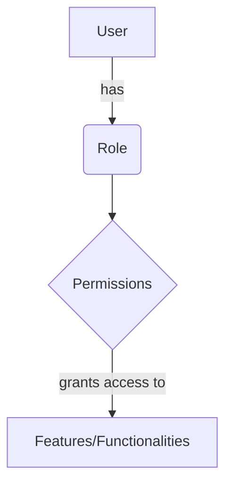
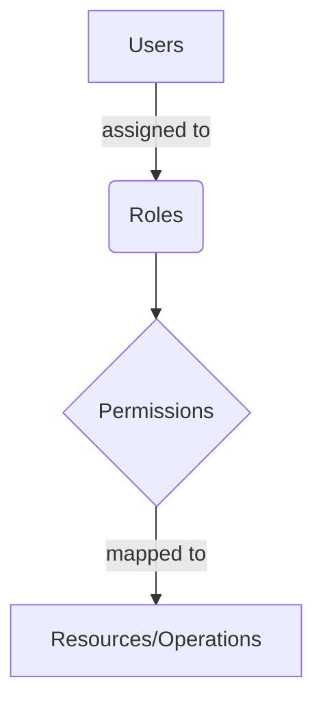

<details>
<summary>Relevant source files</summary>

The following files were used as context for generating this wiki page:

- [config/roles.json](https://github.com/aanickode/access-control-service/blob/main/config/roles.json)
- [src/models.js](https://github.com/aanickode/access-control-service/blob/main/src/models.js)
</details>

# Role Management

## Introduction

The Role Management system is a crucial component of the access control service, responsible for defining and managing user roles and their associated permissions within the application. It provides a structured approach to granting or restricting access to various features and functionalities based on a user's assigned role.

Sources: [config/roles.json](), [src/models.js]()

## Data Models

### User Model

The `User` model represents a user entity within the system. It consists of the following fields:

| Field | Type    | Description                          |
|-------|---------|--------------------------------------|
| email | string  | The email address of the user        |
| role  | string  | The role assigned to the user        |

Sources: [src/models.js:1-4]()

### Role Model

The `Role` model defines a role entity and its associated permissions. It has the following fields:

| Field       | Type     | Description                                |
|-------------|----------|-------------------------------------------|
| name        | string   | The name or identifier of the role        |
| permissions | string[] | An array of permission strings for the role|

Sources: [src/models.js:6-9]()

## Role Configuration

The roles and their corresponding permissions are defined in the `config/roles.json` file. The structure of this configuration file is as follows:

```json
{
  "admin": ["view_users", "create_role", "view_permissions"],
  "engineer": ["view_users", "view_permissions"],
  "analyst": ["view_users"]
}
```

Each key in the JSON object represents a role name, and its value is an array of permission strings associated with that role.

Sources: [config/roles.json]()

## Role Management Flow

The overall flow of role management can be represented by the following diagram:



1. A user is assigned a specific role within the system.
2. Each role is associated with a set of permissions defined in the configuration.
3. The permissions granted to a role determine the features and functionalities that the user can access.

Sources: [config/roles.json](), [src/models.js]()

## Role-based Access Control (RBAC)

The Role Management system implements a Role-based Access Control (RBAC) approach, where permissions are assigned to roles rather than individual users. This simplifies the management of access control and provides a more scalable and maintainable solution.



1. Users are assigned to specific roles within the system.
2. Roles are associated with a set of permissions.
3. Permissions are mapped to specific resources or operations that users with those roles can access or perform.

By separating the assignment of permissions from individual users, RBAC allows for easier management and auditing of access control policies.

Sources: [config/roles.json](), [src/models.js]()

## Conclusion

The Role Management system plays a crucial role in the access control service by defining and managing user roles and their associated permissions. It provides a structured approach to granting or restricting access to various features and functionalities based on a user's assigned role. The system follows the Role-based Access Control (RBAC) approach, which simplifies the management of access control and provides a more scalable and maintainable solution.