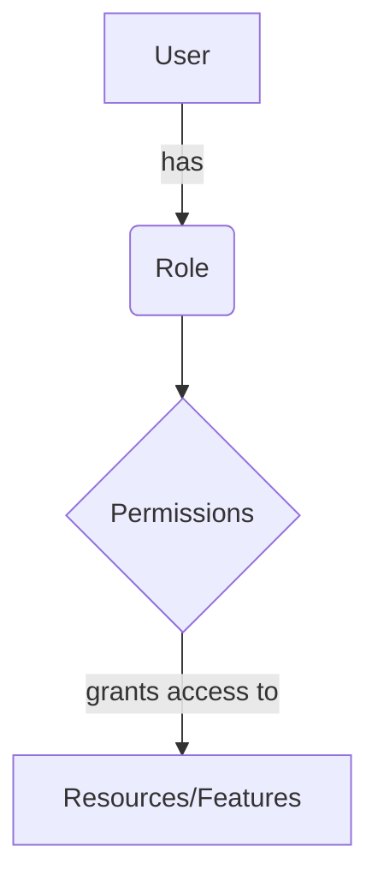

<details>
<summary>Relevant source files</summary>

The following files were used as context for generating this wiki page:

- [config/roles.json](https://github.com/aanickode/access-control-service/blob/main/config/roles.json)
- [src/models.js](https://github.com/aanickode/access-control-service/blob/main/src/models.js)
</details>

# Role Management

## Introduction

The Role Management feature within this project provides a way to define and manage user roles and their associated permissions. It allows for the creation of roles with specific sets of permissions, which can then be assigned to users to control their access to various parts of the application or system. This feature is crucial for implementing access control and ensuring that users have the appropriate level of access based on their roles and responsibilities.

## Role Definition

Roles are defined in the `config/roles.json` file, where each role is represented as a key-value pair. The key represents the role name (e.g., "admin", "engineer", "analyst"), and the value is an array of strings representing the permissions granted to that role.

```json
{
  "admin": ["view_users", "create_role", "view_permissions"],
  "engineer": ["view_users", "view_permissions"],
  "analyst": ["view_users"]
}
```

Sources: [config/roles.json](https://github.com/aanickode/access-control-service/blob/main/config/roles.json)

## Data Models

The project defines two data models related to role management: `User` and `Role`.

### User Model

The `User` model represents a user in the system and has the following fields:

| Field | Type    | Description |
|-------|---------|-------------|
| email | string  | The user's email address |
| role  | string  | The name of the role assigned to the user |

Sources: [src/models.js:1-4](https://github.com/aanickode/access-control-service/blob/main/src/models.js#L1-L4)

### Role Model

The `Role` model represents a role in the system and has the following fields:

| Field       | Type     | Description |
|-------------|----------|-------------|
| name        | string   | The name of the role |
| permissions | string[] | An array of strings representing the permissions granted to the role |

Sources: [src/models.js:6-9](https://github.com/aanickode/access-control-service/blob/main/src/models.js#L6-L9)

## Role Management Flow

The overall flow for role management can be represented by the following diagram:



1. A user is assigned a specific role.
2. Each role has a set of associated permissions defined.
3. The permissions granted to a role determine the resources or features the user can access within the application or system.

Sources: [config/roles.json](https://github.com/aanickode/access-control-service/blob/main/config/roles.json), [src/models.js](https://github.com/aanickode/access-control-service/blob/main/src/models.js)

## Role Hierarchy

Based on the defined roles and their associated permissions in `config/roles.json`, a hierarchy of roles can be inferred:


- The "admin" role has the highest level of permissions, including `view_users`, `create_role`, and `view_permissions`.
- The "engineer" role has the permissions `view_users` and `view_permissions`.
- The "analyst" role has the permission `view_users`.

Sources: [config/roles.json](https://github.com/aanickode/access-control-service/blob/main/config/roles.json)

## Conclusion

The Role Management feature in this project provides a way to define and manage user roles and their associated permissions. It allows for the creation of roles with specific sets of permissions, which can then be assigned to users to control their access to various parts of the application or system. The feature is implemented through the `User` and `Role` data models, with roles and their permissions defined in the `config/roles.json` file. The overall flow involves assigning roles to users, which grants them access to resources or features based on the permissions associated with their roles.