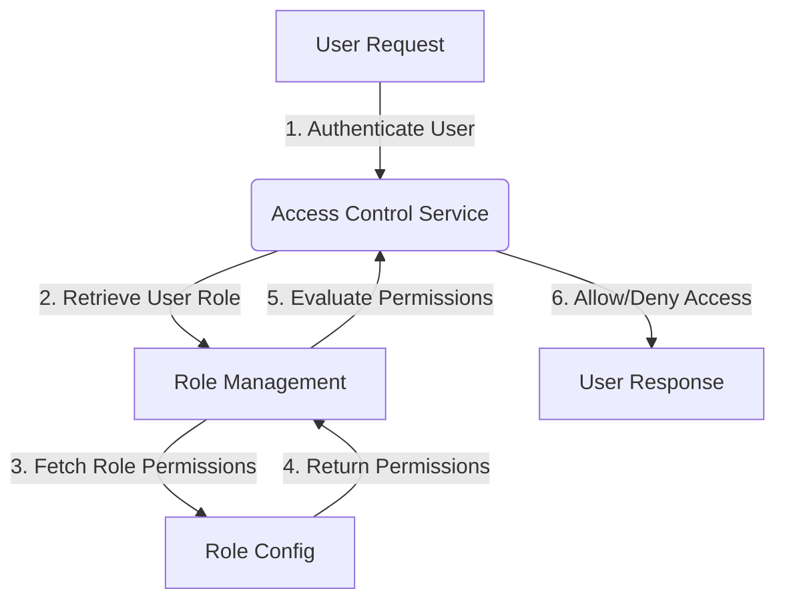
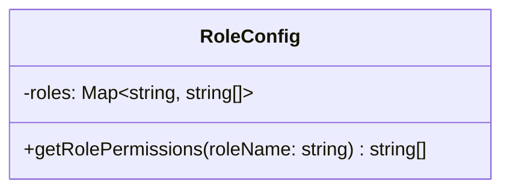
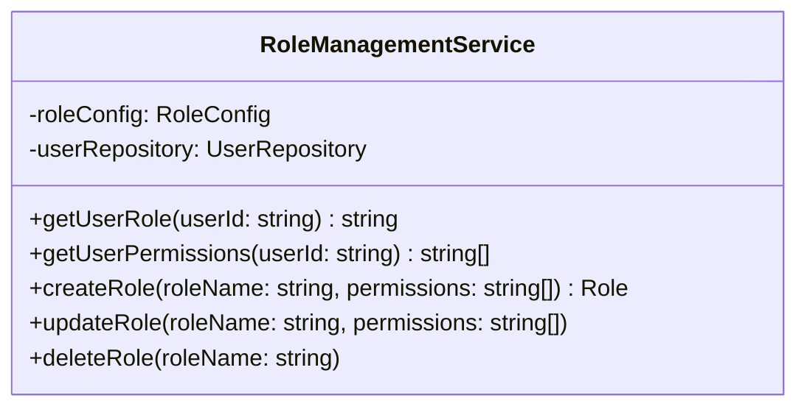
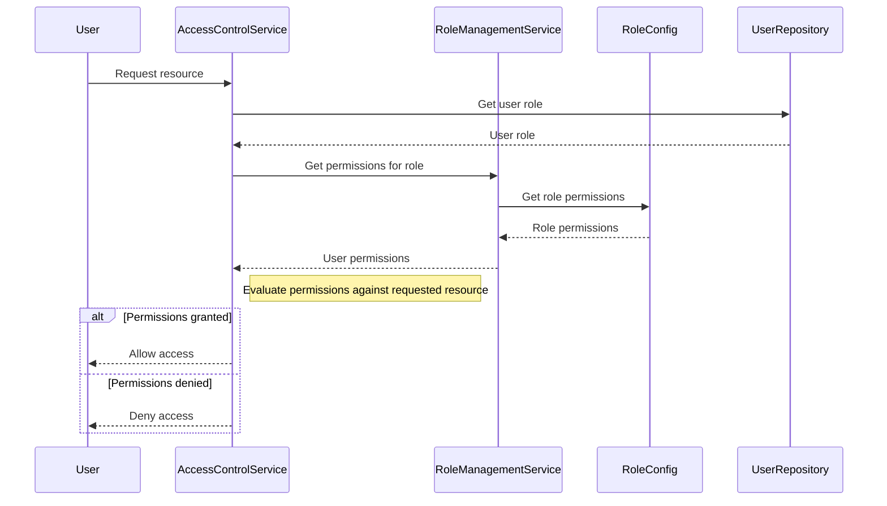

<details>
<summary>Relevant source files</summary>

The following files were used as context for generating this wiki page:

- [config/roles.json](https://github.com/aanickode/access-control-service/blob/main/config/roles.json)
- [src/models.js](https://github.com/aanickode/access-control-service/blob/main/src/models.js)
</details>

# Role Management

## Introduction

The Role Management system within this project provides a way to define and manage user roles and their associated permissions. It allows for the creation of roles with specific sets of permissions, and the assignment of these roles to individual users. This system serves as a foundational component for implementing access control and authorization mechanisms throughout the application.
Sources: [config/roles.json](), [src/models.js]()

## Data Models

### User Model

The `User` model represents an individual user within the system. It consists of the following fields:

| Field | Type     | Description                                  |
|-------|----------|----------------------------------------------|
| email | `string` | The email address of the user (unique identifier) |
| role  | `string` | The name of the role assigned to the user   |

Sources: [src/models.js:1-4]()

### Role Model

The `Role` model defines a set of permissions associated with a specific role. It has the following fields:

| Field       | Type       | Description                                  |
|-------------|------------|----------------------------------------------|
| name        | `string`   | The name of the role (unique identifier)    |
| permissions | `string[]` | An array of permission names for this role   |

Sources: [src/models.js:6-9]()

## Role Configuration

The roles and their associated permissions are defined in the `config/roles.json` configuration file. This file maps role names to an array of permission names.

```json
{
  "admin": ["view_users", "create_role", "view_permissions"],
  "engineer": ["view_users", "view_permissions"],
  "analyst": ["view_users"]
}
```

Sources: [config/roles.json]()

## Role Management Flow

The Role Management system likely follows a flow similar to the one depicted in the diagram below:



1. A user makes a request to the application, which triggers the authentication process.
2. The Access Control Service retrieves the user's assigned role from the User Model.
3. The Role Management component fetches the permissions associated with the user's role from the Role Configuration.
4. The Role Configuration returns the permissions for the requested role.
5. The Role Management component evaluates the user's permissions against the requested action.
6. Based on the evaluation, the Access Control Service either allows or denies the user's request and sends an appropriate response.

Sources: [config/roles.json](), [src/models.js]()

## Role Management Components

### Role Configuration

The `config/roles.json` file serves as the central configuration for defining roles and their associated permissions. It is likely loaded and parsed during the application's initialization or startup process.



The `RoleConfig` class likely provides a method `getRolePermissions` that takes a role name as input and returns an array of permission names for that role. This method retrieves the permissions from the in-memory representation of the configuration data (`roles` map).

Sources: [config/roles.json]()

### Role Management Service

The Role Management Service is responsible for managing the lifecycle of roles and their permissions. It likely interacts with the `RoleConfig` and `User` models to perform various operations.



The `RoleManagementService` class might provide the following methods:

- `getUserRole`: Retrieves the role assigned to a given user.
- `getUserPermissions`: Fetches the permissions associated with a user's role.
- `createRole`: Creates a new role with the specified permissions.
- `updateRole`: Updates the permissions for an existing role.
- `deleteRole`: Removes a role from the system.

Sources: [config/roles.json](), [src/models.js]()

## Access Control Flow

The Access Control Service likely utilizes the Role Management components to enforce authorization rules for user requests. The sequence diagram below illustrates a possible flow:



1. The User makes a request to access a resource.
2. The AccessControlService retrieves the User's role from the UserRepository.
3. The AccessControlService requests the permissions associated with the User's role from the RoleManagementService.
4. The RoleManagementService fetches the role permissions from the RoleConfig.
5. The RoleManagementService returns the permissions to the AccessControlService.
6. The AccessControlService evaluates the User's permissions against the requested resource.
7. If the User has the required permissions, access is granted. Otherwise, access is denied.

Sources: [config/roles.json](), [src/models.js]()

## Conclusion

The Role Management system provides a flexible and extensible way to define and manage user roles and their associated permissions within the application. By leveraging the Role Configuration, User Model, and Role Management Service, the Access Control Service can effectively enforce authorization rules and control access to resources based on a user's assigned role and permissions.