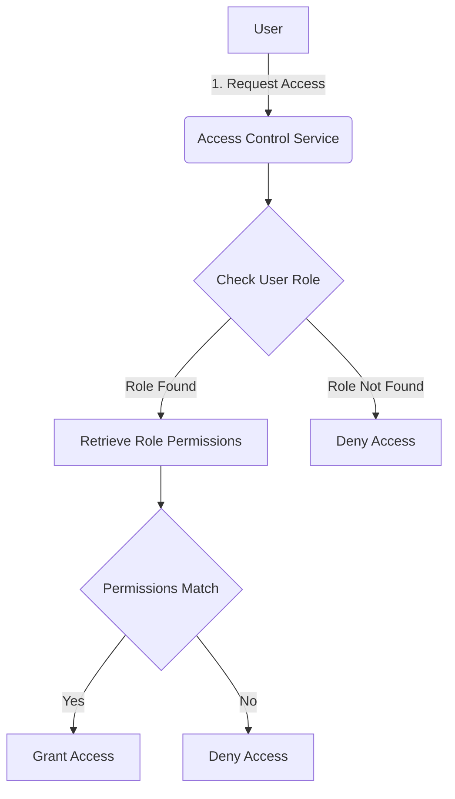
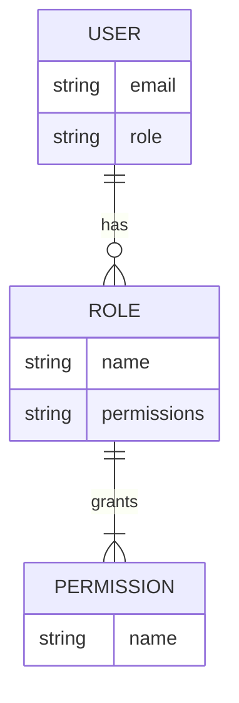

<details>
<summary>Relevant source files</summary>

The following files were used as context for generating this wiki page:

- [config/roles.json](https://github.com/aanickode/access-control-service/blob/main/config/roles.json)
- [src/models.js](https://github.com/aanickode/access-control-service/blob/main/src/models.js)
</details>

# Role Management

## Introduction

The Role Management system is a crucial component of the access control service, responsible for defining and managing user roles and their associated permissions within the application. It provides a structured way to grant or restrict access to various features and resources based on a user's assigned role.

By leveraging the Role Management system, administrators can efficiently control and maintain the appropriate level of access for different user groups, ensuring data security and adhering to the principle of least privilege.

## Role Definition

The roles and their corresponding permissions are defined in the `config/roles.json` file. This configuration file serves as a centralized location for managing the available roles and their associated permissions.

```json
{
  "admin": ["view_users", "create_role", "view_permissions"],
  "engineer": ["view_users", "view_permissions"],
  "analyst": ["view_users"]
}
```

Each key in the JSON object represents a role name, and the associated array contains the permissions granted to that role.

Sources: [config/roles.json](https://github.com/aanickode/access-control-service/blob/main/config/roles.json)

## Data Models

The `src/models.js` file defines the data models used in the application, including the `User` and `Role` models.

### User Model

```javascript
export const User = {
  email: 'string',
  role: 'string'
};
```

The `User` model consists of two properties:

- `email`: A string representing the user's email address.
- `role`: A string representing the user's assigned role.

Sources: [src/models.js:1-4](https://github.com/aanickode/access-control-service/blob/main/src/models.js#L1-L4)

### Role Model

```javascript
export const Role = {
  name: 'string',
  permissions: ['string']
};
```

The `Role` model consists of two properties:

- `name`: A string representing the name of the role.
- `permissions`: An array of strings representing the permissions associated with the role.

Sources: [src/models.js:6-9](https://github.com/aanickode/access-control-service/blob/main/src/models.js#L6-L9)

## Role Management Flow

The following diagram illustrates the high-level flow of the Role Management system:



1. A user requests access to a specific feature or resource within the application.
2. The Access Control Service checks the user's assigned role.
3. If the user's role is found, the system retrieves the associated permissions for that role.
4. The required permissions for the requested feature or resource are compared against the user's role permissions.
5. If the user's role has the necessary permissions, access is granted. Otherwise, access is denied.
6. If the user's role is not found, access is denied.

Sources: [config/roles.json](https://github.com/aanickode/access-control-service/blob/main/config/roles.json), [src/models.js](https://github.com/aanickode/access-control-service/blob/main/src/models.js)

## Role-Based Access Control (RBAC)

The Role Management system implements a Role-Based Access Control (RBAC) approach, where permissions are assigned to roles, and users are assigned specific roles. This approach simplifies the management of permissions and provides a scalable solution for access control.



- Users are assigned a specific role (e.g., `admin`, `engineer`, `analyst`).
- Roles are associated with a set of permissions (e.g., `view_users`, `create_role`, `view_permissions`).
- Permissions define the actions or operations that a user with a particular role can perform within the application.

By assigning roles to users and defining the permissions for each role, the Role Management system provides a flexible and maintainable way to manage access control within the application.

Sources: [config/roles.json](https://github.com/aanickode/access-control-service/blob/main/config/roles.json), [src/models.js](https://github.com/aanickode/access-control-service/blob/main/src/models.js)

## Role Management API

The Role Management system may expose a set of API endpoints for managing roles and permissions. While the provided source files do not include API implementation details, the following table outlines potential API endpoints and their descriptions:

| Endpoint                | Method | Description                                                  |
|-------------------------|--------|--------------------------------------------------------------|
| `/roles`                | GET    | Retrieve a list of all available roles                       |
| `/roles/{roleId}`       | GET    | Retrieve details of a specific role by its ID               |
| `/roles`                | POST   | Create a new role with specified permissions                 |
| `/roles/{roleId}`       | PUT    | Update an existing role's permissions                        |
| `/roles/{roleId}`       | DELETE | Delete a role                                                |
| `/permissions`          | GET    | Retrieve a list of all available permissions                 |
| `/users/{userId}/role`  | GET    | Retrieve the role assigned to a specific user               |
| `/users/{userId}/role`  | PUT    | Assign a role to a specific user                            |

Note: The actual API endpoints and their implementation details are not provided in the given source files.

## Conclusion

The Role Management system plays a crucial role in the access control service by providing a structured and scalable approach to managing user roles and their associated permissions. By defining roles and their permissions in a centralized configuration file, administrators can efficiently control access to various features and resources within the application. The system follows the Role-Based Access Control (RBAC) approach, which simplifies the management of permissions and ensures that users have the appropriate level of access based on their assigned roles.