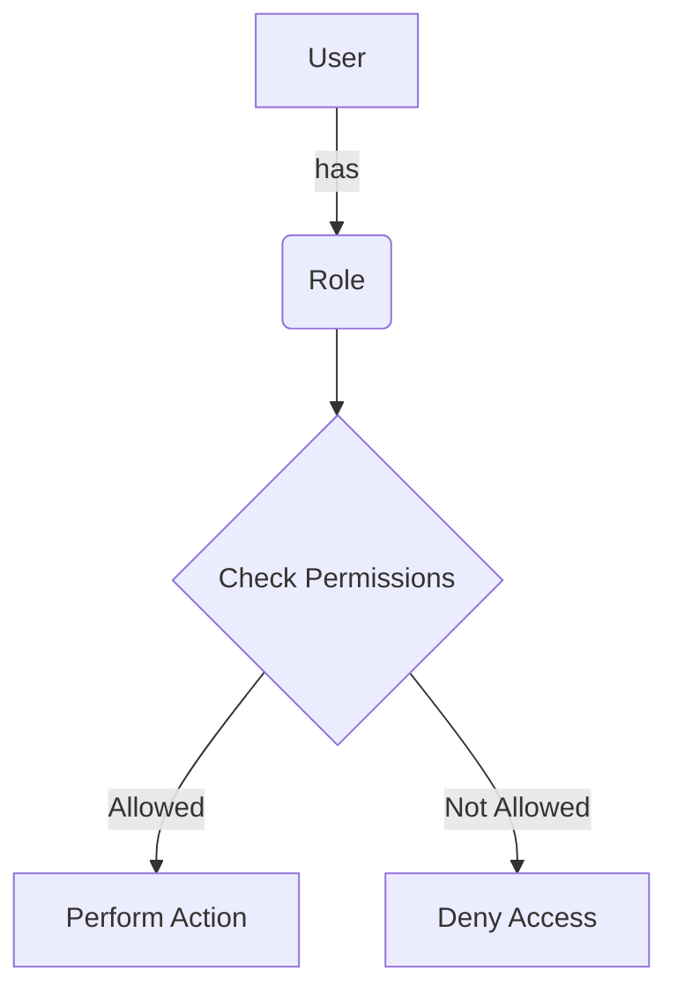

<details>
<summary>Relevant source files</summary>

The following files were used as context for generating this wiki page:

- [config/roles.json](https://github.com/aanickode/access-control-service/blob/main/config/roles.json)
- [src/models.js](https://github.com/aanickode/access-control-service/blob/main/src/models.js)
</details>

# Role Management

## Introduction

The Role Management system is a crucial component of the project, responsible for defining and managing user roles and their associated permissions. It provides a structured way to control access to various features and functionalities within the application based on a user's assigned role. By leveraging this system, developers can ensure that users have appropriate access levels and can perform only the actions they are authorized for, enhancing security and maintaining data integrity.

## Role Definition

The roles and their corresponding permissions are defined in the `config/roles.json` file. This configuration file serves as the central source of truth for role management within the project.

```json
{
  "admin": ["view_users", "create_role", "view_permissions"],
  "engineer": ["view_users", "view_permissions"],
  "analyst": ["view_users"]
}
```

The JSON object in this file maps role names (keys) to an array of permission strings (values). Each role is associated with a set of permissions that determine the actions a user with that role can perform within the application.

Sources: [config/roles.json](https://github.com/aanickode/access-control-service/blob/main/config/roles.json)

## Data Models

The project defines two main data models related to role management: `User` and `Role`. These models are defined in the `src/models.js` file.

### User Model

```javascript
export const User = {
  email: 'string',
  role: 'string'
};
```

The `User` model represents a user in the system. It has the following properties:

| Property | Type     | Description                      |
|----------|----------|----------------------------------|
| `email`  | `string` | The email address of the user.   |
| `role`   | `string` | The name of the role assigned to the user. |

Sources: [src/models.js:1-4](https://github.com/aanickode/access-control-service/blob/main/src/models.js#L1-L4)

### Role Model

```javascript
export const Role = {
  name: 'string',
  permissions: ['string']
};
```

The `Role` model represents a role in the system. It has the following properties:

| Property      | Type       | Description                                  |
|---------------|------------|----------------------------------------------|
| `name`        | `string`   | The name of the role.                        |
| `permissions` | `string[]` | An array of permission strings associated with the role. |

Sources: [src/models.js:6-9](https://github.com/aanickode/access-control-service/blob/main/src/models.js#L6-L9)

## Role Management Flow

The following diagram illustrates the high-level flow of role management within the application:



1. A user is assigned a specific role within the application.
2. The role is associated with a set of permissions defined in the `config/roles.json` file.
3. When the user attempts to perform an action, the system checks if the user's role has the required permission(s) for that action.
4. If the user's role has the necessary permission(s), the action is allowed, and the user can proceed.
5. If the user's role does not have the required permission(s), access is denied, and the user cannot perform the action.

Sources: [config/roles.json](https://github.com/aanickode/access-control-service/blob/main/config/roles.json), [src/models.js](https://github.com/aanickode/access-control-service/blob/main/src/models.js)

## Role-Based Access Control (RBAC)

The Role Management system in this project follows the Role-Based Access Control (RBAC) model. RBAC is a widely adopted access control mechanism that assigns permissions to roles rather than directly to individual users. This approach simplifies the management of permissions and provides a more scalable and flexible solution as the number of users and resources grows.

In the RBAC model, roles are created based on job functions or responsibilities within the organization. Users are then assigned one or more roles, inheriting the permissions associated with those roles. This separation of roles and permissions allows for easier administration and auditing, as well as the ability to modify permissions without directly affecting individual user assignments.

Sources: [config/roles.json](https://github.com/aanickode/access-control-service/blob/main/config/roles.json), [src/models.js](https://github.com/aanickode/access-control-service/blob/main/src/models.js)

## Conclusion

The Role Management system in this project provides a structured and secure way to manage user access and permissions within the application. By defining roles and their associated permissions in a centralized configuration file, developers can easily control and maintain the access levels for different user groups. The system follows the Role-Based Access Control (RBAC) model, which promotes scalability, flexibility, and easier administration of permissions. Overall, this system plays a crucial role in ensuring data integrity and security by ensuring that users can only perform actions they are authorized for based on their assigned roles.