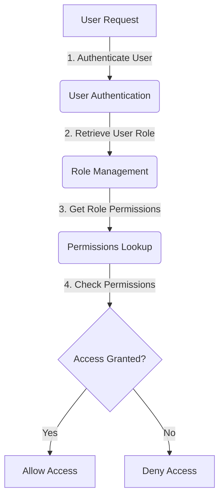

<details>
<summary>Relevant source files</summary>

The following files were used as context for generating this wiki page:

- [config/roles.json](https://github.com/aanickode/access-control-service/blob/main/config/roles.json)
- [src/models.js](https://github.com/aanickode/access-control-service/blob/main/src/models.js)
</details>

# Role Management

## Introduction

The Role Management system is a crucial component of the access control service, responsible for defining and managing user roles and their associated permissions. It provides a structured way to grant or restrict access to various features or resources within the application based on a user's assigned role.

By leveraging the Role Management system, administrators can efficiently control and maintain the appropriate level of access for different user groups, ensuring data security and adherence to organizational policies.

## Role Definition

The roles and their corresponding permissions are defined in the `config/roles.json` file. This configuration file serves as the central repository for managing role-based access control (RBAC) within the application.

```json
{
  "admin": ["view_users", "create_role", "view_permissions"],
  "engineer": ["view_users", "view_permissions"],
  "analyst": ["view_users"]
}
```

In the example above, three roles are defined: `admin`, `engineer`, and `analyst`. Each role is associated with a list of permissions, represented as strings.

Sources: [config/roles.json](https://github.com/aanickode/access-control-service/blob/main/config/roles.json)

## Data Models

The `src/models.js` file defines the data models used within the application, including the `User` and `Role` models.

### User Model

```javascript
export const User = {
  email: 'string',
  role: 'string'
};
```

The `User` model represents a user entity within the system. It consists of the following fields:

| Field | Type     | Description                      |
|-------|----------|----------------------------------|
| email | `string` | The email address of the user.   |
| role  | `string` | The role assigned to the user.   |

Sources: [src/models.js:1-4](https://github.com/aanickode/access-control-service/blob/main/src/models.js#L1-L4)

### Role Model

```javascript
export const Role = {
  name: 'string',
  permissions: ['string']
};
```

The `Role` model represents a role entity within the system. It consists of the following fields:

| Field       | Type       | Description                                |
|-------------|------------|------------------------------------------|
| name        | `string`   | The name of the role.                    |
| permissions | `string[]` | An array of permission strings associated with the role. |

Sources: [src/models.js:6-9](https://github.com/aanickode/access-control-service/blob/main/src/models.js#L6-L9)

## Role-Based Access Control (RBAC) Flow

The following diagram illustrates the high-level flow of the Role-Based Access Control (RBAC) system:



1. A user initiates a request to access a specific resource or feature within the application.
2. The user's credentials are authenticated, and their assigned role is retrieved from the User model.
3. The Role Management system looks up the permissions associated with the user's role in the `config/roles.json` configuration file.
4. The requested action is checked against the user's role permissions to determine if access should be granted or denied.
5. Based on the permission evaluation, the user is either allowed or denied access to the requested resource or feature.

Sources: [config/roles.json](https://github.com/aanickode/access-control-service/blob/main/config/roles.json), [src/models.js](https://github.com/aanickode/access-control-service/blob/main/src/models.js)

## Role Management Operations

The Role Management system likely includes operations for managing roles and their associated permissions. While the provided source files do not contain implementation details, potential operations could include:

- **Create Role**: Allows administrators to define a new role and specify its associated permissions.
- **Update Role**: Enables modifying an existing role's permissions or other attributes.
- **Delete Role**: Removes a role from the system, potentially reassigning or handling users with that role.
- **Assign Role to User**: Associates a user with a specific role, granting them the corresponding permissions.
- **Remove Role from User**: Disassociates a user from a role, revoking their access to the associated permissions.

These operations would typically be exposed through an API or administrative interface, allowing authorized personnel to manage roles and user access within the application.

## Conclusion

The Role Management system is a fundamental component of the access control service, enabling fine-grained control over user access to various features and resources within the application. By defining roles and their associated permissions, administrators can efficiently manage and maintain appropriate access levels for different user groups, ensuring data security and adherence to organizational policies.