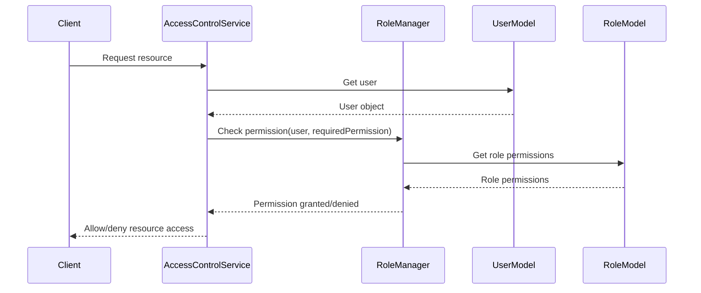

<details>
<summary>Relevant source files</summary>

The following files were used as context for generating this wiki page:

- [config/roles.json](https://github.com/aanickode/access-control-service/blob/main/config/roles.json)
- [src/models.js](https://github.com/aanickode/access-control-service/blob/main/src/models.js)
</details>

# Role Management

## Introduction

The Role Management system within this project provides a way to define and manage user roles and their associated permissions. It allows for the creation of roles with specific sets of permissions, and the assignment of these roles to individual users. This system is crucial for implementing access control and ensuring that users have the appropriate level of access to various features or resources within the application.

Sources: [config/roles.json](), [src/models.js]()

## Data Models

### User Model

The `User` model represents an individual user within the system. It consists of the following fields:

| Field | Type    | Description                    |
|-------|---------|--------------------------------|
| email | string  | The user's email address       |
| role  | string  | The name of the role assigned to the user |

Sources: [src/models.js:1-4]()

### Role Model

The `Role` model defines a role within the system, along with its associated permissions. It has the following fields:

| Field       | Type     | Description                    |
|-------------|----------|--------------------------------|
| name        | string   | The name of the role           |
| permissions | string[] | An array of permission strings |

Sources: [src/models.js:6-9]()

## Role Configuration

The roles and their associated permissions are defined in the `config/roles.json` file. This file contains a JSON object where the keys represent the role names, and the values are arrays of permission strings.

```json
{
  "admin": ["view_users", "create_role", "view_permissions"],
  "engineer": ["view_users", "view_permissions"],
  "analyst": ["view_users"]
}
```

Sources: [config/roles.json]()

## Role Assignment

To assign a role to a user, the `role` field in the `User` model should be set to the desired role name. This role name should match one of the keys defined in the `config/roles.json` file.

```javascript
const newUser = {
  email: 'john@example.com',
  role: 'admin' // Assigns the 'admin' role to the user
};
```

Sources: [src/models.js:1-4](), [config/roles.json]()

## Permission Checking

To check if a user has a specific permission, the system should first retrieve the user's role from the `User` model. Then, it should look up the permissions associated with that role in the `config/roles.json` file. If the desired permission is present in the array of permissions for the user's role, the user is granted access; otherwise, access is denied.

```javascript
const userRole = user.role; // Retrieve the user's role
const rolePermissions = roles[userRole]; // Get the permissions for the user's role

if (rolePermissions.includes('view_users')) {
  // User has the 'view_users' permission
} else {
  // User does not have the 'view_users' permission
}
```

Sources: [src/models.js:1-4](), [config/roles.json]()

## Sequence Diagram: Permission Checking



This sequence diagram illustrates the flow of checking if a user has a specific permission:

1. The client sends a request to access a resource to the `AccessControlService`.
2. The `AccessControlService` retrieves the user object from the `UserModel`.
3. The `AccessControlService` calls the `RoleManager` to check if the user has the required permission.
4. The `RoleManager` retrieves the permissions associated with the user's role from the `RoleModel`.
5. The `RoleManager` checks if the required permission is present in the role's permissions and returns the result to the `AccessControlService`.
6. The `AccessControlService` allows or denies access to the resource based on the permission check result and responds to the client accordingly.

Sources: [src/models.js](), [config/roles.json]()

## Conclusion

The Role Management system in this project provides a flexible and scalable way to manage user permissions and access control. By defining roles and their associated permissions in a centralized configuration file, and assigning these roles to users, the system can efficiently determine whether a user has the necessary permissions to access specific resources or perform certain actions within the application.