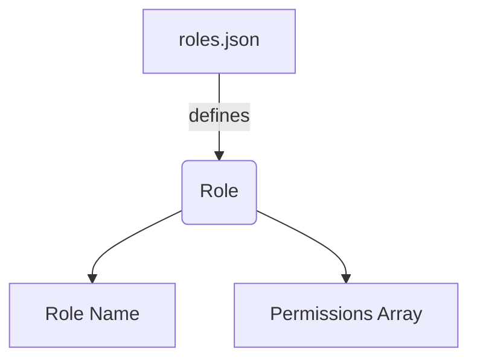
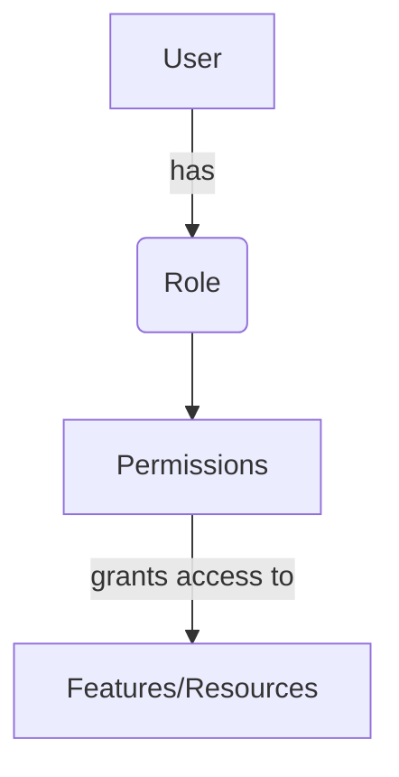

<details>
<summary>Relevant source files</summary>

The following files were used as context for generating this wiki page:

- [config/roles.json](https://github.com/aanickode/access-control-service/blob/main/config/roles.json)
- [src/models.js](https://github.com/aanickode/access-control-service/blob/main/src/models.js)
</details>

# Role Management

## Introduction

The Role Management system within this project provides a way to define and manage user roles and their associated permissions. It allows for the creation of roles with specific sets of permissions, and the assignment of these roles to users. This system is crucial for implementing access control and ensuring that users have the appropriate level of access to various features or resources within the application.

## Role Definition

Roles are defined in the `config/roles.json` file, where each role is a key-value pair. The key represents the role name, and the value is an array of permission strings associated with that role.



For example, the `admin` role is defined with the permissions `"view_users"`, `"create_role"`, and `"view_permissions"`.

```json
{
  "admin": ["view_users", "create_role", "view_permissions"]
}
```

Sources: [config/roles.json](https://github.com/aanickode/access-control-service/blob/main/config/roles.json)

## Data Models

The `src/models.js` file defines the data models for `User` and `Role` objects.

### User Model

The `User` model has the following fields:

| Field | Type    | Description |
|-------|---------|-------------|
| email | string  | The user's email address |
| role  | string  | The name of the role assigned to the user |

```javascript
export const User = {
  email: 'string',
  role: 'string'
};
```

Sources: [src/models.js:1-4](https://github.com/aanickode/access-control-service/blob/main/src/models.js#L1-L4)

### Role Model

The `Role` model has the following fields:

| Field       | Type     | Description |
|-------------|----------|-------------|
| name        | string   | The name of the role |
| permissions | string[] | An array of permission strings associated with the role |

```javascript
export const Role = {
  name: 'string',
  permissions: ['string']
};
```

Sources: [src/models.js:6-9](https://github.com/aanickode/access-control-service/blob/main/src/models.js#L6-L9)

## Role Assignment

Based on the provided files, it appears that users are assigned roles, and their access to various features or resources is determined by the permissions associated with their assigned role.



However, the specific implementation details for role assignment and permission checking are not present in the provided source files.

## Conclusion

The Role Management system in this project defines roles with associated permissions and provides a way to assign these roles to users. This allows for the implementation of access control, ensuring that users have the appropriate level of access to various features or resources within the application. The system is defined through the `config/roles.json` file for role definitions and the `src/models.js` file for data models.