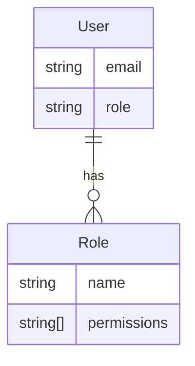

<details>
<summary>Relevant source files</summary>

The following files were used as context for generating this wiki page:

- [config/roles.json](https://github.com/aanickode/access-control-service/blob/main/config/roles.json)
- [src/models.js](https://github.com/aanickode/access-control-service/blob/main/src/models.js)
</details>

# Role Management

## Introduction

The Role Management feature within this project provides a way to define and manage access control based on roles and associated permissions. It allows for the creation of roles with specific sets of permissions, and the assignment of these roles to users. This system enables granular control over what actions or resources different types of users can access within the application.
Sources: [config/roles.json](), [src/models.js]()

## Data Models

### User Model

The `User` model represents a user entity within the system. It consists of the following fields:

| Field | Type     | Description                                  |
|-------|----------|----------------------------------------------|
| email | `string` | The email address of the user (unique identifier) |
| role  | `string` | The name of the role assigned to the user    |

Sources: [src/models.js:1-4]()

### Role Model

The `Role` model defines a role entity with its associated permissions. It has the following fields:

| Field       | Type       | Description                                  |
|-------------|------------|----------------------------------------------|
| name        | `string`   | The name of the role (unique identifier)     |
| permissions | `string[]` | An array of permission names granted to the role |

Sources: [src/models.js:6-9]()

## Role Definitions

The project defines three roles with predefined sets of permissions:

```json
{
  "admin": ["view_users", "create_role", "view_permissions"],
  "engineer": ["view_users", "view_permissions"],
  "analyst": ["view_users"]
}
```

- The `admin` role has permissions to view users, create new roles, and view permissions.
- The `engineer` role can view users and view permissions.
- The `analyst` role can only view users.

Sources: [config/roles.json]()

## Role Assignment

Users are assigned roles during the user creation or update process. The `role` field in the `User` model corresponds to the `name` field in the `Role` model, establishing the relationship between users and their assigned roles.



Sources: [src/models.js]()

## Permission Checking

When a user attempts to perform an action within the application, the system checks if the user's assigned role has the required permission(s) for that action. This permission checking logic likely involves:

1. Retrieving the user's role from the `User` model.
2. Looking up the permissions associated with that role in the `Role` model or a similar role configuration.
3. Verifying if the required permission(s) for the requested action are present in the user's role permissions.
4. Allowing or denying the action based on the permission check result.

The specific implementation details of the permission checking mechanism are not provided in the given source files.

Sources: [config/roles.json](), [src/models.js]()

## Role Management Operations

While the provided source files do not include implementation details, the Role Management feature likely supports the following operations:

### Creating a New Role

This operation allows an authorized user (e.g., `admin` role) to define a new role with a set of permissions. It may involve:

1. Validating the new role name and permissions.
2. Ensuring the role name is unique.
3. Persisting the new role and its permissions to a data store.

### Updating an Existing Role

This operation enables authorized users to modify the permissions associated with an existing role. It may involve:

1. Retrieving the existing role from a data store.
2. Validating and updating the role's permissions.
3. Persisting the updated role to the data store.

### Deleting a Role

This operation allows authorized users to remove an existing role from the system. It may involve:

1. Verifying that the role is not assigned to any users.
2. Removing the role and its associated permissions from the data store.

The specific implementation details and data storage mechanisms for these operations are not provided in the given source files.

Sources: [config/roles.json]()

## Summary

The Role Management feature in this project provides a way to define roles with specific sets of permissions and assign these roles to users. It enables granular access control by allowing or denying user actions based on their assigned role's permissions. The provided source files define the data models for users and roles, as well as a predefined set of roles with their associated permissions. While the implementation details for role management operations and permission checking are not included, this feature is a crucial component for ensuring secure and controlled access to resources within the application.