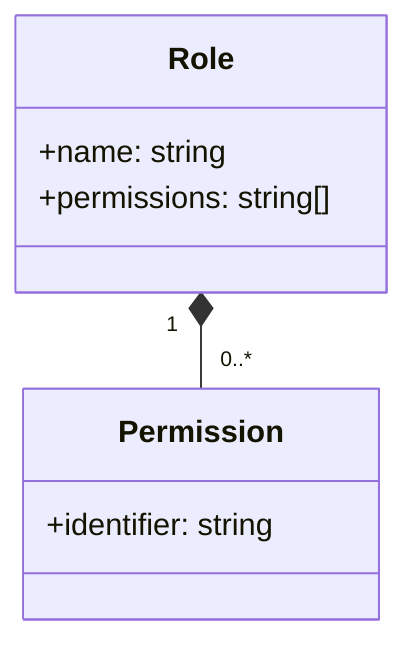
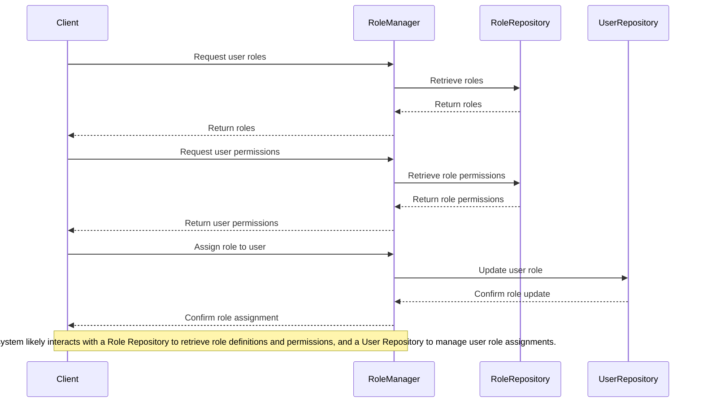

Relevant source files

The following files were used as context for generating this wiki page:

- [config/roles.json](https://github.com/aanickode/access-control-service/blob/main/config/roles.json)
- [src/models.js](https://github.com/aanickode/access-control-service/blob/main/src/models.js)

# Role Management

## Introduction

The Role Management system is a crucial component of the access control service, responsible for defining and managing user roles and their associated permissions within the application. It provides a structured approach to granting or restricting access to various features and functionalities based on a user's assigned role.

By leveraging roles, the application can efficiently control and enforce access privileges, ensuring that users only have the necessary permissions to perform their designated tasks. This not only enhances security but also promotes better organization and maintainability of the codebase.

Sources: [config/roles.json](), [src/models.js]()

## Data Models

### User Model

The `User` model represents an individual user within the system. It consists of the following fields:

| Field | Type    | Description                      |
|-------|---------|----------------------------------|
| email | string  | The user's email address         |
| role  | string  | The name of the role assigned to the user |

Sources: [src/models.js:1-4]()

### Role Model

The `Role` model defines a role and its associated permissions. It has the following structure:

| Field       | Type     | Description                       |
|-------------|----------|-----------------------------------|
| name        | string   | The name of the role              |
| permissions | string[] | An array of permission identifiers granted to the role |

Sources: [src/models.js:6-9]()

## Role Definitions

The application defines three predefined roles: `admin`, `engineer`, and `analyst`. Each role is associated with a set of permissions that govern the actions and resources a user with that role can access.

Sources: [config/roles.json](), [src/models.js:6-9]()

### Role Permissions

The following table outlines the permissions granted to each predefined role:

| Role     | Permissions                                      |
|----------|--------------------------------------------------|
| admin    | view_users, create_role, view_permissions       |
| engineer | view_users, view_permissions                     |
| analyst  | view_users                                       |

Sources: [config/roles.json]()

## Role Management Flow

The Role Management system likely follows a flow similar to the one depicted in the sequence diagram below:

Sources: [config/roles.json](), [src/models.js]()

## Conclusion

The Role Management system plays a pivotal role in the access control service by defining and managing user roles and their associated permissions. It provides a structured approach to granting or restricting access to various features and functionalities based on a user's assigned role, enhancing security and promoting better organization and maintainability of the codebase.