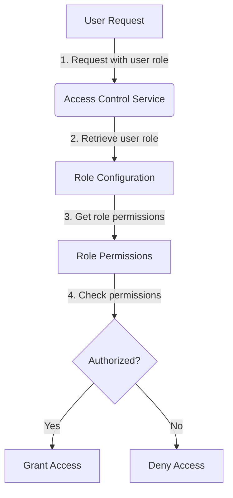
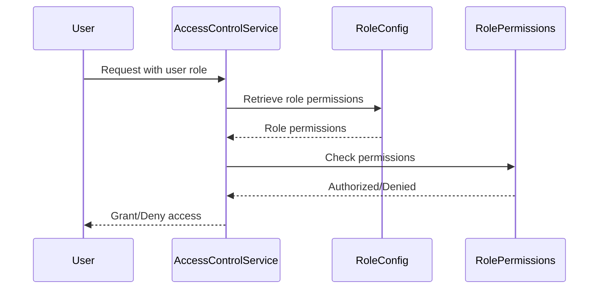

<details>
<summary>Relevant source files</summary>

The following files were used as context for generating this wiki page:

- [config/roles.json](https://github.com/aanickode/access-control-service/blob/main/config/roles.json)
- [src/models.js](https://github.com/aanickode/access-control-service/blob/main/src/models.js)
</details>

# Role Management

## Introduction

The Role Management feature within this project provides a way to define and manage user roles and their associated permissions. It allows for the creation of roles with specific sets of permissions, which can then be assigned to individual users. This feature is crucial for implementing access control and ensuring that users have the appropriate level of access to various parts of the system.

Sources: [config/roles.json](), [src/models.js]()

## Data Models

### User Model

The `User` model represents an individual user within the system. It consists of the following fields:

| Field | Type    | Description                    |
|-------|---------|--------------------------------|
| email | string  | The email address of the user. |
| role  | string  | The name of the role assigned to the user. |

Sources: [src/models.js:1-4]()

### Role Model

The `Role` model defines a role and its associated permissions. It has the following fields:

| Field       | Type     | Description                                |
|-------------|----------|-------------------------------------------|
| name        | string   | The name of the role.                     |
| permissions | string[] | An array of permission strings associated with the role. |

Sources: [src/models.js:6-9]()

## Role Configuration

The roles and their associated permissions are defined in the `config/roles.json` file. This file contains a JSON object where the keys represent the role names, and the values are arrays of permission strings.

```json
{
  "admin": ["view_users", "create_role", "view_permissions"],
  "engineer": ["view_users", "view_permissions"],
  "analyst": ["view_users"]
}
```

Sources: [config/roles.json]()

## Role Management Flow

The Role Management feature likely involves the following high-level steps:



1. A user makes a request to access a resource or perform an action within the system.
2. The Access Control Service retrieves the user's assigned role from the User Model.
3. The Role Configuration file is consulted to obtain the permissions associated with the user's role.
4. The requested action or resource is checked against the user's role permissions.
5. If the user has the required permission(s), access is granted. Otherwise, access is denied.

Sources: [config/roles.json](), [src/models.js]()

## Role Management Sequence

The sequence of interactions between the components involved in Role Management could be represented as follows:



1. The User makes a request with their assigned role to the Access Control Service.
2. The Access Control Service retrieves the permissions associated with the user's role from the Role Configuration.
3. The Access Control Service checks the requested action or resource against the Role Permissions.
4. Based on the permission check, the Access Control Service grants or denies access to the User.

Sources: [config/roles.json](), [src/models.js]()

## Conclusion

The Role Management feature in this project provides a way to define and manage user roles and their associated permissions. It allows for the creation of roles with specific sets of permissions, which can then be assigned to individual users. This feature is crucial for implementing access control and ensuring that users have the appropriate level of access to various parts of the system.

Sources: [config/roles.json](), [src/models.js]()