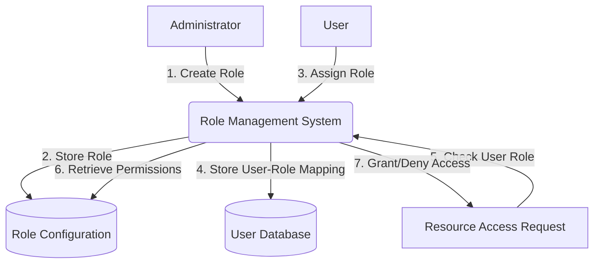
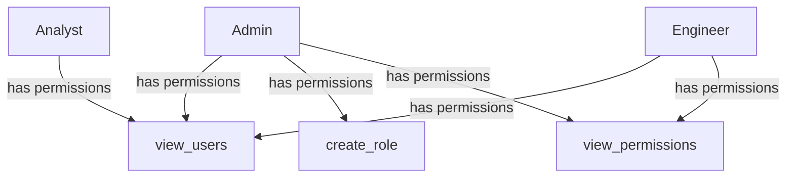

<details>
<summary>Relevant source files</summary>

The following files were used as context for generating this wiki page:

- [config/roles.json](https://github.com/aanickode/access-control-service/blob/main/config/roles.json)
- [src/models.js](https://github.com/aanickode/access-control-service/blob/main/src/models.js)
</details>

# Role Management

## Introduction

The Role Management feature within this project provides a way to define and manage user roles and their associated permissions. It allows administrators to create roles with specific sets of permissions, and assign those roles to users. This system enables access control and authorization, ensuring that users can only perform actions they are permitted to based on their assigned roles.

Sources: [config/roles.json](), [src/models.js]()

## Data Models

### User Model

The `User` model represents a user within the system. It has the following fields:

| Field | Type    | Description                   |
|-------|---------|-------------------------------|
| email | string  | The user's email address      |
| role  | string  | The name of the user's role   |

Sources: [src/models.js:1-4]()

### Role Model

The `Role` model defines a role and its associated permissions. It has the following fields:

| Field       | Type     | Description                                |
|-------------|----------|-------------------------------------------|
| name        | string   | The name of the role                      |
| permissions | string[] | An array of permission names for the role |

Sources: [src/models.js:6-9]()

## Role Configuration

The roles and their associated permissions are defined in the `config/roles.json` file. This file contains a JSON object where the keys represent role names, and the values are arrays of permission names.

```json
{
  "admin": ["view_users", "create_role", "view_permissions"],
  "engineer": ["view_users", "view_permissions"],
  "analyst": ["view_users"]
}
```

Sources: [config/roles.json]()

## Role Management Flow

The following diagram illustrates the high-level flow of role management within the system:



1. An administrator creates a new role with a set of permissions.
2. The role is stored in the role configuration file (`config/roles.json`).
3. A user is assigned a role.
4. The user-role mapping is stored in the user database.
5. When a user attempts to access a resource, the system checks the user's role.
6. The system retrieves the permissions associated with the user's role from the role configuration.
7. Based on the user's role and permissions, the system grants or denies access to the requested resource.

Sources: [config/roles.json](), [src/models.js]()

## Role Hierarchy (Example)

The roles defined in the `config/roles.json` file suggest a hierarchy of permissions, where the `admin` role has the highest level of access, followed by `engineer`, and then `analyst`. This hierarchy can be represented using the following diagram:



In this example hierarchy:

- The `admin` role has permissions to view users, create roles, and view permissions.
- The `engineer` role has permissions to view users and view permissions.
- The `analyst` role has permission to view users.

Sources: [config/roles.json]()

## Conclusion

The Role Management feature in this project provides a flexible and extensible way to manage user roles and their associated permissions. By defining roles and their permissions in a configuration file, administrators can easily modify or add new roles as needed. The system then uses these roles to control access to resources based on the user's assigned role and its permissions.