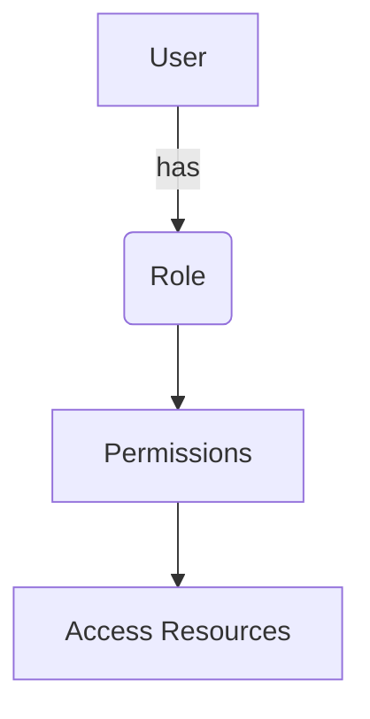
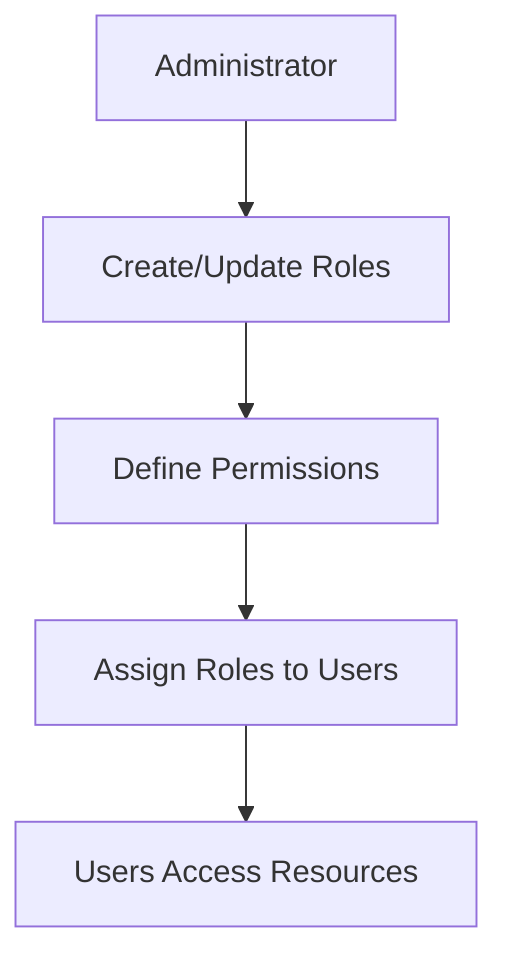

<details>
<summary>Relevant source files</summary>

The following files were used as context for generating this wiki page:

- [config/roles.json](https://github.com/aanickode/access-control-service/blob/main/config/roles.json)
- [src/models.js](https://github.com/aanickode/access-control-service/blob/main/src/models.js)
</details>

# Role Management

## Introduction

The Role Management feature within this project provides a mechanism for defining and managing user roles and their associated permissions. It allows administrators to create and configure roles with specific sets of permissions, which can then be assigned to users to control their access to various parts of the application or system. This feature is crucial for implementing access control and ensuring that users have appropriate levels of authorization based on their roles and responsibilities.

Sources: [config/roles.json](), [src/models.js]()

## Role Definition

Roles are defined as objects with two key properties: `name` and `permissions`. The `name` property is a string representing the role identifier, while `permissions` is an array of strings that specifies the individual permissions granted to that role.

```javascript
export const Role = {
  name: 'string',
  permissions: ['string']
};
```

Sources: [src/models.js:4-7]()

## Predefined Roles

The project includes a set of predefined roles and their associated permissions defined in the `config/roles.json` file. This configuration file serves as a central location for managing and updating role definitions.

```json
{
  "admin": ["view_users", "create_role", "view_permissions"],
  "engineer": ["view_users", "view_permissions"],
  "analyst": ["view_users"]
}
```

The predefined roles are:

- **admin**: This role has permissions to view users, create new roles, and view permissions.
- **engineer**: This role has permissions to view users and view permissions.
- **analyst**: This role has permission to view users.

Sources: [config/roles.json]()

## User Model

The User model defines the structure of user data, including the `email` and `role` properties. The `role` property is a string that corresponds to one of the defined roles in the `config/roles.json` file.

```javascript
export const User = {
  email: 'string',
  role: 'string'
};
```

Sources: [src/models.js:1-3]()

## Role-Based Access Control (RBAC)

The Role Management feature is likely used to implement Role-Based Access Control (RBAC) within the application or system. RBAC is a security model that restricts access to resources based on the roles assigned to users.



In this RBAC model, users are assigned roles, and each role is associated with a set of permissions. These permissions determine the resources and actions that users with that role can access or perform within the application or system.

Sources: [config/roles.json](), [src/models.js]()

## Role Management Workflow

The typical workflow for managing roles and permissions within the application or system might involve the following steps:



1. An administrator creates or updates roles by defining their names and associated permissions in the `config/roles.json` file.
2. The administrator specifies the permissions granted to each role, such as `view_users`, `create_role`, or `view_permissions`.
3. Users are assigned roles based on their responsibilities and access requirements.
4. Users with assigned roles can access resources and perform actions within the application or system based on the permissions associated with their roles.

Sources: [config/roles.json](), [src/models.js]()

## Conclusion

The Role Management feature in this project provides a flexible and scalable way to manage user access and permissions within the application or system. By defining roles and their associated permissions, administrators can easily control and update access levels for different user groups. This approach promotes security and helps ensure that users have appropriate access based on their roles and responsibilities.