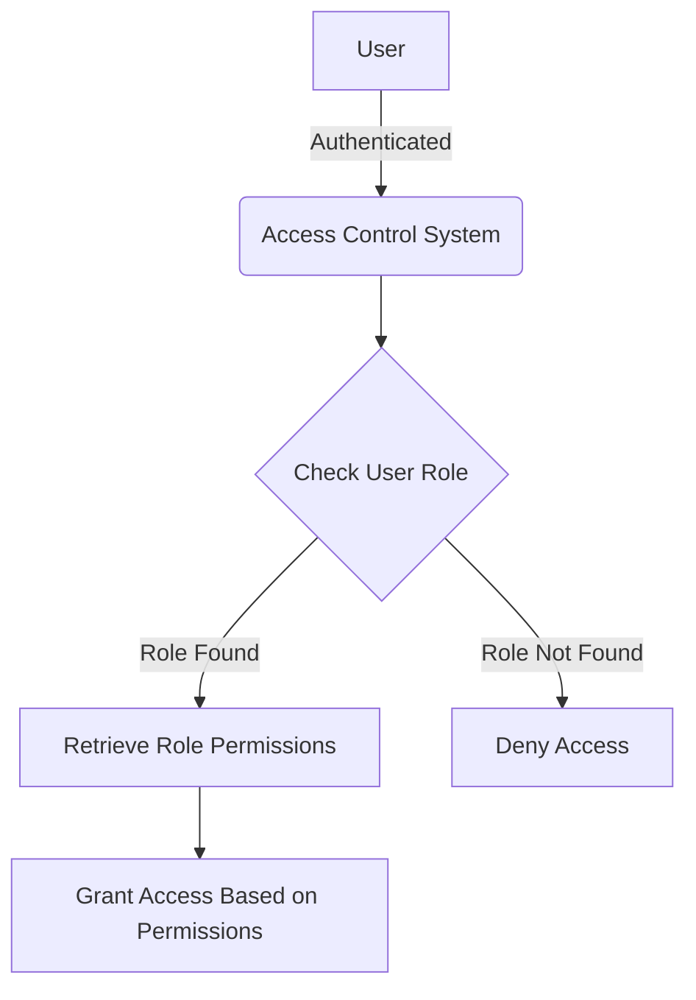

<details>
<summary>Relevant source files</summary>

The following files were used as context for generating this wiki page:

- [config/roles.json](https://github.com/aanickode/access-control-service/blob/main/config/roles.json)
- [src/models.js](https://github.com/aanickode/access-control-service/blob/main/src/models.js)
</details>

# Role Management

## Introduction

The Role Management feature within this project provides a way to define and manage user roles and their associated permissions. It allows for the creation of roles with specific sets of permissions, and the assignment of these roles to users. This feature is crucial for implementing access control and ensuring that users have the appropriate level of access to various parts of the system.

Sources: [config/roles.json](), [src/models.js]()

## Data Models

### User Model

The `User` model represents a user in the system and has the following fields:

| Field | Type    | Description                  |
|-------|---------|------------------------------|
| email | string  | The user's email address     |
| role  | string  | The name of the user's role  |

Sources: [src/models.js:1-4]()

### Role Model

The `Role` model defines a role and its associated permissions:

| Field       | Type     | Description                                 |
|-------------|----------|---------------------------------------------|
| name        | string   | The name of the role                        |
| permissions | string[] | An array of permission names for this role  |

Sources: [src/models.js:6-9]()

## Role Configuration

The roles and their associated permissions are defined in the `config/roles.json` file:

```json
{
  "admin": ["view_users", "create_role", "view_permissions"],
  "engineer": ["view_users", "view_permissions"],
  "analyst": ["view_users"]
}
```

This configuration defines three roles:

- `admin`: This role has permissions to view users, create new roles, and view permissions.
- `engineer`: This role can view users and view permissions.
- `analyst`: This role can only view users.

Sources: [config/roles.json]()

## Role Management Flow

The overall flow for role management can be represented by the following diagram:



1. A user is authenticated by the system.
2. The Access Control System checks the user's role.
3. If the user's role is found, the system retrieves the associated permissions for that role.
4. Access is granted or denied based on the user's role permissions.
5. If the user's role is not found, access is denied.

Sources: [config/roles.json](), [src/models.js]()

## Potential Enhancements

While the current implementation provides a basic role management system, there are several potential enhancements that could be considered:

- Support for hierarchical roles, where a higher-level role inherits permissions from lower-level roles.
- Dynamic assignment of permissions to roles, rather than hardcoding them in a configuration file.
- Integration with an external authentication and authorization system for more robust user management.
- Auditing and logging capabilities for tracking changes to roles and permissions.

Sources: [config/roles.json](), [src/models.js]()