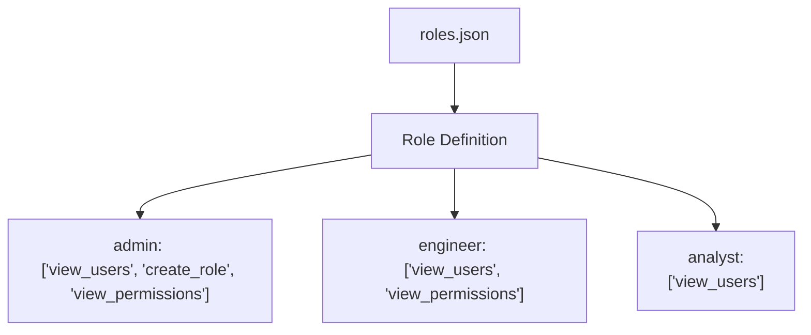
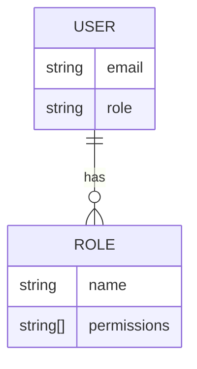
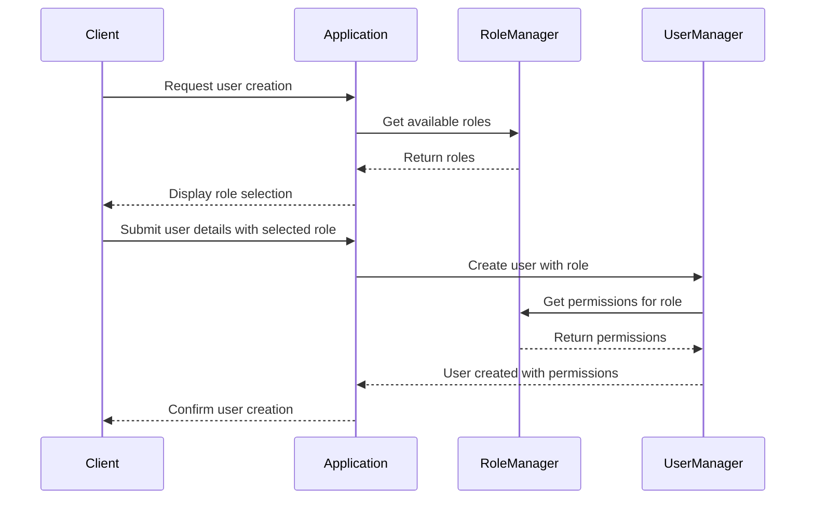

Relevant source files

The following files were used as context for generating this wiki page:

- [config/roles.json](https://github.com/aanickode/access-control-service/blob/main/config/roles.json)
- [src/models.js](https://github.com/aanickode/access-control-service/blob/main/src/models.js)

# Role Management

## Introduction

The Role Management feature within this project provides a mechanism for defining and assigning roles to users, where each role is associated with a set of permissions. This feature enables access control and authorization within the application, ensuring that users can only perform actions they are authorized for based on their assigned roles.

Sources: [config/roles.json](), [src/models.js]()

## Role Definition

Roles are defined in the `config/roles.json` file, where each role is represented as a key-value pair. The key represents the role name, and the value is an array of permission strings associated with that role.

In the example above, the `admin` role has permissions to `view_users`, `create_role`, and `view_permissions`, while the `engineer` role can only `view_users` and `view_permissions`. The `analyst` role has the most limited permissions, only allowing users to `view_users`.

Sources: [config/roles.json]()

## Data Models

The project defines two data models: `User` and `Role`.

### User Model

The `User` model represents a user in the system and has the following fields:

| Field | Type    | Description |
|-------|---------|-------------|
| email | string  | The user's email address |
| role  | string  | The name of the role assigned to the user |

Sources: [src/models.js:1-4]()

### Role Model

The `Role` model represents a role in the system and has the following fields:

| Field       | Type     | Description |
|-------------|----------|-------------|
| name        | string   | The name of the role |
| permissions | string[] | An array of permission strings associated with the role |

Sources: [src/models.js:6-9]()

The diagram above illustrates the relationship between the `User` and `Role` models, where a `User` has a single `role`, and a `Role` can be assigned to multiple `User` instances.

Sources: [src/models.js]()

## Role Assignment and Authorization

The application likely implements logic to assign roles to users during user creation or management. Once a user is assigned a role, the application can use the role's associated permissions to authorize the user's actions within the system.

The sequence diagram above illustrates a potential flow for user creation and role assignment. The application retrieves available roles from the `RoleManager`, presents them to the client for selection, and then creates the user with the selected role. The `UserManager` obtains the permissions associated with the assigned role from the `RoleManager` and stores them with the user's data for future authorization checks.

Sources: [config/roles.json](), [src/models.js]()

## Conclusion

The Role Management feature in this project provides a flexible and extensible way to define roles, associate permissions with those roles, and assign roles to users. This allows for granular access control and authorization within the application, ensuring that users can only perform actions they are authorized for based on their assigned roles and permissions.