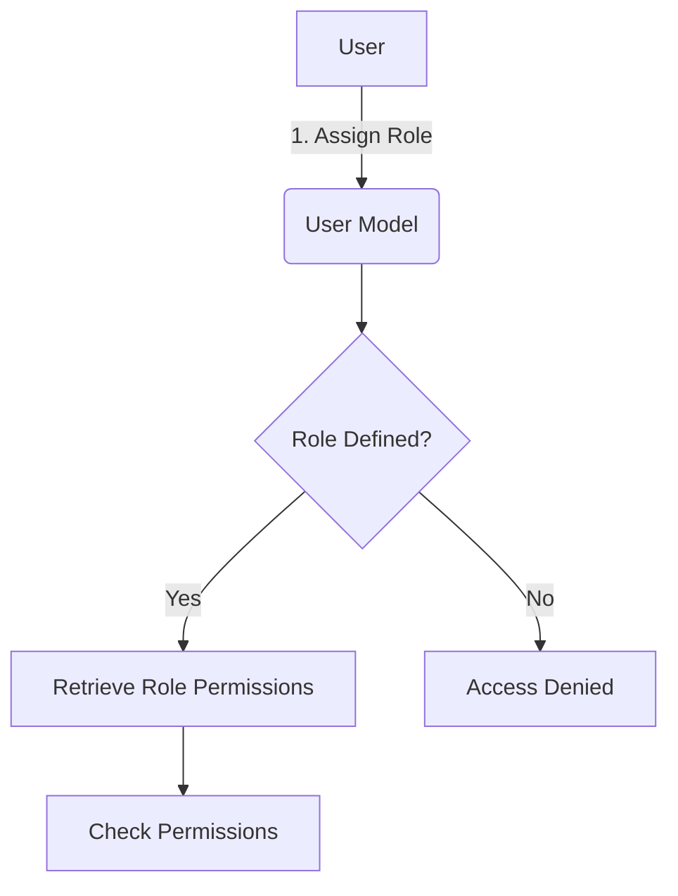

<details>
<summary>Relevant source files</summary>

The following files were used as context for generating this wiki page:

- [config/roles.json](https://github.com/aanickode/access-control-service/blob/main/config/roles.json)
- [src/models.js](https://github.com/aanickode/access-control-service/blob/main/src/models.js)
</details>

# Role Management

## Introduction

The Role Management system within this project provides a way to define and manage user roles and their associated permissions. It allows for the creation of roles with specific sets of permissions, and the assignment of these roles to individual users. This system is crucial for implementing access control and ensuring that users have the appropriate level of access to various features or resources within the application.

Sources: [config/roles.json](), [src/models.js]()

## Role Definition

Roles are defined in the `config/roles.json` file, where each role is represented as a key-value pair. The key represents the role name, and the value is an array of permission strings associated with that role.

```json
{
  "admin": ["view_users", "create_role", "view_permissions"],
  "engineer": ["view_users", "view_permissions"],
  "analyst": ["view_users"]
}
```

This configuration defines three roles: `admin`, `engineer`, and `analyst`. The `admin` role has permissions to view users, create roles, and view permissions. The `engineer` role can view users and permissions, while the `analyst` role can only view users.

Sources: [config/roles.json]()

## Data Models

The data models for `User` and `Role` are defined in the `src/models.js` file.

```javascript
export const User = {
  email: 'string',
  role: 'string'
};

export const Role = {
  name: 'string',
  permissions: ['string']
};
```

The `User` model has two properties:

- `email`: A string representing the user's email address.
- `role`: A string representing the user's assigned role.

The `Role` model has two properties:

- `name`: A string representing the name of the role.
- `permissions`: An array of strings representing the permissions associated with the role.

Sources: [src/models.js]()

## Role Assignment

To assign a role to a user, the `role` property of the `User` model should be set to the desired role name defined in the `config/roles.json` file.

```javascript
const user = {
  email: 'john@example.com',
  role: 'admin'
};
```

In this example, the user with the email `john@example.com` is assigned the `admin` role, granting them the permissions defined for that role in the `config/roles.json` file.

Sources: [src/models.js](), [config/roles.json]()

## Permission Checking

To check if a user has a specific permission, you can retrieve the user's role from the `User` model and look up the associated permissions in the `config/roles.json` file.

```javascript
import roles from '../config/roles.json';

function hasPermission(user, permission) {
  const userRole = roles[user.role];
  return userRole && userRole.includes(permission);
}
```

The `hasPermission` function takes a `user` object and a `permission` string as arguments. It retrieves the user's role from the `roles` object and checks if the `permission` string is included in the array of permissions associated with that role. If the user has the specified permission, the function returns `true`; otherwise, it returns `false`.

Sources: [config/roles.json](), [src/models.js]()

## Role Management Flow

The overall flow for managing roles and permissions can be represented by the following diagram:



1. A role is assigned to a user through the `User` model.
2. The system checks if the assigned role is defined in the `config/roles.json` file.
3. If the role is defined, the system retrieves the associated permissions for that role.
4. The system can then check if the user has specific permissions based on their assigned role.
5. If the role is not defined, access is denied.

Sources: [config/roles.json](), [src/models.js]()

## Conclusion

The Role Management system in this project provides a simple yet effective way to manage user roles and their associated permissions. By defining roles and their permissions in a centralized configuration file, and associating users with these roles, the system can control access to various features or resources within the application. This approach promotes code reusability, maintainability, and adherence to the principle of least privilege.