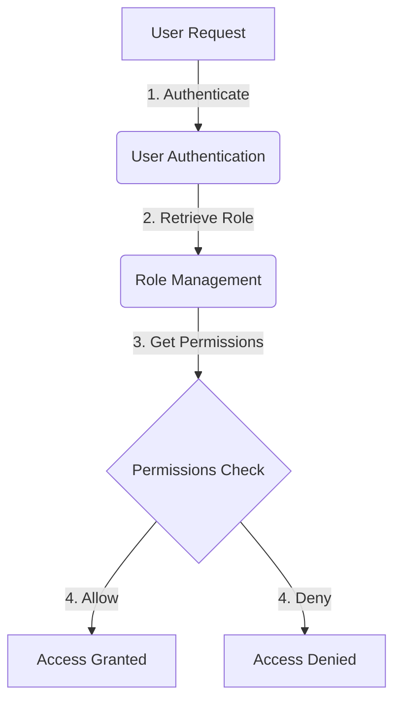
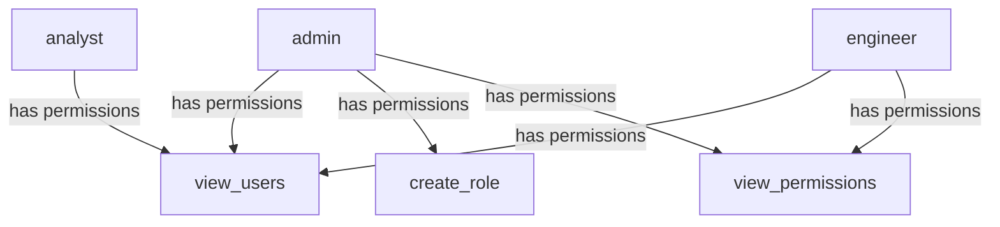

<details>
<summary>Relevant source files</summary>

The following files were used as context for generating this wiki page:

- [config/roles.json](https://github.com/aanickode/access-control-service/blob/main/config/roles.json)
- [src/models.js](https://github.com/aanickode/access-control-service/blob/main/src/models.js)
</details>

# Role Management

## Introduction

The Role Management system is a crucial component of the access control service, responsible for defining and managing user roles and their associated permissions within the application. It provides a structured way to grant or restrict access to various features and functionalities based on a user's assigned role.

By leveraging the Role Management system, administrators can efficiently control and maintain the security and access levels of different user groups, ensuring that sensitive operations are performed only by authorized individuals. This system promotes better organization, scalability, and maintainability of access control policies.

## Role Definition

The roles and their corresponding permissions are defined in the `config/roles.json` file. This configuration file serves as the central source of truth for role-based access control (RBAC) within the application.

```json
{
  "admin": ["view_users", "create_role", "view_permissions"],
  "engineer": ["view_users", "view_permissions"],
  "analyst": ["view_users"]
}
```

The JSON object in this file maps role names (keys) to an array of permission strings (values). Each role is associated with a set of permissions that determine the actions and resources a user with that role can access.

Sources: [config/roles.json](https://github.com/aanickode/access-control-service/blob/main/config/roles.json)

## Data Models

The `src/models.js` file defines the data models used within the application, including the `User` and `Role` models.

### User Model

```javascript
export const User = {
  email: 'string',
  role: 'string'
};
```

The `User` model represents a user entity within the system. It consists of the following properties:

- `email` (string): The email address of the user, serving as a unique identifier.
- `role` (string): The name of the role assigned to the user, which determines their access permissions.

Sources: [src/models.js:1-4](https://github.com/aanickode/access-control-service/blob/main/src/models.js#L1-L4)

### Role Model

```javascript
export const Role = {
  name: 'string',
  permissions: ['string']
};
```

The `Role` model defines the structure of a role within the system. It includes the following properties:

- `name` (string): The unique name of the role.
- `permissions` (array of strings): An array of permission strings associated with the role, granting access to specific features or operations.

Sources: [src/models.js:6-9](https://github.com/aanickode/access-control-service/blob/main/src/models.js#L6-L9)

## Role-Based Access Control (RBAC) Flow

The following diagram illustrates the high-level flow of role-based access control within the application:



1. A user initiates a request to access a specific feature or resource within the application.
2. The user's authentication credentials are verified, and their assigned role is retrieved from the `User` model.
3. The Role Management system fetches the permissions associated with the user's role from the `Role` model or the `config/roles.json` configuration file.
4. The requested action or resource is checked against the user's permissions. If the user has the required permission(s), access is granted; otherwise, access is denied.

This flow ensures that only authorized users with the appropriate roles and permissions can perform specific actions or access sensitive resources within the application.

Sources: [config/roles.json](https://github.com/aanickode/access-control-service/blob/main/config/roles.json), [src/models.js](https://github.com/aanickode/access-control-service/blob/main/src/models.js)

## Role Hierarchy

Based on the `config/roles.json` file, the following role hierarchy can be derived:



The `admin` role has the highest level of access, with permissions to view users (`view_users`), create new roles (`create_role`), and view permissions (`view_permissions`). The `engineer` role has permissions to view users and view permissions, while the `analyst` role only has permission to view users.

This hierarchy allows for a structured and granular approach to access control, where roles with higher privileges can perform a superset of actions compared to roles with lower privileges.

Sources: [config/roles.json](https://github.com/aanickode/access-control-service/blob/main/config/roles.json)

## Role Management Operations

While the provided source files do not include implementation details for role management operations, it is expected that the application would provide functionality to perform the following tasks:

- **Create Role**: Administrators should be able to create new roles by specifying a unique role name and the associated permissions.
- **Update Role**: Administrators should be able to modify the permissions associated with an existing role.
- **Delete Role**: Administrators should be able to remove roles that are no longer needed, ensuring that no users are assigned to the role being deleted.
- **Assign Role to User**: When creating or updating a user, administrators should be able to assign the appropriate role to the user based on their responsibilities and access requirements.
- **Change User Role**: Administrators should be able to change the role assigned to an existing user, effectively modifying their access permissions.

These operations would likely be implemented through API endpoints, user interfaces, or administrative tools, allowing authorized personnel to manage roles and user access effectively.

## Conclusion

The Role Management system is a fundamental component of the access control service, enabling efficient and secure management of user access within the application. By defining roles and their associated permissions, the system ensures that users can only perform actions and access resources they are authorized for, based on their assigned roles.

The `config/roles.json` file serves as the central configuration for role definitions, while the `User` and `Role` models in `src/models.js` provide the data structures for storing user and role information. The role-based access control flow, illustrated through a diagram, outlines the process of authenticating users, retrieving their roles, and checking permissions before granting or denying access.

By implementing a well-designed Role Management system, the application can maintain a clear separation of concerns, improve security, and facilitate easier administration and maintenance of access control policies.