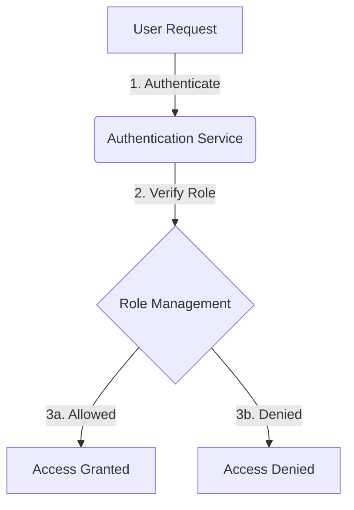
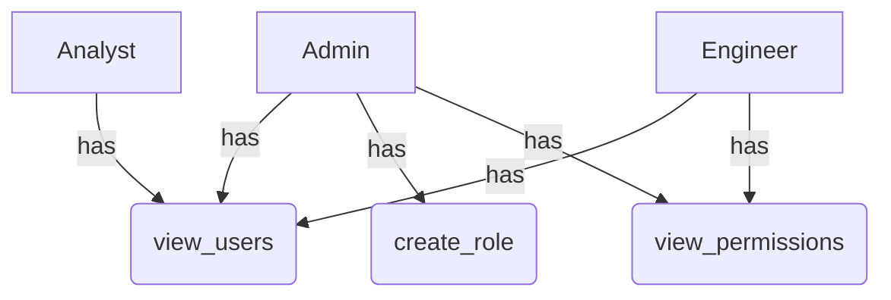

<details>
<summary>Relevant source files</summary>

The following files were used as context for generating this wiki page:

- [config/roles.json](https://github.com/aanickode/access-control-service/blob/main/config/roles.json)
- [src/models.js](https://github.com/aanickode/access-control-service/blob/main/src/models.js)
</details>

# Role Management

## Introduction

The Role Management system is a crucial component of the access control service, responsible for defining and managing user roles and their associated permissions. It provides a structured way to grant or restrict access to various features or resources within the application based on a user's assigned role. By leveraging this system, administrators can effectively control and govern user access, ensuring data security and maintaining appropriate levels of authorization.

## Role Configuration

The roles and their corresponding permissions are defined in the `config/roles.json` file. This configuration file serves as the central repository for managing role-based access control (RBAC) within the application.

```json
{
  "admin": ["view_users", "create_role", "view_permissions"],
  "engineer": ["view_users", "view_permissions"],
  "analyst": ["view_users"]
}
```

The configuration follows a simple key-value structure, where the keys represent the role names, and the values are arrays containing the associated permissions for each role.

Sources: [config/roles.json](https://github.com/aanickode/access-control-service/blob/main/config/roles.json)

## Data Models

The application defines two primary data models related to role management: `User` and `Role`.

### User Model

```javascript
export const User = {
  email: 'string',
  role: 'string'
};
```

The `User` model represents a user entity within the system. It consists of the following fields:

| Field | Type     | Description                      |
|-------|----------|----------------------------------|
| email | `string` | The email address of the user.   |
| role  | `string` | The assigned role for the user.  |

Sources: [src/models.js:1-4](https://github.com/aanickode/access-control-service/blob/main/src/models.js#L1-L4)

### Role Model

```javascript
export const Role = {
  name: 'string',
  permissions: ['string']
};
```

The `Role` model defines the structure of a role within the system. It includes the following fields:

| Field       | Type     | Description                                |
|-------------|----------|--------------------------------------------|
| name        | `string` | The name or identifier of the role.        |
| permissions | `array`  | An array of strings representing the permissions associated with the role. |

Sources: [src/models.js:6-9](https://github.com/aanickode/access-control-service/blob/main/src/models.js#L6-L9)

## Role-Based Access Control Flow

The following diagram illustrates the high-level flow of role-based access control within the application:



1. A user initiates a request to access a specific feature or resource within the application.
2. The Authentication Service verifies the user's credentials and retrieves their assigned role.
3. The Role Management system checks if the user's role has the necessary permissions for the requested action.
   - If the role has the required permissions, access is granted.
   - If the role does not have the required permissions, access is denied.

Sources: [config/roles.json](https://github.com/aanickode/access-control-service/blob/main/config/roles.json), [src/models.js](https://github.com/aanickode/access-control-service/blob/main/src/models.js)

## Role Hierarchy and Inheritance

Based on the `config/roles.json` file, the application appears to follow a hierarchical structure for roles and their associated permissions. The `admin` role has the highest level of access, with permissions to view users, create roles, and view permissions. The `engineer` role has a subset of permissions, allowing users to view users and permissions. Finally, the `analyst` role has the most restricted access, only permitting users to view other users.



This hierarchical structure allows for efficient management of permissions, where higher-level roles inherit the permissions of lower-level roles, and additional permissions can be granted as needed.

Sources: [config/roles.json](https://github.com/aanickode/access-control-service/blob/main/config/roles.json)

## Role Management Operations

While the provided source files do not include implementation details for role management operations, based on the defined roles and permissions, we can infer the following potential operations:

- **Create Role**: The `admin` role has the `create_role` permission, suggesting the ability to create new roles within the system.
- **View Roles**: Both the `admin` and `engineer` roles have the `view_permissions` permission, indicating they can view the list of available roles and their associated permissions.
- **Assign Role to User**: Although not explicitly shown in the provided files, it is reasonable to assume that there would be functionality to assign roles to users during user creation or management.
- **Update Role Permissions**: The `admin` role likely has the capability to modify the permissions associated with existing roles, as it has the `create_role` and `view_permissions` permissions.

It's important to note that the actual implementation details and additional role management operations may vary based on the specific requirements and design of the access control service.

Sources: [config/roles.json](https://github.com/aanickode/access-control-service/blob/main/config/roles.json)

## Conclusion

The Role Management system is a fundamental component of the access control service, providing a structured and secure way to manage user access and permissions within the application. By defining roles and their associated permissions, administrators can effectively control and govern user access, ensuring data security and maintaining appropriate levels of authorization. The hierarchical structure of roles and permissions allows for efficient management and inheritance of access rights, while the configuration file (`config/roles.json`) serves as the central repository for managing role-based access control (RBAC).