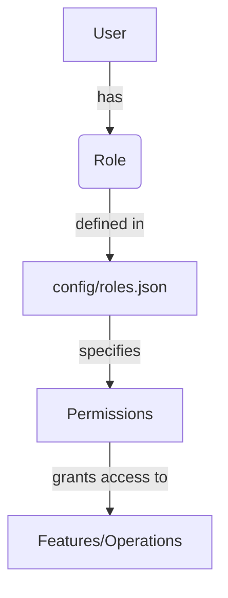
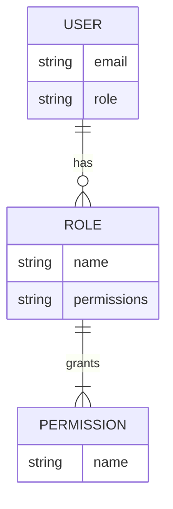

<details>
<summary>Relevant source files</summary>

The following files were used as context for generating this wiki page:

- [config/roles.json](https://github.com/aanickode/access-control-service/blob/main/config/roles.json)
- [src/models.js](https://github.com/aanickode/access-control-service/blob/main/src/models.js)
</details>

# Role Management

## Introduction

The Role Management system is a crucial component of the access control service, responsible for defining and managing user roles and their associated permissions within the application. It provides a structured way to grant or restrict access to various features and functionalities based on a user's assigned role. By leveraging this system, the application can effectively control and secure access to sensitive data or operations, ensuring that users only have the necessary privileges to perform their designated tasks.

## Role Definition

The roles and their corresponding permissions are defined in the `config/roles.json` file. This configuration file serves as a centralized location for managing the available roles and their associated permissions.

```json
{
  "admin": ["view_users", "create_role", "view_permissions"],
  "engineer": ["view_users", "view_permissions"],
  "analyst": ["view_users"]
}
```

Each key in the JSON object represents a role name, and its value is an array of strings representing the permissions granted to that role.

Sources: [config/roles.json](https://github.com/aanickode/access-control-service/blob/main/config/roles.json)

## Data Models

The application utilizes two primary data models: `User` and `Role`. These models are defined in the `src/models.js` file.

### User Model

```javascript
export const User = {
  email: 'string',
  role: 'string'
};
```

The `User` model represents a user in the system and consists of two properties:

- `email`: A string representing the user's email address.
- `role`: A string representing the user's assigned role.

Sources: [src/models.js:1-4](https://github.com/aanickode/access-control-service/blob/main/src/models.js#L1-L4)

### Role Model

```javascript
export const Role = {
  name: 'string',
  permissions: ['string']
};
```

The `Role` model represents a role in the system and consists of two properties:

- `name`: A string representing the name of the role.
- `permissions`: An array of strings representing the permissions associated with the role.

Sources: [src/models.js:6-9](https://github.com/aanickode/access-control-service/blob/main/src/models.js#L6-L9)

## Role Management Flow

The following diagram illustrates the high-level flow of role management within the access control service:



1. Each user in the system is assigned a specific role.
2. The roles and their associated permissions are defined in the `config/roles.json` configuration file.
3. The permissions specified for each role determine the features or operations that users with that role can access or perform.

Sources: [config/roles.json](https://github.com/aanickode/access-control-service/blob/main/config/roles.json), [src/models.js](https://github.com/aanickode/access-control-service/blob/main/src/models.js)

## Role-Based Access Control (RBAC)

The Role Management system implements a Role-Based Access Control (RBAC) model, where permissions are assigned to roles, and users are assigned specific roles. This approach simplifies the management of permissions and provides a more granular and scalable access control mechanism.



In this model:

- Users are assigned one or more roles.
- Roles are assigned one or more permissions.
- Permissions define the specific actions or operations that can be performed within the application.

By assigning users to appropriate roles and defining the permissions associated with each role, the application can effectively control and manage access to various features and functionalities.

Sources: [config/roles.json](https://github.com/aanickode/access-control-service/blob/main/config/roles.json), [src/models.js](https://github.com/aanickode/access-control-service/blob/main/src/models.js)

## Role Hierarchy

Based on the `config/roles.json` file, the following role hierarchy can be observed:

| Role     | Permissions                                |
|----------|---------------------------------------------|
| admin    | view_users, create_role, view_permissions  |
| engineer | view_users, view_permissions               |
| analyst  | view_users                                  |

The `admin` role has the highest level of permissions, granting access to view users, create roles, and view permissions. The `engineer` role has a subset of the `admin` permissions, allowing users to view users and permissions. The `analyst` role has the most restricted permissions, only allowing users to view users.

Sources: [config/roles.json](https://github.com/aanickode/access-control-service/blob/main/config/roles.json)

## Conclusion

The Role Management system is a critical component of the access control service, providing a structured and scalable approach to managing user permissions and access control within the application. By defining roles and their associated permissions, the system ensures that users only have access to the features and operations necessary for their designated tasks, enhancing security and reducing the risk of unauthorized access or actions.