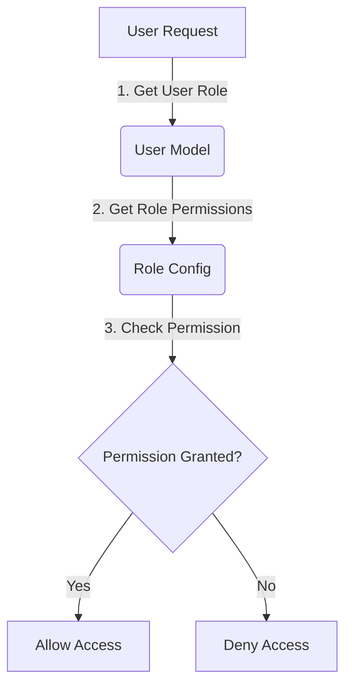
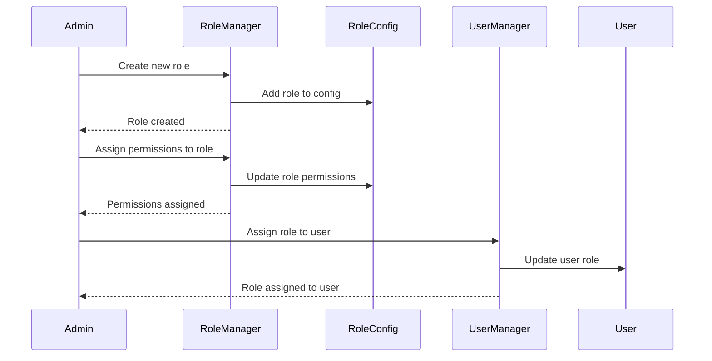

<details>
<summary>Relevant source files</summary>

The following files were used as context for generating this wiki page:

- [config/roles.json](https://github.com/aanickode/access-control-service/blob/main/config/roles.json)
- [src/models.js](https://github.com/aanickode/access-control-service/blob/main/src/models.js)
</details>

# Role Management

## Introduction

The Role Management feature within this project provides a way to define and manage user roles and their associated permissions. It allows for the creation of roles with specific sets of permissions, and the assignment of these roles to users. This feature is crucial for implementing access control and ensuring that users have the appropriate level of access to various parts of the system based on their roles.

Sources: [config/roles.json](), [src/models.js]()

## Data Models

### User Model

The `User` model represents a user in the system and has the following fields:

| Field | Type    | Description                  |
|-------|---------|------------------------------|
| email | string  | The user's email address     |
| role  | string  | The name of the user's role  |

Sources: [src/models.js:1-4]()

### Role Model

The `Role` model defines a role and its associated permissions:

| Field       | Type     | Description                                |
|-------------|----------|-------------------------------------------|
| name        | string   | The name of the role                      |
| permissions | string[] | An array of permission names for the role |

Sources: [src/models.js:6-9]()

## Role Configuration

The roles and their associated permissions are defined in the `config/roles.json` file. This file contains a JSON object where the keys represent role names, and the values are arrays of permission names.

```json
{
  "admin": ["view_users", "create_role", "view_permissions"],
  "engineer": ["view_users", "view_permissions"],
  "analyst": ["view_users"]
}
```

Sources: [config/roles.json]()

## Role Assignment

Users are assigned roles, which determine their access permissions within the system. The `role` field in the `User` model stores the name of the user's assigned role.

Sources: [src/models.js:2]()

## Permission Checking

To check if a user has a specific permission, the system likely retrieves the user's role from the `User` model, looks up the associated permissions for that role in the `config/roles.json` file, and checks if the requested permission is present in the role's permissions array.



Sources: [src/models.js](), [config/roles.json]()

## Role Management Workflow

The typical workflow for managing roles and permissions might involve the following steps:



Sources: [config/roles.json](), [src/models.js]()

## Conclusion

The Role Management feature in this project provides a way to define roles with specific permissions, assign these roles to users, and control access to various parts of the system based on the user's role. It follows a simple but effective approach by defining roles and their permissions in a configuration file, and using the user's assigned role to check for the required permissions.