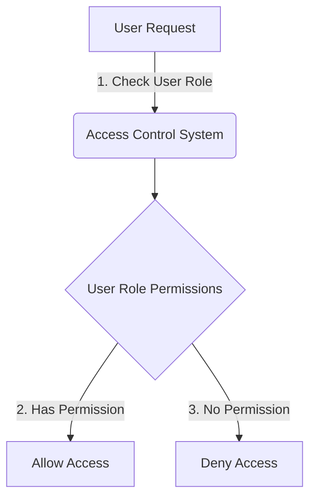

<details>
<summary>Relevant source files</summary>

The following files were used as context for generating this wiki page:

- [config/roles.json](https://github.com/aanickode/access-control-service/blob/main/config/roles.json)
- [src/models.js](https://github.com/aanickode/access-control-service/blob/main/src/models.js)
</details>

# Role Management

## Introduction

Role Management is a crucial component of the access control system in this project. It defines and manages the various roles available within the application, along with their associated permissions. Roles serve as a way to group and assign specific privileges to users, enabling fine-grained control over their access to different features or resources. This system ensures that users can only perform actions they are authorized for based on their assigned role.

Sources: [config/roles.json](), [src/models.js]()

## Role Definition

Roles are defined in the `config/roles.json` file, where each role is represented as a key-value pair. The key represents the role name, and the value is an array of permission strings associated with that role.

```json
{
  "admin": ["view_users", "create_role", "view_permissions"],
  "engineer": ["view_users", "view_permissions"],
  "analyst": ["view_users"]
}
```

This configuration defines three roles: `admin`, `engineer`, and `analyst`. The `admin` role has permissions to view users, create roles, and view permissions. The `engineer` role can view users and permissions, while the `analyst` role can only view users.

Sources: [config/roles.json]()

## Data Models

The project defines two data models related to Role Management: `User` and `Role`.

### User Model

```javascript
export const User = {
  email: 'string',
  role: 'string'
};
```

The `User` model has two properties:

- `email`: A string representing the user's email address.
- `role`: A string representing the user's assigned role.

Sources: [src/models.js:1-4]()

### Role Model

```javascript
export const Role = {
  name: 'string',
  permissions: ['string']
};
```

The `Role` model has two properties:

- `name`: A string representing the name of the role.
- `permissions`: An array of strings representing the permissions associated with the role.

Sources: [src/models.js:6-9]()

## Role Assignment

To assign a role to a user, the `role` property of the `User` model should be set to the desired role name defined in the `config/roles.json` file.

```javascript
const newUser = {
  email: 'john@example.com',
  role: 'admin' // Assign the 'admin' role
};
```

Once a user is assigned a role, they will inherit all the permissions associated with that role, as defined in the `config/roles.json` file.

Sources: [src/models.js:1-4](), [config/roles.json]()

## Role-based Access Control (RBAC)

The Role Management system is designed to facilitate Role-based Access Control (RBAC) within the application. RBAC is a security model that restricts access to resources based on the roles assigned to users.

When a user attempts to perform an action or access a resource, the application should check the user's assigned role and verify if the corresponding permissions are present in the `config/roles.json` file. If the user's role has the required permission, the action is allowed; otherwise, it is denied.



This diagram illustrates the high-level flow of the RBAC system. When a user makes a request (1), the Access Control System checks the user's assigned role (2). Based on the permissions associated with the user's role (3), access is either allowed or denied.

Sources: [config/roles.json](), [src/models.js]()

## Permission Management

Permissions are defined and managed within the `config/roles.json` file. Each permission is represented as a string value in the array associated with a role.

```json
{
  "admin": ["view_users", "create_role", "view_permissions"],
  // ...
}
```

In this example, the `admin` role has three permissions: `view_users`, `create_role`, and `view_permissions`.

To add a new permission, you can modify the `config/roles.json` file and include the new permission string in the appropriate role's array.

To remove a permission, you can remove the corresponding permission string from the role's array in the `config/roles.json` file.

Sources: [config/roles.json]()

## Role Management Operations

The Role Management system may include operations for creating, updating, and deleting roles. However, the provided source files do not contain implementation details for these operations. If such functionality is required, it would need to be implemented separately and documented accordingly.

## Conclusion

The Role Management system in this project provides a structured way to define and manage roles, permissions, and their assignments to users. It enables fine-grained access control by allowing users to perform only the actions they are authorized for based on their assigned role. By leveraging the Role-based Access Control (RBAC) model, the application can ensure secure and controlled access to its features and resources.