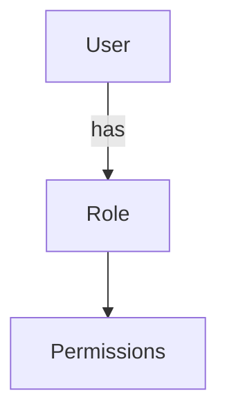
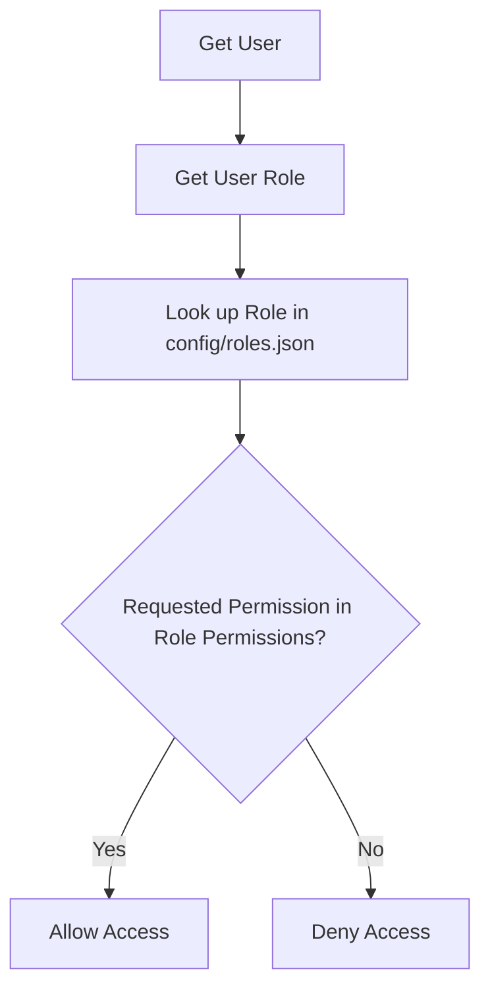

<details>
<summary>Relevant source files</summary>

The following files were used as context for generating this wiki page:

- [config/roles.json](https://github.com/aanickode/access-control-service/blob/main/config/roles.json)
- [src/models.js](https://github.com/aanickode/access-control-service/blob/main/src/models.js)
</details>

# Role Management

## Introduction

The Role Management system within this project provides a way to define and manage user roles and their associated permissions. It allows for the creation of roles with specific sets of permissions, and the assignment of these roles to individual users. This system serves as a foundational component for implementing access control and authorization mechanisms within the application.

Sources: [config/roles.json](), [src/models.js]()

## Data Models

### User Model

The `User` model represents an individual user within the system. It consists of the following fields:

| Field | Type    | Description                    |
|-------|---------|--------------------------------|
| email | string  | The user's email address       |
| role  | string  | The name of the role assigned to the user |

Sources: [src/models.js:1-4]()

### Role Model

The `Role` model defines a set of permissions that can be assigned to users. It has the following fields:

| Field       | Type     | Description                    |
|-------------|----------|--------------------------------|
| name        | string   | The name of the role           |
| permissions | string[] | An array of permission strings associated with the role |

Sources: [src/models.js:6-9]()

## Role Configuration

The roles and their associated permissions are defined in the `config/roles.json` file. This file contains a JSON object where the keys represent role names, and the values are arrays of permission strings.

```json
{
  "admin": ["view_users", "create_role", "view_permissions"],
  "engineer": ["view_users", "view_permissions"],
  "analyst": ["view_users"]
}
```

Sources: [config/roles.json]()

## Role Assignment

Users are assigned roles through the `role` field in the `User` model. This field should match one of the role names defined in the `config/roles.json` file.



Sources: [src/models.js:2,8](), [config/roles.json]()

## Permission Checking

To check if a user has a specific permission, the system needs to:

1. Retrieve the user's role from the `User` model.
2. Look up the role in the `config/roles.json` file.
3. Check if the requested permission is present in the array of permissions for that role.



Sources: [src/models.js](), [config/roles.json]()

## Conclusion

The Role Management system provides a flexible and extensible way to manage user permissions within the application. By defining roles and their associated permissions in a centralized configuration file, and assigning these roles to users, the system can effectively control access to various features and functionalities based on the user's role. This approach promotes code reusability, maintainability, and scalability, as new roles and permissions can be easily added or modified without changing the core application logic.