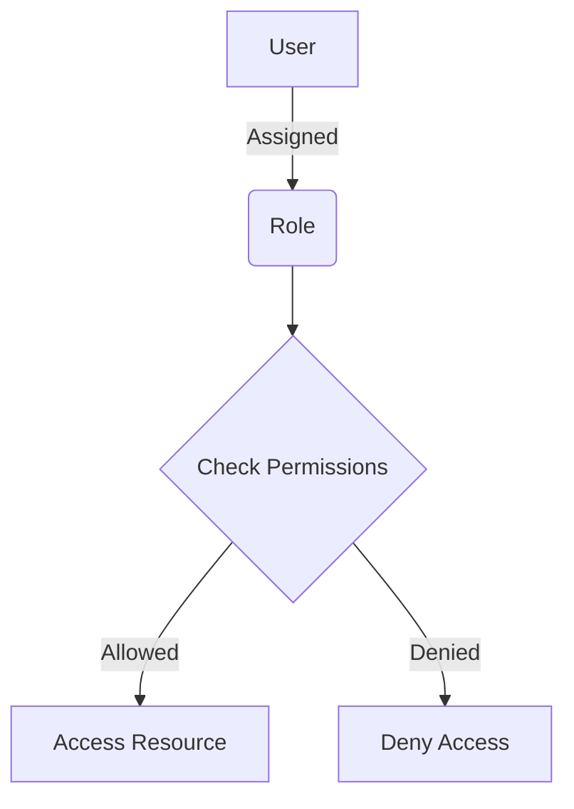

<details>
<summary>Relevant source files</summary>

The following files were used as context for generating this wiki page:

- [config/roles.json](https://github.com/aanickode/access-control-service/blob/main/config/roles.json)
- [src/models.js](https://github.com/aanickode/access-control-service/blob/main/src/models.js)
</details>

# Role Management

## Introduction

The Role Management feature within this project provides a way to define and manage user roles and their associated permissions. It allows for the creation of roles with specific sets of permissions, and the assignment of these roles to users. This feature is crucial for implementing access control and ensuring that users have the appropriate level of access to various parts of the system based on their roles.

Sources: [config/roles.json](), [src/models.js]()

## Role Definition

Roles are defined in the `config/roles.json` file, where each role is represented as a key-value pair. The key represents the role name, and the value is an array of permission strings.

```json
{
  "admin": ["view_users", "create_role", "view_permissions"],
  "engineer": ["view_users", "view_permissions"],
  "analyst": ["view_users"]
}
```

This configuration defines three roles: `admin`, `engineer`, and `analyst`. The `admin` role has permissions to view users, create roles, and view permissions. The `engineer` role can view users and permissions, while the `analyst` role can only view users.

Sources: [config/roles.json]()

## Data Models

The project defines two data models related to role management: `User` and `Role`.

### User Model

```javascript
export const User = {
  email: 'string',
  role: 'string'
};
```

The `User` model has two properties:

- `email`: A string representing the user's email address.
- `role`: A string representing the user's assigned role.

Sources: [src/models.js:1-4]()

### Role Model

```javascript
export const Role = {
  name: 'string',
  permissions: ['string']
};
```

The `Role` model has two properties:

- `name`: A string representing the name of the role.
- `permissions`: An array of strings representing the permissions associated with the role.

Sources: [src/models.js:6-9]()

## Role Assignment

Based on the provided source files, it is not clear how roles are assigned to users or how the role-based access control is implemented. However, the `User` model includes a `role` property, suggesting that each user is associated with a specific role.

Sources: [src/models.js:3]()

## Role Management Flow

The following diagram illustrates a potential flow for role management within the system:



1. A user is assigned a specific role.
2. When the user attempts to access a resource, the system checks the permissions associated with the user's role.
3. If the user's role has the required permission, access to the resource is granted.
4. If the user's role does not have the required permission, access is denied.

Sources: [config/roles.json](), [src/models.js]()

## Potential Improvements

Based on the provided source files, the following potential improvements could be considered:

1. **Role Hierarchy**: Implement a role hierarchy to support inheritance of permissions from higher-level roles. This would allow for more granular permission management and easier maintenance of roles.

2. **Dynamic Role Assignment**: Implement a mechanism to dynamically assign roles to users based on certain conditions or rules, rather than hardcoding the role assignments.

3. **Role-based Access Control Implementation**: Provide implementation details or examples of how the role-based access control is enforced within the application, such as middleware or decorators that check user roles and permissions before allowing access to certain routes or resources.

4. **Role Management API**: Consider exposing an API or user interface for managing roles and permissions, allowing administrators to create, update, and delete roles, as well as assign or revoke permissions from roles.

5. **Role Auditing and Logging**: Implement logging and auditing mechanisms to track changes to roles, permissions, and user role assignments for security and compliance purposes.

These improvements would enhance the functionality, flexibility, and maintainability of the Role Management feature within the project.

Sources: [config/roles.json](), [src/models.js]()

## Conclusion

The Role Management feature in this project provides a way to define roles with specific permissions and assign those roles to users. It is a crucial component for implementing access control and ensuring that users have the appropriate level of access to various parts of the system based on their roles. While the provided source files give a basic understanding of the feature, there is potential for further enhancements and improvements to make it more robust and flexible.