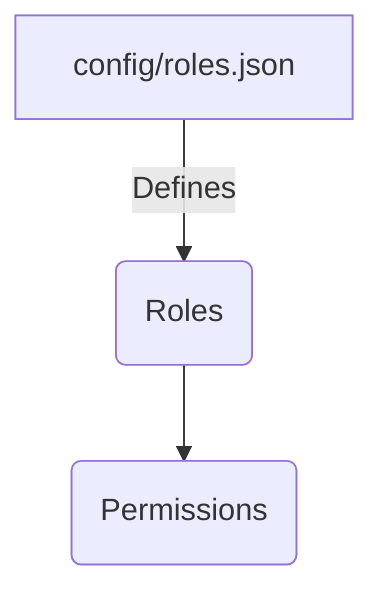
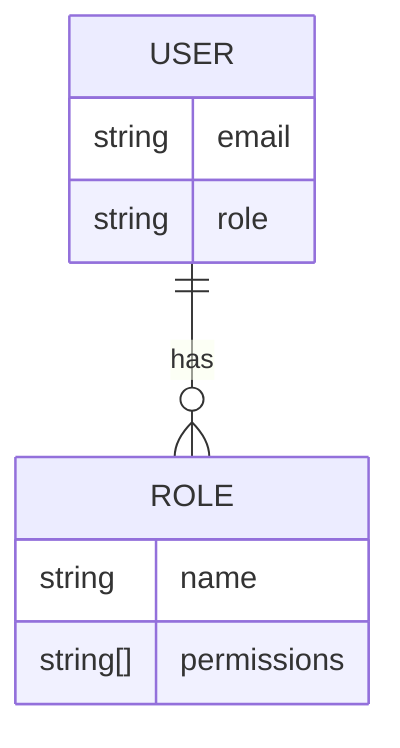
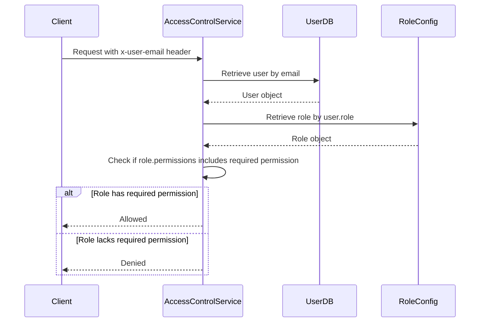

<details>
<summary>Relevant source files</summary>

The following files were used as context for generating this wiki page:

- [config/roles.json](https://github.com/aanickode/access-control-service/blob/main/config/roles.json)
- [src/models.js](https://github.com/aanickode/access-control-service/blob/main/src/models.js)
- [docs/permissions.md](https://github.com/aanickode/access-control-service/blob/main/docs/permissions.md)

</details>

# Role and Permission Management

## Introduction

The Role and Permission Management system is a crucial component of the access-control-service project, responsible for managing user roles and their associated permissions. It ensures that users have appropriate access levels based on their assigned roles, enabling secure and controlled access to various resources and functionalities within the system.

The system follows a Role-Based Access Control (RBAC) model, where permissions are granted to roles, and users are assigned one or more roles. This approach simplifies the management of permissions by grouping them into logical roles, making it easier to assign and revoke access privileges as needed.

## Role Management

The roles and their associated permissions are defined in the `config/roles.json` file. This file serves as the central configuration for the RBAC system, allowing administrators to easily manage and update roles and their corresponding permissions.



The `config/roles.json` file contains a JSON object where the keys represent role names, and the values are arrays of permission strings. For example:

```json
{
  "admin": ["view_users", "create_role", "view_permissions"],
  "engineer": ["view_users", "view_permissions"],
  "analyst": ["view_users"]
}
```

Sources: [config/roles.json](https://github.com/aanickode/access-control-service/blob/main/config/roles.json)

### Default Roles

The system comes with three predefined roles:

| Role     | Permissions                                  | Description                                    |
|----------|-----------------------------------------------|------------------------------------------------|
| admin    | view_users, create_role, view_permissions    | Full system access for platform and DevOps teams |
| engineer | view_users, view_permissions                 | Read-only access for observability and debugging |
| analyst  | view_users                                   | Basic read-only access for data/reporting use cases |

Sources: [docs/permissions.md](https://github.com/aanickode/access-control-service/blob/main/docs/permissions.md)

## User Management

The `src/models.js` file defines the data model for users and roles within the system. Each user has an `email` and a `role` property, where the `role` corresponds to one of the roles defined in `config/roles.json`.



Sources: [src/models.js](https://github.com/aanickode/access-control-service/blob/main/src/models.js)

## Permission Enforcement

The access-control-service enforces permissions on a per-route basis. Each route defines the required permission(s) to access it, and these permissions are checked at runtime against the user's assigned role.



For a request to be considered valid, it must:

1. Include the `x-user-email` header
2. Match a known user in the in-memory `db.users` map
3. Have a role that includes the required permission for the requested route

Sources: [docs/permissions.md](https://github.com/aanickode/access-control-service/blob/main/docs/permissions.md)

## Adding a New Role

To add a new role to the system, follow these steps:

1. Edit the `config/roles.json` file and define the new role with its associated permissions:

```json
{
  "support": ["view_users"]
}
```

2. Assign the new role to a user using the provided CLI tool:

```bash
node cli/manage.js assign-role support@company.com support
```

3. Ensure that consuming services request the appropriate permissions when making requests to the access-control-service.

Sources: [docs/permissions.md](https://github.com/aanickode/access-control-service/blob/main/docs/permissions.md)

## Limitations and Future Enhancements

The current implementation of the Role and Permission Management system has the following limitations:

- All permission checks are flat; no wildcarding or nesting is supported.
- All user-role mappings are stored in-memory, which may not be suitable for large-scale deployments.
- Changes to the `roles.json` configuration file require a service restart to take effect.

To address these limitations and enhance the system's capabilities, the following improvements are suggested:

- Implement scoped permissions (e.g., `project:view:marketing`) to provide more granular access control.
- Integrate with a Single Sign-On (SSO) system to leverage group claims for role assignments.
- Introduce audit logging for role changes and access attempts to improve security and compliance.

Sources: [docs/permissions.md](https://github.com/aanickode/access-control-service/blob/main/docs/permissions.md)

## Conclusion

The Role and Permission Management system is a critical component of the access-control-service project, enabling secure and controlled access to resources based on user roles and associated permissions. By following the RBAC model, the system simplifies the management of permissions and provides a flexible and scalable approach to access control. While the current implementation has some limitations, the proposed future enhancements will further enhance the system's capabilities and address potential scalability and security concerns.