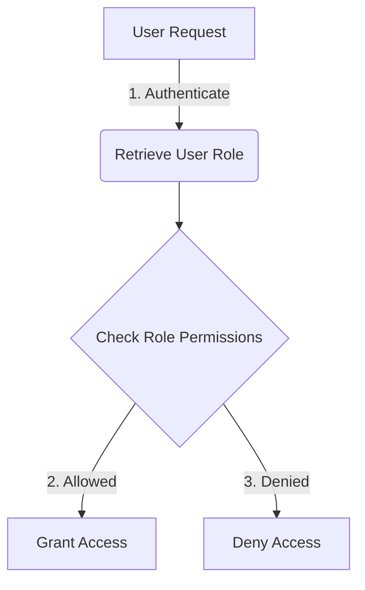

<details>
<summary>Relevant source files</summary>

The following files were used as context for generating this wiki page:

- [src/db.js](https://github.com/aanickode/access-control-service/blob/main/src/db.js)
- [src/models.js](https://github.com/aanickode/access-control-service/blob/main/src/models.js)
</details>

# Data Storage and Access

## Introduction

The "Data Storage and Access" component within this project is responsible for managing user data and role-based access control. It provides a centralized data store for user accounts and their associated roles, as well as the permissions granted to each role. This component serves as the foundation for implementing authentication and authorization mechanisms throughout the application.

## Data Models

### User Model

The `User` model represents a user account within the system. It consists of the following fields:

```javascript
export const User = {
  email: 'string',
  role: 'string'
};
```

- `email` (string): The unique email address associated with the user account.
- `role` (string): The role assigned to the user, which determines their access permissions.

Sources: [src/models.js:1-4]()

### Role Model

The `Role` model defines the permissions and access levels granted to different user roles within the application.

```javascript
export const Role = {
  name: 'string',
  permissions: ['string']
};
```

- `name` (string): The name or identifier of the role.
- `permissions` (array of strings): A list of permissions granted to users with this role.

Sources: [src/models.js:6-9]()

## Data Storage

The project uses an in-memory data store implemented as a JavaScript object called `db`. This data store holds the user accounts and role definitions.

```javascript
const db = {
  users: {
    'admin@internal.company': 'admin',
    'analyst@internal.company': 'analyst',
  },
  roles: roles
};
```

- `db.users`: An object that maps user email addresses to their respective role names.
- `db.roles`: An object containing the role definitions, imported from a JSON file (`roles.json`).

Sources: [src/db.js:3-9]()

### Role Definitions

The role definitions are stored in a JSON file (`roles.json`) and imported into the `db` object. The structure and content of this file are not provided in the given source files.

## Access Control Flow

Based on the provided source files, the access control flow within the application likely follows these steps:

1. A user attempts to access a resource or perform an action within the application.
2. The application retrieves the user's email and associated role from the `db.users` object.
3. The application looks up the role definition in the `db.roles` object to determine the permissions granted to that role.
4. Based on the user's role and permissions, the application either allows or denies access to the requested resource or action.



Sources: [src/db.js](), [src/models.js]()

## Limitations and Considerations

Based on the provided source files, the following limitations and considerations should be noted:

- The data store is an in-memory object, which means data will be lost upon application restart or server reboot. A persistent data storage solution (e.g., a database) would be required for production use.
- The user accounts and role definitions are hardcoded in the source files. A more scalable solution would involve loading user data from a database or external source and providing an interface for managing roles and permissions.
- The provided source files do not include any implementation details for authentication, authorization, or access control mechanisms. Additional components and logic would be required to handle user authentication, session management, and enforcing access control based on the user's role and permissions.

## Summary

The "Data Storage and Access" component within this project provides a basic in-memory data store for managing user accounts, roles, and permissions. It serves as a foundation for implementing role-based access control mechanisms within the application. However, the provided source files do not include the complete implementation details for authentication, authorization, and access control logic. Additional components and integration with persistent data storage would be required for a production-ready solution.