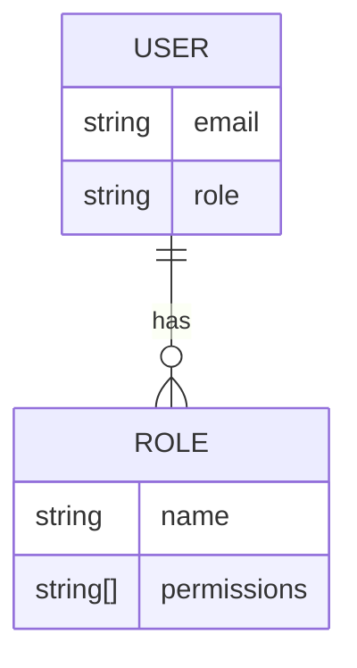
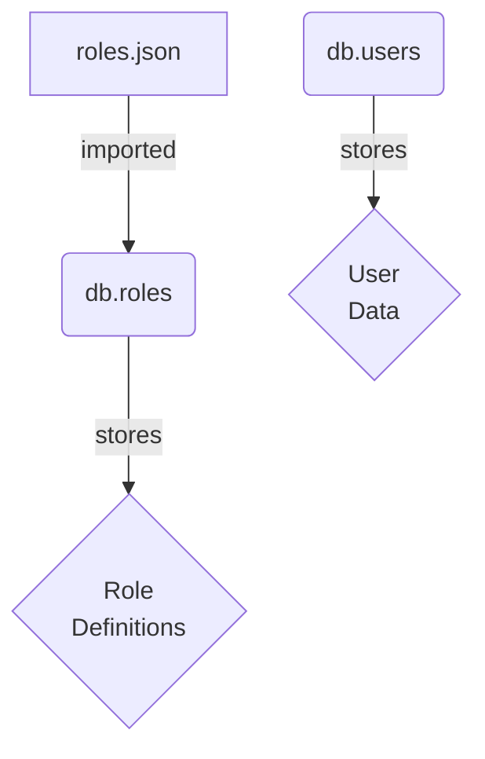

<details>
<summary>Relevant source files</summary>

The following files were used as context for generating this wiki page:

- [src/db.js](https://github.com/aanickode/access-control-service/blob/main/src/db.js)
- [src/models.js](https://github.com/aanickode/access-control-service/blob/main/src/models.js)
</details>

# Data Storage and Access

## Introduction

This section covers the data storage and access mechanisms within the project. It appears to be a simple in-memory data store implementation for managing users, their roles, and associated permissions. The data is stored in JavaScript objects, with one object representing the user data (`db.users`) and another representing the role definitions (`db.roles`).

Sources: [src/db.js](), [src/models.js]()

## Data Models

### User Model

The `User` model represents a user entity within the system. It has the following fields:

| Field | Type    | Description |
|-------|---------|-------------|
| email | string  | The user's email address, which serves as the unique identifier. |
| role  | string  | The name of the role assigned to the user. |

Sources: [src/models.js:1-4]()

### Role Model

The `Role` model defines a role within the system, which is associated with a set of permissions. It has the following fields:

| Field       | Type     | Description |
|-------------|----------|-------------|
| name        | string   | The name of the role. |
| permissions | string[] | An array of permission strings associated with the role. |

Sources: [src/models.js:6-9]()

## Data Storage

The project uses a simple in-memory data store implemented as a JavaScript object called `db`. This object has two properties:

1. `users`: An object that stores user data, where the keys are email addresses, and the values are the corresponding role names.
2. `roles`: An object that stores role definitions, imported from a JSON file (`roles.json`). The structure of this object is not shown in the provided source files.

```javascript
const db = {
  users: {
    'admin@internal.company': 'admin',
    'analyst@internal.company': 'analyst',
  },
  roles: roles
};
```

Sources: [src/db.js:3-9]()

The `roles.json` file is imported using the `import` statement with the `assert` clause, which ensures that the imported data is treated as JSON.

```javascript
import roles from '../config/roles.json' assert { type: 'json' };
```

Sources: [src/db.js:1]()

## Data Access

The source files provided do not contain any implementation details for accessing or modifying the data stored in the `db` object. It is likely that other parts of the codebase (not included in the provided files) handle data access and manipulation operations.

Sources: N/A

## Mermaid Diagrams

### Data Model Diagram



This diagram represents the data models for `User` and `Role` entities, as well as their relationship. A `User` has a one-to-one relationship with a `Role`, indicating that each user is assigned a single role.

Sources: [src/models.js]()

### Data Storage Diagram



This diagram illustrates the data storage structure within the project. The `roles.json` file is imported and stored in the `db.roles` object. The `db.users` object stores user data, where each user is associated with a role name. The role definitions themselves are stored in the `db.roles` object.

Sources: [src/db.js]()

## Conclusion

This wiki page covered the data storage and access mechanisms within the project. The project uses a simple in-memory data store implemented as a JavaScript object called `db`. The `db` object stores user data and role definitions, with users being associated with specific roles. The data models for `User` and `Role` entities were explained, along with their relationships. Mermaid diagrams were used to visually represent the data models and the data storage structure.