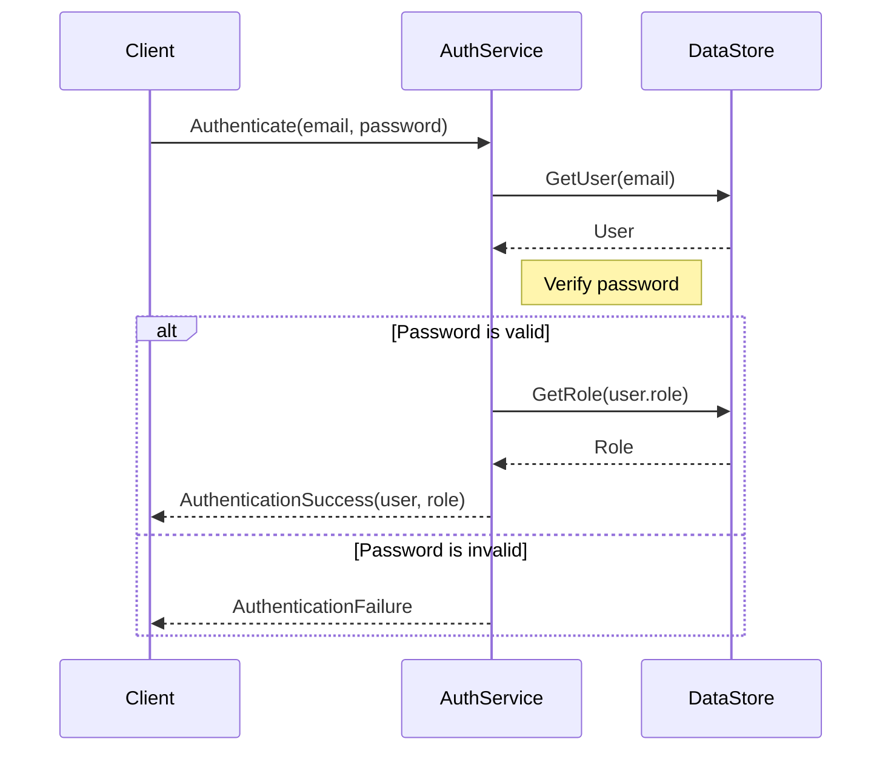

<details>
<summary>Relevant source files</summary>

The following files were used as context for generating this wiki page:

- [src/db.js](https://github.com/aanickode/access-control-service/blob/main/src/db.js)
- [src/models.js](https://github.com/aanickode/access-control-service/blob/main/src/models.js)
</details>

# Data Storage and Access

## Introduction

The "Data Storage and Access" component within this project is responsible for managing user data and role-based access control. It provides a simple in-memory data store for storing user information and role definitions, as well as a set of models that define the structure of user and role data.

This component serves as the foundation for implementing authentication and authorization mechanisms within the application, ensuring that users have the appropriate permissions to access and perform various actions based on their assigned roles.

## Data Models

The project defines two main data models: `User` and `Role`. These models are defined in the `src/models.js` file.

### User Model

The `User` model represents a user entity within the system. It has the following properties:

```javascript
export const User = {
  email: 'string',
  role: 'string'
};
```

- `email` (string): The email address of the user, which serves as a unique identifier.
- `role` (string): The name of the role assigned to the user, which determines the user's permissions.

Sources: [src/models.js:1-4]()

### Role Model

The `Role` model defines the structure of a role within the system. It has the following properties:

```javascript
export const Role = {
  name: 'string',
  permissions: ['string']
};
```

- `name` (string): The name of the role, which is used to associate users with specific permissions.
- `permissions` (array of strings): An array of permission strings that define the actions or resources that users with this role can access.

Sources: [src/models.js:6-9]()

## Data Storage

The project uses an in-memory data store to store user and role data. The data store is defined in the `src/db.js` file.

```javascript
import roles from '../config/roles.json' assert { type: 'json' };

const db = {
  users: {
    'admin@internal.company': 'admin',
    'analyst@internal.company': 'analyst',
  },
  roles: roles
};

export default db;
```

The `db` object has two properties:

- `users`: An object that maps user email addresses to their respective role names.
- `roles`: An object that contains the role definitions imported from a JSON file (`roles.json`).

The `roles.json` file is not provided in the given source files, so its contents cannot be described in this documentation.

Sources: [src/db.js:1-11]()

## Data Access

The project likely provides functions or modules to interact with the in-memory data store and retrieve user and role information. However, since no additional source files were provided, the specific implementation details of data access cannot be documented here.

## Sequence Diagram: User Authentication and Authorization



This sequence diagram illustrates a hypothetical flow for user authentication and authorization within the system:

1. The client initiates the authentication process by sending the user's email and password to the `AuthService`.
2. The `AuthService` retrieves the user data from the `DataStore` based on the provided email.
3. The `AuthService` verifies the provided password against the user's stored password (not shown in the provided source files).
4. If the password is valid, the `AuthService` retrieves the user's role information from the `DataStore`.
5. The `AuthService` returns the authenticated user and their associated role to the client.
6. If the password is invalid, the `AuthService` returns an authentication failure to the client.

Note: This diagram is based on a hypothetical scenario, as the provided source files do not contain implementation details for authentication and authorization.

Sources: [src/db.js](), [src/models.js]()

## Conclusion

The "Data Storage and Access" component in this project provides a simple in-memory data store for managing user and role data. It defines data models for users and roles, and stores user information and role definitions in memory. While the provided source files do not include implementation details for data access or authentication/authorization logic, this component serves as the foundation for implementing access control mechanisms within the application.