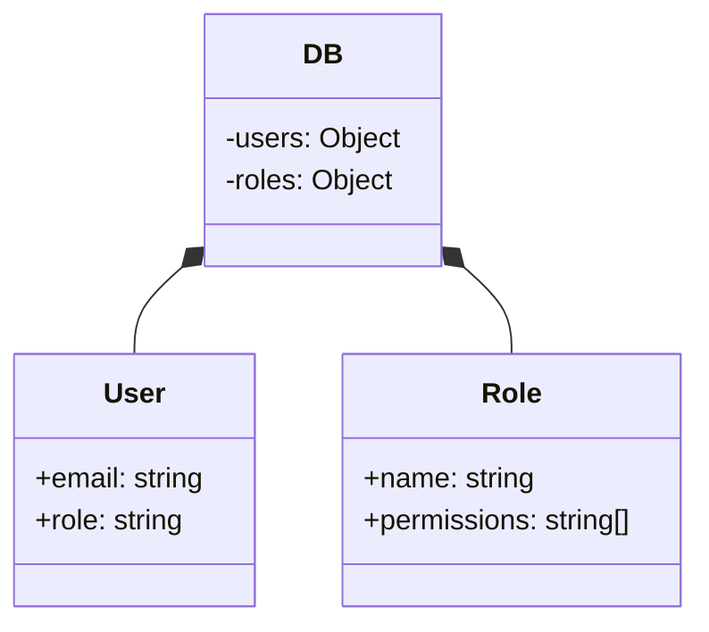

<details>
<summary>Relevant source files</summary>

The following files were used as context for generating this wiki page:

- [src/db.js](https://github.com/aanickode/access-control-service/blob/main/src/db.js)
- [src/models.js](https://github.com/aanickode/access-control-service/blob/main/src/models.js)
</details>

# Data Storage and Access

## Introduction

The "Data Storage and Access" component within this project is responsible for managing user data and role-based access control. It defines the data models for users and roles, and provides a simple in-memory data store for storing and retrieving this information.

Sources: [src/db.js](), [src/models.js]()

## Data Models

### User Model

The `User` model represents a user entity within the system. It has the following fields:

| Field | Type    | Description                   |
|-------|---------|-------------------------------|
| email | string  | The user's email address      |
| role  | string  | The name of the user's role   |

Sources: [src/models.js:1-4]()

### Role Model

The `Role` model defines a role with associated permissions. It consists of the following fields:

| Field       | Type     | Description                                |
|-------------|----------|-------------------------------------------|
| name        | string   | The name of the role                      |
| permissions | string[] | An array of permission strings for the role |

Sources: [src/models.js:6-9]()

## Data Storage

The project uses an in-memory data store implemented as a JavaScript object called `db`. This data store contains two properties:

1. `users`: An object that maps user email addresses to their respective roles.
2. `roles`: An object that maps role names to their corresponding `Role` objects, which define the permissions associated with each role.



The `users` object is initialized with two hardcoded user entries:

```javascript
const db = {
  users: {
    'admin@internal.company': 'admin',
    'analyst@internal.company': 'analyst',
  },
  // ...
};
```

Sources: [src/db.js:3-7]()

The `roles` object is imported from a JSON configuration file (`roles.json`), which defines the available roles and their associated permissions.

```javascript
import roles from '../config/roles.json' assert { type: 'json' };

const db = {
  // ...
  roles: roles
};
```

Sources: [src/db.js:1,10]()

## Access Control

Based on the provided source files, there is no explicit implementation of access control logic or permission checking. However, the data models and data store suggest that this project is designed to support role-based access control (RBAC).

In an RBAC system, permissions are assigned to roles, and users are assigned one or more roles. Access to resources or functionality is then granted or denied based on the user's assigned roles and the permissions associated with those roles.

While the current implementation does not include any access control logic, the data models and data store provide the necessary foundation for implementing RBAC functionality in the future.

Sources: [src/db.js](), [src/models.js]()

## Conclusion

The "Data Storage and Access" component in this project defines the data models for users and roles, and provides a simple in-memory data store for storing and retrieving this information. The data models and data store are designed to support role-based access control (RBAC), although the implementation of access control logic is not included in the provided source files.