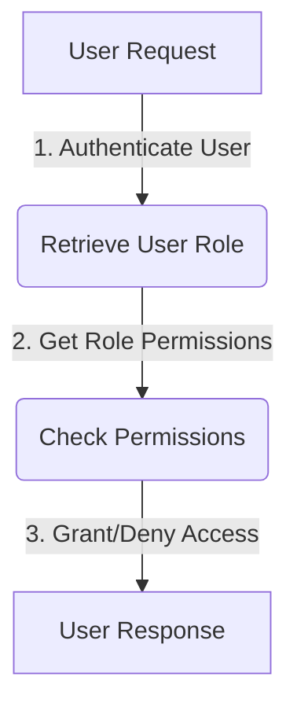

<details>
<summary>Relevant source files</summary>

The following files were used as context for generating this wiki page:

- [src/db.js](https://github.com/aanickode/access-control-service/blob/main/src/db.js)
- [src/models.js](https://github.com/aanickode/access-control-service/blob/main/src/models.js)
</details>

# Data Storage and Access

## Introduction

The "Data Storage and Access" component within this project is responsible for managing user data and role-based access control. It defines the data models for users and roles, and provides a simple in-memory data store for storing and retrieving this information.

Sources: [src/db.js](), [src/models.js]()

## Data Models

### User Model

The `User` model represents a user entity within the system. It has the following properties:

```javascript
export const User = {
  email: 'string',
  role: 'string'
};
```

- `email` (string): The email address of the user, which serves as a unique identifier.
- `role` (string): The name of the role assigned to the user, which determines their access permissions.

Sources: [src/models.js:1-4]()

### Role Model

The `Role` model defines the access permissions associated with a particular role. It has the following properties:

```javascript
export const Role = {
  name: 'string',
  permissions: ['string']
};
```

- `name` (string): The name of the role, which is used to associate users with a specific set of permissions.
- `permissions` (array of strings): A list of permission strings that define the access rights granted to users with this role.

Sources: [src/models.js:6-9]()

## Data Storage

The project uses an in-memory data store implemented as a JavaScript object called `db`. This data store contains two main properties:

1. `users`: An object that maps user email addresses to their respective roles.
2. `roles`: An object that maps role names to their corresponding `Role` objects, which define the permissions for each role.

```javascript
const db = {
  users: {
    'admin@internal.company': 'admin',
    'analyst@internal.company': 'analyst',
  },
  roles: roles
};
```

The `roles` object is imported from a JSON configuration file (`roles.json`), which likely defines the available roles and their associated permissions.

Sources: [src/db.js:1-10]()

## Access Control Flow

The access control flow within this project likely involves the following steps:



1. When a user makes a request, the system authenticates the user's identity (e.g., by verifying their email and password).
2. Once authenticated, the system retrieves the user's role from the `users` object in the `db` data store.
3. Using the retrieved role, the system looks up the associated permissions in the `roles` object.
4. Based on the user's permissions, the system grants or denies access to the requested resource or functionality.
5. The user receives a response indicating whether their request was successful or denied due to insufficient permissions.

Sources: [src/db.js](), [src/models.js]()

Note that this is a simplified representation of the access control flow, and the actual implementation may involve additional steps or complexities not evident from the provided source files.