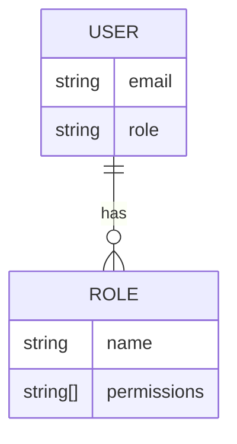

<details>
<summary>Relevant source files</summary>

The following files were used as context for generating this wiki page:

- [src/db.js](https://github.com/aanickode/access-control-service/blob/main/src/db.js)
- [src/models.js](https://github.com/aanickode/access-control-service/blob/main/src/models.js)
</details>

# Data Storage and Access

## Introduction

This section covers the data storage and access mechanisms within the project. It appears to be a simple in-memory data store for managing users, their roles, and associated permissions. The data is stored in a JavaScript object, which serves as a rudimentary database.

Sources: [src/db.js](), [src/models.js]()

## Data Models

The project defines two main data models: `User` and `Role`.

### User Model

The `User` model represents a user entity with the following properties:

```javascript
export const User = {
  email: 'string',
  role: 'string'
};
```

- `email` (string): The email address of the user, which serves as a unique identifier.
- `role` (string): The name of the role assigned to the user, which determines their permissions.

Sources: [src/models.js:1-4]()

### Role Model

The `Role` model represents a role entity with the following properties:

```javascript
export const Role = {
  name: 'string',
  permissions: ['string']
};
```

- `name` (string): The name of the role, which is used to associate users with a specific set of permissions.
- `permissions` (array of strings): A list of permission strings granted to users with this role.

Sources: [src/models.js:6-9]()

## Data Storage

The project uses a simple in-memory data store implemented as a JavaScript object called `db`. This object contains two properties: `users` and `roles`.

```javascript
const db = {
  users: {
    'admin@internal.company': 'admin',
    'analyst@internal.company': 'analyst',
  },
  roles: roles
};
```

- `users` (object): An object that maps user email addresses (keys) to their respective role names (values).
- `roles` (object): An object containing role definitions, imported from a JSON file (`roles.json`).

Sources: [src/db.js:3-10]()

### Role Definitions

The role definitions are stored in a separate JSON file (`roles.json`) and imported into the `db` object. The structure of this file is not provided in the given source files.

Sources: [src/db.js:1]()

## Data Access

The source files provided do not include any code for accessing or manipulating the data store. It is likely that other parts of the project import the `db` object and interact with it directly to perform operations such as:

- Authenticating users based on their email and role
- Retrieving user roles and associated permissions
- Potentially modifying or adding new users and roles (not shown in the provided files)

Without additional source files related to data access and manipulation, it is not possible to provide further details on how the data store is utilized within the project.

Sources: [src/db.js](), [src/models.js]()

## Mermaid Diagrams

### Data Model Diagram



This entity-relationship diagram illustrates the relationship between the `User` and `Role` models. A user has a single role, while a role can be associated with multiple users. The role defines the set of permissions granted to its associated users.

Sources: [src/models.js]()

### Data Storage Structure

```mermaid
graph TD
    subgraph Database
        users[Users]
        roles[Roles]
    end
    
    config[roles.json] --> roles
    
    users --> |1| user1[admin@internal.company]
    users --> |2| user2[analyst@internal.company]
    
    user1 --> |role| admin[admin]
    user2 --> |role| analyst[analyst]
    
    admin -.- roles
    analyst -.- roles
```

This diagram depicts the structure of the in-memory data store (`db`). The `users` object maps user email addresses to their respective role names. The `roles` object contains role definitions imported from the `roles.json` file. Each user is associated with a specific role, which in turn defines the set of permissions granted to that user.

Sources: [src/db.js]()

## Summary

This wiki page covered the data storage and access mechanisms within the project. The project uses a simple in-memory data store implemented as a JavaScript object to manage users, their roles, and associated permissions. The data models include `User` and `Role` entities, with users being assigned a single role that determines their permissions. The data store structure and relationships were illustrated using Mermaid diagrams. However, the provided source files do not include any code for accessing or manipulating the data store, so further details on data access operations could not be provided.