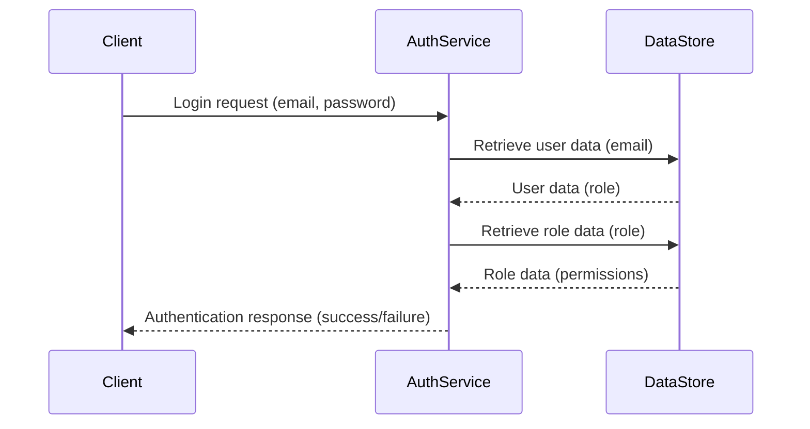

<details>
<summary>Relevant source files</summary>

The following files were used as context for generating this wiki page:

- [src/db.js](https://github.com/aanickode/access-control-service/blob/main/src/db.js)
- [src/models.js](https://github.com/aanickode/access-control-service/blob/main/src/models.js)
</details>

# Data Storage and Access

## Introduction

The "Data Storage and Access" component of this project is responsible for managing user data and role-based access control. It provides a centralized data store for user accounts and their associated roles, as well as the permissions granted to each role. This component serves as the foundation for implementing authentication and authorization mechanisms within the application.

## Data Models

### User Model

The `User` model represents a user account within the system. It consists of the following properties:

```javascript
export const User = {
  email: 'string',
  role: 'string'
};
```

- `email` (string): The email address associated with the user account, which serves as a unique identifier.
- `role` (string): The role assigned to the user, which determines their access permissions.

Sources: [src/models.js:1-4]()

### Role Model

The `Role` model defines the permissions and capabilities associated with a particular role within the system:

```javascript
export const Role = {
  name: 'string',
  permissions: ['string']
};
```

- `name` (string): The name or identifier of the role.
- `permissions` (array of strings): A list of permissions granted to users with this role.

Sources: [src/models.js:6-9]()

## Data Storage

The project uses an in-memory data store implemented in the `db.js` file. This data store holds the user accounts and role definitions.

```javascript
const db = {
  users: {
    'admin@internal.company': 'admin',
    'analyst@internal.company': 'analyst',
  },
  roles: roles
};
```

- `users` (object): An object that maps user email addresses to their respective roles.
- `roles` (object): An object containing the role definitions, imported from a separate `roles.json` configuration file.

Sources: [src/db.js:3-9]()

### Role Definitions

The `roles.json` file (not shown in the provided source files) likely contains the definitions for each role and its associated permissions. The structure of this file is not explicitly defined in the provided code, but it is expected to follow a format compatible with the `Role` model defined in `models.js`.

## Data Access

The provided source files do not include any specific functions or methods for accessing or manipulating the data store. However, it is reasonable to assume that additional modules or components exist within the project to facilitate data access operations, such as:

- Retrieving user information by email
- Verifying user roles and permissions
- Adding, updating, or removing user accounts
- Managing role definitions and permissions

These operations would likely involve importing the `db` object from `db.js` and interacting with the `users` and `roles` properties based on the application's requirements.

## Sequence Diagram: User Authentication



This sequence diagram illustrates a potential flow for user authentication within the application:

1. The client (e.g., a web application or API client) sends a login request to the `AuthService` with the user's email and password.
2. The `AuthService` retrieves the user data from the `DataStore` based on the provided email.
3. The `DataStore` returns the user data, including the user's role.
4. The `AuthService` then retrieves the role data from the `DataStore` based on the user's role.
5. The `DataStore` returns the role data, including the associated permissions.
6. The `AuthService` processes the user's credentials and role permissions, and sends an authentication response back to the client indicating success or failure.

Note that this is a simplified example, and the actual implementation may involve additional steps or components for password verification, session management, or other security measures.

Sources: [src/models.js](), [src/db.js]()

## Conclusion

The "Data Storage and Access" component in this project provides a centralized data store for user accounts and role-based access control. It defines the data models for users and roles, and stores this information in an in-memory data structure. While the provided source files do not include specific data access methods, it is expected that additional modules or components exist to facilitate operations such as user authentication, authorization, and role management based on the defined data models and storage.