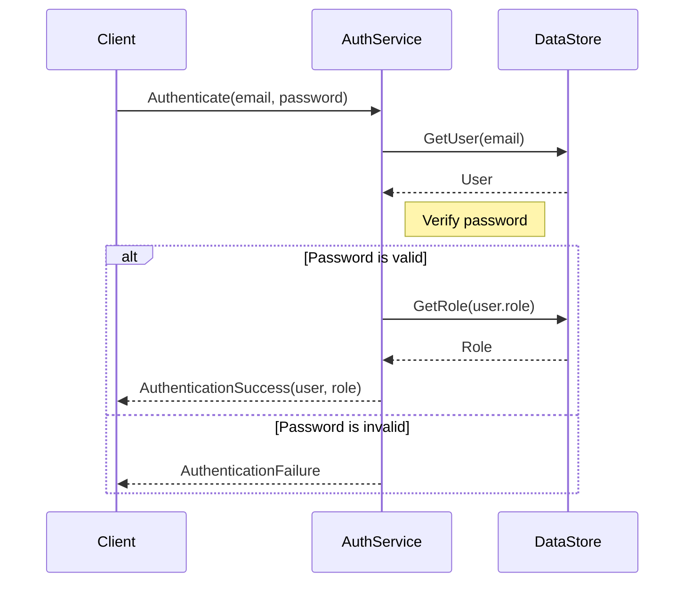

<details>
<summary>Relevant source files</summary>

The following files were used as context for generating this wiki page:

- [src/db.js](https://github.com/aanickode/access-control-service/blob/main/src/db.js)
- [src/models.js](https://github.com/aanickode/access-control-service/blob/main/src/models.js)
</details>

# Data Storage and Access

## Introduction

This section covers the data storage and access mechanisms within the project. It provides an overview of how user data and role-based access control (RBAC) information is stored and accessed. The project appears to use an in-memory data store for simplicity, but the architecture could potentially be extended to integrate with a persistent database in the future.

Sources: [src/db.js](), [src/models.js]()

## Data Models

The project defines two main data models: `User` and `Role`. These models are defined as JavaScript objects with specific properties.

### User Model

The `User` model represents a user in the system and has the following properties:

```javascript
export const User = {
  email: 'string',
  role: 'string'
};
```

- `email` (string): Represents the user's email address, which serves as a unique identifier.
- `role` (string): Represents the name of the role assigned to the user, which determines their access permissions.

Sources: [src/models.js:1-4]()

### Role Model

The `Role` model represents a role in the system and has the following properties:

```javascript
export const Role = {
  name: 'string',
  permissions: ['string']
};
```

- `name` (string): Represents the name of the role.
- `permissions` (array of strings): An array of strings representing the permissions granted to users with this role.

Sources: [src/models.js:6-9]()

## Data Storage

The project uses an in-memory data store implemented as a JavaScript object called `db`. The `db` object has two properties: `users` and `roles`.

```javascript
const db = {
  users: {
    'admin@internal.company': 'admin',
    'analyst@internal.company': 'analyst',
  },
  roles: roles
};
```

- `users`: An object that maps user email addresses to their respective role names.
- `roles`: An object containing the role definitions, which is imported from a JSON configuration file (`roles.json`).

Sources: [src/db.js:1-9]()

The `roles.json` file is not provided in the given source files, but it is assumed to contain the actual role definitions with their associated permissions.

## Data Access

The project does not provide any specific functions or APIs for accessing the data store directly. However, it is likely that other parts of the codebase (not included in the provided files) would interact with the `db` object to perform operations such as:

- Authenticating users based on their email and role.
- Retrieving a user's role and associated permissions.
- Checking if a user has specific permissions based on their assigned role.
- Potentially modifying or updating the user and role data (although not evident from the provided files).

Without additional context or source files, it is difficult to provide more detailed information about the data access mechanisms or APIs.

## Sequence Diagram: User Authentication Flow (Hypothetical)



This sequence diagram illustrates a hypothetical user authentication flow, assuming the existence of an `AuthService` that interacts with the `DataStore` (the `db` object) to authenticate users based on their email and password.

1. The client initiates the authentication process by calling `Authenticate(email, password)` on the `AuthService`.
2. The `AuthService` retrieves the user data from the `DataStore` using the provided email.
3. The `DataStore` responds with the `User` object.
4. The `AuthService` verifies the provided password (implementation not shown).
5. If the password is valid, the `AuthService` retrieves the user's role from the `DataStore`.
6. The `DataStore` responds with the `Role` object.
7. The `AuthService` sends an `AuthenticationSuccess` response to the client, including the user and role data.
8. If the password is invalid, the `AuthService` sends an `AuthenticationFailure` response to the client.

Note that this is a hypothetical scenario based on the limited information provided in the source files. The actual implementation may differ.

Sources: [src/db.js](), [src/models.js]()

## Limitations and Future Improvements

Based on the provided source files, the following limitations and potential improvements can be identified:

- **In-Memory Data Store**: The current implementation uses an in-memory data store, which means that all data is lost when the application restarts. To persist data across application restarts, the project should integrate with a persistent database solution (e.g., SQL, NoSQL, or a dedicated RBAC service).

- **Hardcoded User Data**: The user data is currently hardcoded in the `db.js` file. A more robust solution would be to separate user management from the data store and provide APIs or interfaces for creating, updating, and deleting users.

- **Limited Role Management**: The role definitions are imported from a JSON file (`roles.json`), but there is no evident mechanism for managing or modifying roles dynamically. A more comprehensive RBAC system would include APIs or interfaces for creating, updating, and deleting roles, as well as assigning and revoking permissions.

- **Lack of Authentication and Authorization Mechanisms**: The provided source files do not include any implementation details for user authentication (e.g., password hashing, token generation) or authorization (e.g., checking permissions before allowing access to resources). These crucial components would need to be implemented to have a complete and secure access control system.

- **Lack of Documentation and Testing**: While the source files provide a basic structure for data storage and access, they lack comprehensive documentation, comments, and test cases. Proper documentation and testing are essential for maintaining and evolving the codebase.

Sources: [src/db.js](), [src/models.js]()

## Summary

This wiki page covered the data storage and access mechanisms within the project, focusing on the `User` and `Role` models, the in-memory data store (`db`), and the hypothetical flow of user authentication. While the provided source files offer a basic foundation, several limitations and potential improvements were identified, such as integrating with a persistent database, enhancing user and role management, implementing authentication and authorization mechanisms, and improving documentation and testing.