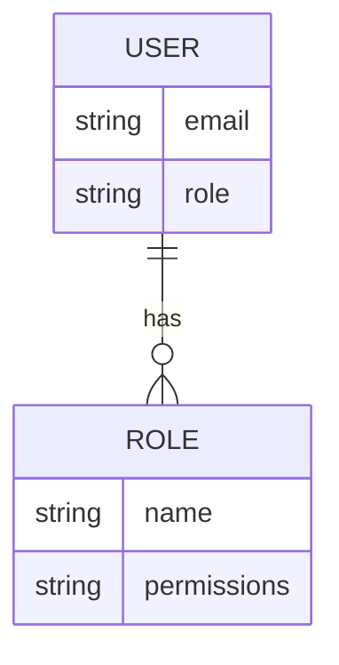
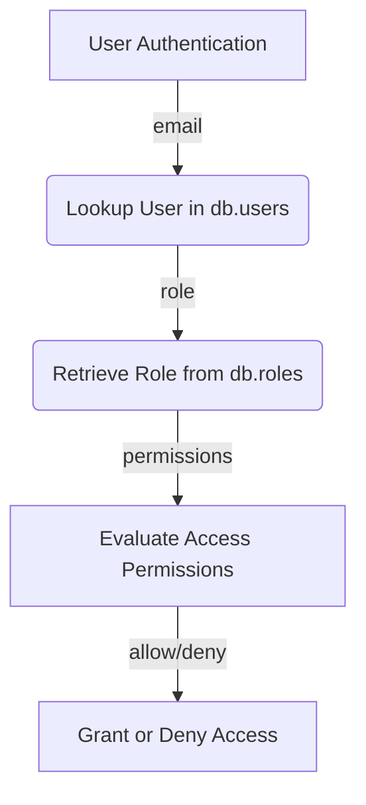

<details>
<summary>Relevant source files</summary>

The following files were used as context for generating this wiki page:

- [src/db.js](https://github.com/aanickode/access-control-service/blob/main/src/db.js)
- [src/models.js](https://github.com/aanickode/access-control-service/blob/main/src/models.js)
</details>

# Data Storage and Access

## Introduction

The "Data Storage and Access" component within this project serves as a centralized data management system, handling user authentication, role-based access control, and data modeling. It provides a simple in-memory data store and defines the core data structures for users, roles, and their associated permissions.

Sources: [src/db.js](), [src/models.js]()

## Data Models

The project defines two primary data models: `User` and `Role`. These models are structured as follows:

### User Model

```javascript
export const User = {
  email: 'string',
  role: 'string'
};
```

The `User` model represents an authenticated user within the system. It consists of two properties:

- `email` (string): The email address of the user, serving as a unique identifier.
- `role` (string): The name of the role assigned to the user, which determines their access permissions.

Sources: [src/models.js:1-4]()

### Role Model

```javascript
export const Role = {
  name: 'string',
  permissions: ['string']
};
```

The `Role` model defines the access permissions associated with a particular role. It has the following properties:

- `name` (string): The unique name of the role.
- `permissions` (array of strings): A list of permission strings granted to users with this role.

Sources: [src/models.js:6-9]()

## Data Storage

The project uses an in-memory data store to persist user and role information. The data store is represented by the `db` object, which is defined as follows:

```javascript
const db = {
  users: {
    'admin@internal.company': 'admin',
    'analyst@internal.company': 'analyst',
  },
  roles: roles
};
```

The `db` object contains two properties:

- `users`: An object that maps user email addresses to their respective role names.
- `roles`: An object containing the defined roles and their associated permissions. This object is imported from the `roles.json` configuration file.

Sources: [src/db.js:1-9]()

## Role Configuration

The roles and their corresponding permissions are defined in the `roles.json` configuration file, which is imported into the `db.js` file. This file likely contains a JSON object with role definitions, but its contents are not provided in the given source files.

Sources: [src/db.js:2]()



The above Entity-Relationship Diagram illustrates the relationships between the `User` and `Role` models. A user can have one role, and a role can be assigned to multiple users. The role defines the permissions granted to the associated users.

Sources: [src/models.js]()

## Access Control Flow

While the provided source files do not include implementation details for access control logic, we can infer a potential flow based on the data structures:



1. A user is authenticated, typically by providing their email address.
2. The user's email is looked up in the `db.users` object to retrieve their assigned role.
3. The role is then looked up in the `db.roles` object to retrieve the associated permissions.
4. The requested access is evaluated against the user's permissions.
5. Based on the evaluation, access is either granted or denied.

Sources: [src/db.js](), [src/models.js]()

## Conclusion

The "Data Storage and Access" component in this project provides a simple in-memory data store for managing user authentication, role-based access control, and data modeling. It defines the core data structures for users, roles, and their associated permissions, enabling the implementation of access control logic based on these models.

While the provided source files do not include the actual access control implementation, they lay the foundation for a role-based access control system by defining the necessary data structures and relationships.

Sources: [src/db.js](), [src/models.js]()