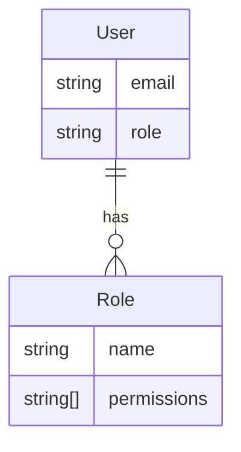
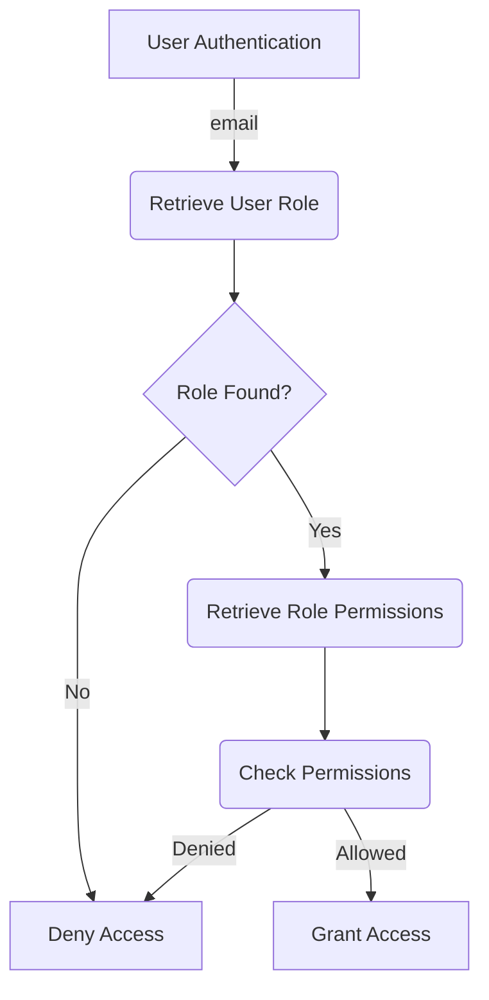

<details>
<summary>Relevant source files</summary>

The following files were used as context for generating this wiki page:

- [src/db.js](https://github.com/aanickode/access-control-service/blob/main/src/db.js)
- [src/models.js](https://github.com/aanickode/access-control-service/blob/main/src/models.js)
</details>

# Data Storage and Access

## Introduction

The "Data Storage and Access" component is responsible for managing user data and role-based access control within the project. It provides a centralized data store for user accounts, their associated roles, and the permissions granted to each role. This component serves as the foundation for implementing authentication and authorization mechanisms throughout the application.

## Data Models

### User Model

The `User` model represents a user account within the system. It consists of the following fields:

```javascript
export const User = {
  email: 'string',
  role: 'string'
};
```

- `email` (string): The unique email address associated with the user account.
- `role` (string): The role assigned to the user, which determines their access permissions.

Sources: [src/models.js:1-4]()

### Role Model

The `Role` model defines the permissions and access levels granted to different user roles within the application.

```javascript
export const Role = {
  name: 'string',
  permissions: ['string']
};
```

- `name` (string): The name or identifier of the role.
- `permissions` (array of strings): A list of permissions granted to users with this role.

Sources: [src/models.js:6-9]()

## Data Storage

The application uses an in-memory data store implemented as a JavaScript object called `db`. This data store holds user account information and role definitions.

```javascript
const db = {
  users: {
    'admin@internal.company': 'admin',
    'analyst@internal.company': 'analyst',
  },
  roles: roles
};
```

- `users` (object): An object that maps user email addresses to their respective role names.
- `roles` (object): An object containing role definitions, which are imported from a separate configuration file (`roles.json`).

Sources: [src/db.js:3-9]()

### Role Configuration

The `roles.json` file (not shown) is expected to define the available roles and their associated permissions. The structure of this file is not explicitly defined in the provided source files.

## Access Control Flow

The provided source files do not contain any implementation details regarding the access control flow or how the data models and data store are utilized within the application. However, based on the available information, it can be inferred that the "Data Storage and Access" component serves as a foundation for implementing role-based access control (RBAC) mechanisms.

The typical flow for RBAC would involve:

1. Authenticating a user based on their email address.
2. Retrieving the user's assigned role from the `users` object in the `db`.
3. Looking up the permissions associated with the user's role in the `roles` object.
4. Granting or denying access to specific application features or resources based on the user's role permissions.

However, the actual implementation details of this flow are not present in the provided source files.

## Mermaid Diagrams

### Data Model Relationships



This entity-relationship diagram illustrates the relationship between the `User` and `Role` models. A user has a single role, while a role can be assigned to multiple users. The role defines the set of permissions granted to its associated users.

Sources: [src/models.js]()

### Potential Access Control Flow



This flowchart represents a potential access control flow based on the available data models and data store. However, the actual implementation details are not provided in the source files.

1. User authentication is performed, likely based on the email address.
2. The user's role is retrieved from the `users` object in the data store.
3. If the user's role is not found, access is denied.
4. If the user's role is found, the associated permissions are retrieved from the `roles` object.
5. The user's permissions are checked against the requested resource or action.
6. If the user has the required permissions, access is granted; otherwise, access is denied.

Sources: [src/db.js](), [src/models.js]()

## Summary

The "Data Storage and Access" component provides a basic foundation for implementing role-based access control within the application. It defines data models for users and roles, as well as an in-memory data store to hold user accounts and role definitions. However, the provided source files do not include the actual implementation details for authentication, authorization, or access control mechanisms. The component serves as a starting point for building more comprehensive security and access management features within the project.