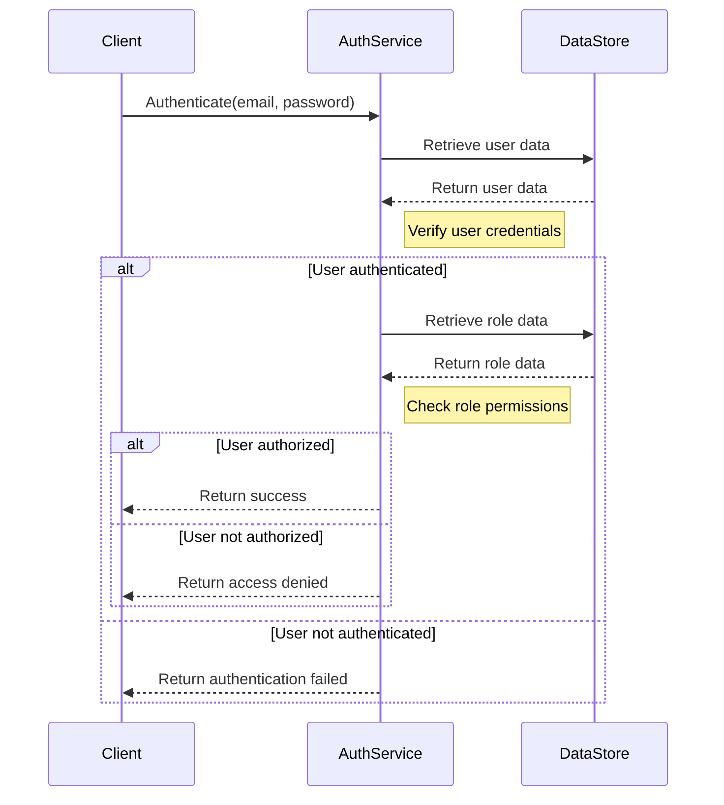

<details>
<summary>Relevant source files</summary>

The following files were used as context for generating this wiki page:

- [src/db.js](https://github.com/aanickode/access-control-service/blob/main/src/db.js)
- [src/models.js](https://github.com/aanickode/access-control-service/blob/main/src/models.js)
</details>

# Data Storage and Access

## Introduction

The "Data Storage and Access" component within this project serves as a centralized module for managing user data and role-based access control. It provides a simple in-memory data store for storing user information and role definitions, along with their associated permissions. This module is likely used by other parts of the application to authenticate users, authorize access based on roles, and enforce permissions.

Sources: [src/db.js](), [src/models.js]()

## Data Models

### User Model

The `User` model represents a user entity within the system. It consists of the following fields:

| Field | Type    | Description                    |
|-------|---------|--------------------------------|
| email | string  | The user's email address       |
| role  | string  | The name of the role assigned to the user |

Sources: [src/models.js:1-4]()

### Role Model

The `Role` model defines a role within the access control system. It has the following structure:

| Field       | Type     | Description                    |
|-------------|----------|--------------------------------|
| name        | string   | The name of the role           |
| permissions | string[] | An array of permission strings associated with the role |

Sources: [src/models.js:6-9]()

## Data Storage

The project uses an in-memory data store implemented in the `db.js` file. This data store contains two main properties:

1. `users`: An object that maps user email addresses to their respective roles.
2. `roles`: An object that defines the available roles and their associated permissions.

```javascript
const db = {
  users: {
    'admin@internal.company': 'admin',
    'analyst@internal.company': 'analyst',
  },
  roles: roles
};
```

The `roles` object is imported from a JSON configuration file (`roles.json`), which likely contains the actual role definitions.

Sources: [src/db.js:1-9]()

## Data Access

The `db` object serves as the central data access point for user and role information. Other parts of the application can import this object and interact with it to perform various operations, such as:

- Authenticating users by checking if their email exists in the `users` object.
- Retrieving a user's role by looking up their email in the `users` object.
- Fetching the permissions associated with a role by accessing the `roles` object.
- Potentially modifying or updating the data store, although no such functionality is present in the provided files.

Sources: [src/db.js]()

## Sequence Diagram: User Authentication and Authorization

The following sequence diagram illustrates a potential flow for authenticating a user and authorizing their access based on their role and permissions:



In this diagram, the `AuthService` interacts with the `DataStore` (represented by the `db` object) to retrieve user and role data for authentication and authorization purposes.

Sources: [src/db.js](), [src/models.js]()

## Limitations and Potential Improvements

Based on the provided source files, the following limitations and potential improvements can be identified:

- **In-Memory Data Store**: The current implementation uses an in-memory data store, which may not be suitable for larger applications or scenarios where data persistence is required. Integrating with a more robust database solution could be considered.

- **Static Data**: The user and role data appear to be static and hardcoded. Implementing mechanisms for dynamically managing users, roles, and permissions would enhance the system's flexibility and scalability.

- **Security Considerations**: The current implementation does not seem to include any security measures, such as password hashing or encryption. Proper security practices should be implemented to protect sensitive user data and prevent unauthorized access.

- **Lack of User Management**: There is no apparent functionality for creating, updating, or deleting user accounts or role assignments. Adding user management capabilities would be necessary for a production-ready access control system.

- **Lack of Role Management**: Similar to user management, there is no functionality for managing roles and their associated permissions. Implementing role management features would allow for more dynamic and flexible access control.

- **Separation of Concerns**: The `db.js` file currently combines user data, role data, and potentially other configuration data. Separating these concerns into distinct modules or services could improve code organization and maintainability.

Sources: [src/db.js](), [src/models.js]()

## Conclusion

The "Data Storage and Access" component in this project provides a simple in-memory data store for managing user data and role-based access control. While it serves as a basic foundation, several improvements and enhancements would be necessary to make it more robust, secure, and scalable for production environments. Integrating with a persistent database, implementing user and role management features, and separating concerns into distinct modules could be potential next steps in evolving this component.