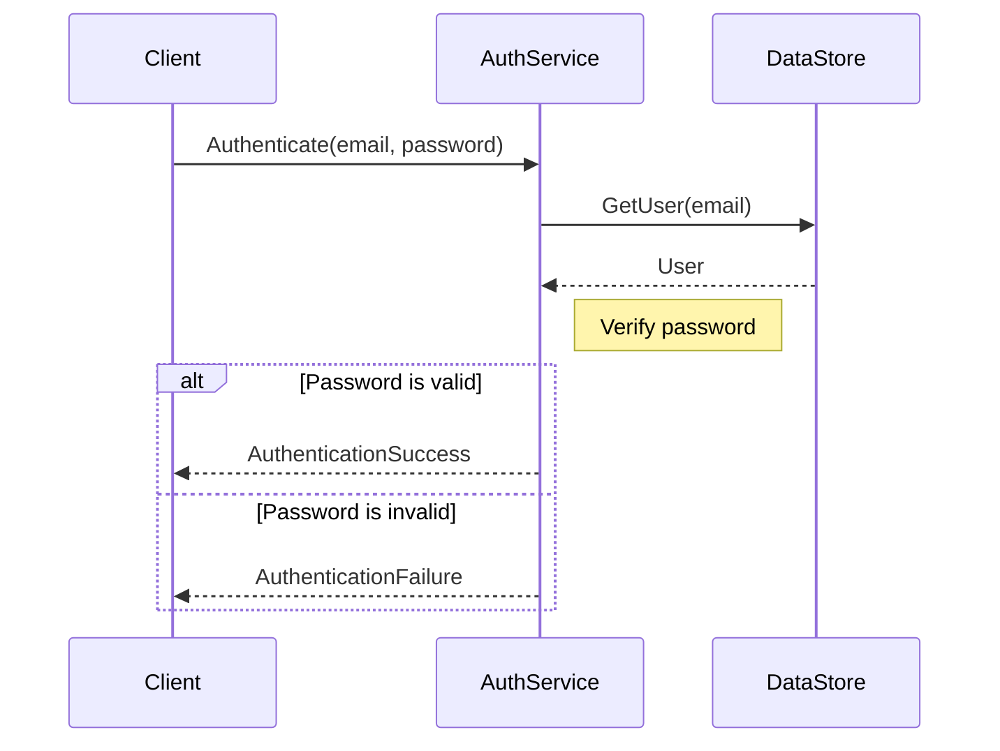
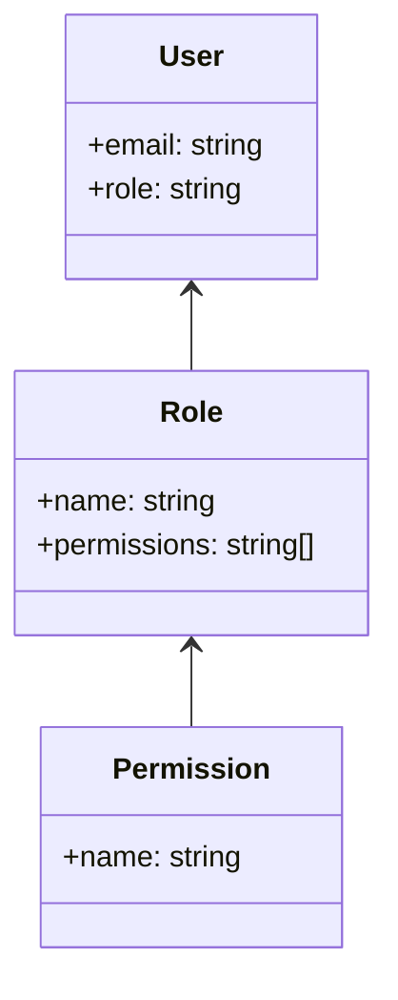

<details>
<summary>Relevant source files</summary>

The following files were used as context for generating this wiki page:

- [src/db.js](https://github.com/aanickode/access-control-service/blob/main/src/db.js)
- [src/models.js](https://github.com/aanickode/access-control-service/blob/main/src/models.js)
</details>

# Data Storage and Access

## Introduction

The "Data Storage and Access" component within this project is responsible for managing user data and role-based access control. It provides a centralized data store for user accounts and their associated roles, as well as the permissions granted to each role. This component serves as the foundation for implementing authentication and authorization mechanisms throughout the application.

Sources: [src/db.js](), [src/models.js]()

## Data Models

### User Model

The `User` model represents a user account within the system. It consists of the following fields:

| Field | Type    | Description                      |
|-------|---------|----------------------------------|
| email | string  | The user's email address (unique identifier) |
| role  | string  | The name of the role assigned to the user     |

Sources: [src/models.js:1-4]()

### Role Model

The `Role` model defines a set of permissions associated with a specific role. It has the following structure:

| Field       | Type     | Description                                |
|-------------|----------|------------------------------------------|
| name        | string   | The name of the role                     |
| permissions | string[] | An array of permission strings granted to the role |

Sources: [src/models.js:6-9]()

## Data Storage

The application uses an in-memory data store implemented as a JavaScript object called `db`. This data store contains two main properties:

1. `users`: An object that maps user email addresses (keys) to their respective roles (values).
2. `roles`: An object that maps role names (keys) to their associated permissions (values).

```js
const db = {
  users: {
    'admin@internal.company': 'admin',
    'analyst@internal.company': 'analyst',
  },
  roles: roles
};
```

The `roles` object is imported from a JSON configuration file (`roles.json`) located in the `config` directory.

Sources: [src/db.js:1-10]()

## Data Access

The `db` object serves as the central data store, providing access to user and role information. However, the provided source files do not include any specific functions or APIs for interacting with this data store. It is likely that additional modules or components are responsible for implementing data access and manipulation operations, such as user authentication, role assignment, and permission checking.

Sources: [src/db.js]()

## Sequence Diagram: User Authentication

While the provided source files do not contain implementation details for user authentication, a hypothetical sequence diagram illustrating the process could look like this:



In this diagram, the `AuthService` component would interact with the `DataStore` (the `db` object) to retrieve user information and validate the provided credentials.

Sources: [src/db.js](), [src/models.js]() (Hypothetical example based on the data models)

## Role-Based Access Control (RBAC)

The project appears to be implementing a Role-Based Access Control (RBAC) system, where permissions are granted to roles, and users are assigned specific roles. This approach allows for flexible and centralized management of access privileges within the application.



In this RBAC model, users are associated with a specific role, and each role has a set of permissions defined. By assigning roles to users, the application can determine the appropriate access levels and permissions for each user based on their role.

Sources: [src/models.js](), [src/db.js]() (Inferred from the data structure)

## Potential Improvements

While the provided source files establish a basic data storage and access mechanism, there are several potential improvements that could be considered:

1. **Persistent Storage**: Currently, the data store is implemented as an in-memory object, which means that all data will be lost when the application is restarted. Integrating a persistent storage solution, such as a database or file-based storage, would ensure data durability and enable more robust data management capabilities.

2. **Data Access Layer**: Introducing a dedicated data access layer or module could improve code organization, maintainability, and testability. This layer could encapsulate all operations related to data retrieval, manipulation, and persistence, separating concerns from other application components.

3. **Authentication and Authorization Mechanisms**: The source files do not include implementation details for user authentication and authorization based on roles and permissions. Developing these mechanisms would be crucial for a complete access control system.

4. **User Management**: Implementing user management functionality, such as creating, updating, and deleting user accounts, as well as assigning and modifying roles, would enhance the overall user and access control capabilities of the application.

5. **Role Management**: Providing mechanisms for managing roles, including creating, updating, and deleting roles, as well as modifying their associated permissions, would allow for more flexible and dynamic access control configurations.

6. **Auditing and Logging**: Incorporating auditing and logging mechanisms could improve security, compliance, and troubleshooting capabilities by tracking user activities, authentication events, and access control decisions.

7. **Security Enhancements**: Implementing additional security measures, such as password hashing, session management, and input validation, would strengthen the overall security posture of the application and its access control mechanisms.

Sources: [src/db.js](), [src/models.js]() (Potential improvements based on the provided code and common software development practices)

## Conclusion

The "Data Storage and Access" component in this project provides a foundation for managing user accounts, roles, and permissions within an access control system. While the current implementation is relatively basic, it establishes the necessary data models and structures for role-based access control. However, to build a more robust and production-ready access control system, additional features and enhancements, such as persistent storage, dedicated data access layers, authentication and authorization mechanisms, user and role management, auditing, and security enhancements, would need to be implemented.