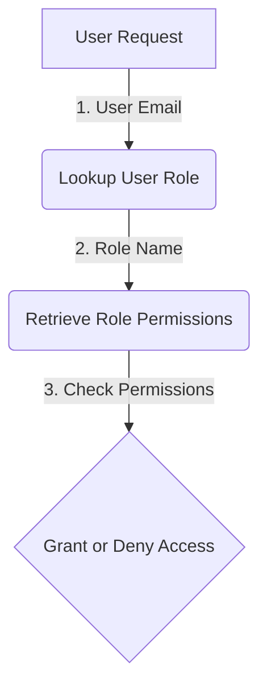

<details>
<summary>Relevant source files</summary>

The following files were used as context for generating this wiki page:

- [src/db.js](https://github.com/aanickode/access-control-service/blob/main/src/db.js)
- [src/models.js](https://github.com/aanickode/access-control-service/blob/main/src/models.js)
</details>

# Data Storage and Access

## Introduction

The "Data Storage and Access" component within this project is responsible for managing user data and role-based access control. It defines the data models for users and roles, and provides a simple in-memory data store for storing and retrieving this information.

Sources: [src/db.js](), [src/models.js]()

## Data Models

### User Model

The `User` model represents a user entity within the system. It has the following properties:

```javascript
export const User = {
  email: 'string',
  role: 'string'
};
```

- `email` (string): The email address of the user, which serves as a unique identifier.
- `role` (string): The name of the role assigned to the user, which determines their access permissions.

Sources: [src/models.js:1-4]()

### Role Model

The `Role` model defines the access permissions associated with a particular role. It has the following properties:

```javascript
export const Role = {
  name: 'string',
  permissions: ['string']
};
```

- `name` (string): The name of the role, which is used to associate users with a specific set of permissions.
- `permissions` (array of strings): A list of permission strings that define the access rights granted to users with this role.

Sources: [src/models.js:6-9]()

## Data Storage

The project uses a simple in-memory data store implemented in the `db.js` file. The data store consists of two main objects:

1. `users`: An object that maps user email addresses to their respective roles.
2. `roles`: An object that maps role names to their corresponding permissions.

```javascript
const db = {
  users: {
    'admin@internal.company': 'admin',
    'analyst@internal.company': 'analyst',
  },
  roles: roles
};
```

The `roles` object is imported from a JSON configuration file (`roles.json`), which likely defines the available roles and their associated permissions.

Sources: [src/db.js:1-9]()

## Access Control Flow

The access control flow within the project likely follows these steps:

1. A user attempts to perform an action or access a resource.
2. The user's email address is used to look up their assigned role in the `users` object.
3. The role name is then used to retrieve the corresponding permissions from the `roles` object.
4. The requested action or resource is granted or denied based on whether the user's role has the necessary permissions.



Sources: [src/db.js](), [src/models.js]()

## Potential Improvements

While the current implementation provides a basic access control mechanism, it has several limitations:

- **In-memory storage**: The data store is in-memory, which means that data is lost when the application restarts. A persistent storage solution, such as a database, would be more suitable for production environments.
- **Static data**: The user and role data is static and hardcoded in the source code. A more flexible approach would be to allow dynamic management of users and roles through an administrative interface or API.
- **Limited role hierarchy**: The current implementation does not support role hierarchies or inheritance, where roles can inherit permissions from other roles. This feature could be useful for more complex access control scenarios.
- **Lack of authentication**: The current implementation does not include any authentication mechanisms. In a real-world application, user authentication (e.g., via passwords, tokens, or other methods) would be necessary to ensure secure access control.

Sources: [src/db.js](), [src/models.js]()

## Conclusion

The "Data Storage and Access" component in this project provides a basic foundation for user and role-based access control. It defines data models for users and roles, and implements a simple in-memory data store for storing and retrieving this information. While functional, the current implementation has limitations in terms of persistence, flexibility, and security, which would need to be addressed for production use cases.