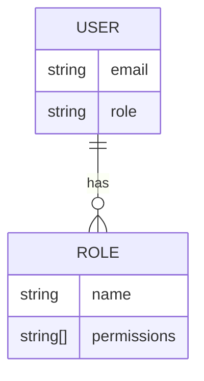
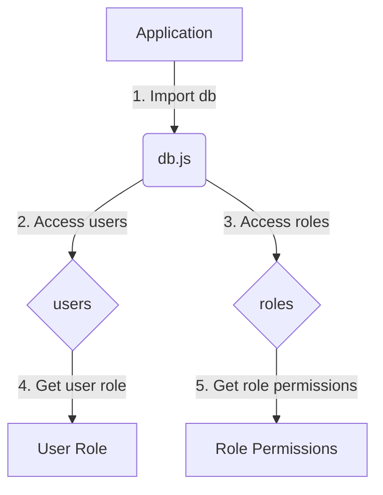

<details>
<summary>Relevant source files</summary>

The following files were used as context for generating this wiki page:

- [src/db.js](https://github.com/aanickode/access-control-service/blob/main/src/db.js)
- [src/models.js](https://github.com/aanickode/access-control-service/blob/main/src/models.js)
</details>

# Data Storage and Access

## Introduction

The "Data Storage and Access" component within this project is responsible for managing user data and role-based access control. It provides a simple in-memory data store for storing user information and role definitions, as well as mechanisms for retrieving and validating user roles and permissions.

Sources: [src/db.js](), [src/models.js]()

## Data Models

The project defines two main data models: `User` and `Role`.

### User Model

The `User` model represents a user in the system and has the following fields:

| Field | Type    | Description                  |
|-------|---------|------------------------------|
| email | string  | The user's email address     |
| role  | string  | The name of the user's role  |

Sources: [src/models.js:1-4]()

### Role Model

The `Role` model defines a role within the system and its associated permissions:

| Field       | Type     | Description                                 |
|-------------|----------|---------------------------------------------|
| name        | string   | The name of the role                        |
| permissions | string[] | An array of permission strings for the role |

Sources: [src/models.js:6-9]()

## Data Storage

The project uses an in-memory data store implemented in the `db.js` file. This data store contains two main objects:

1. `users`: An object that maps user email addresses to their respective roles.
2. `roles`: An object that maps role names to their corresponding `Role` objects.

```js
const db = {
  users: {
    'admin@internal.company': 'admin',
    'analyst@internal.company': 'analyst',
  },
  roles: roles
};
```

The `roles` object is imported from a JSON configuration file (`roles.json`).

Sources: [src/db.js:1-10]()

## Data Access

The project does not provide any explicit data access functions or APIs. However, the `db` object can be imported and accessed directly to retrieve user and role information.

For example, to get the role of a user with the email `'admin@internal.company'`, you can access `db.users['admin@internal.company']`.

To get the permissions associated with a role named `'admin'`, you can access `db.roles['admin'].permissions`.

Sources: [src/db.js]()

## Mermaid Diagrams

### Data Model Relationships



This diagram shows the relationship between the `User` and `Role` models. A `User` has a single `role`, while a `Role` can be associated with multiple `User` instances. The `Role` model also contains an array of `permissions` strings.

Sources: [src/models.js]()

### Data Access Flow



This flow diagram illustrates the data access pattern within the project:

1. The application imports the `db` object from `db.js`.
2. The `users` object is accessed to retrieve user information.
3. The `roles` object is accessed to retrieve role definitions.
4. A user's role can be obtained by accessing the `users` object with their email address.
5. The permissions associated with a role can be obtained by accessing the `roles` object with the role name.

Sources: [src/db.js]()

## Conclusion

The "Data Storage and Access" component in this project provides a simple in-memory data store for managing user and role information. It defines data models for `User` and `Role` entities, and allows direct access to the data store through the `db` object. While basic, this component serves as a foundation for implementing role-based access control and user management within the application.