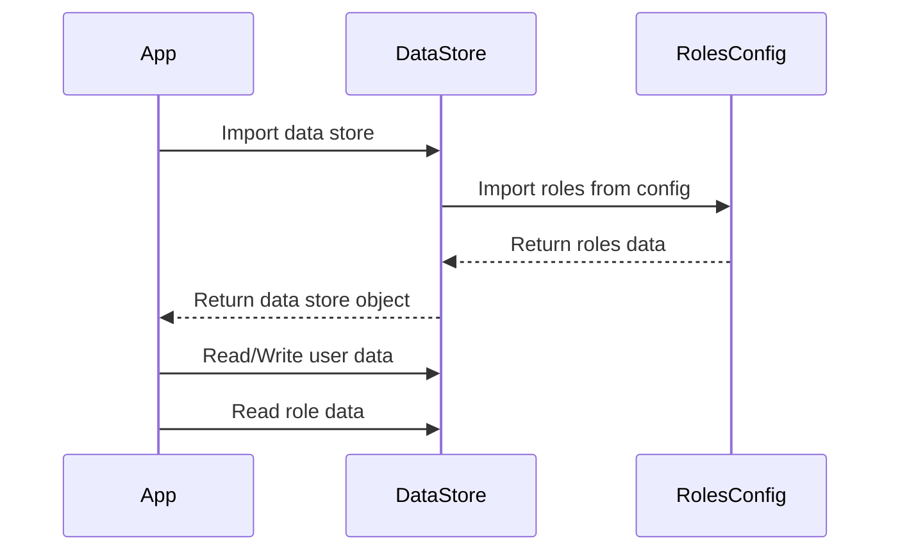

<details>
<summary>Relevant source files</summary>

The following files were used as context for generating this wiki page:

- [src/db.js](https://github.com/aanickode/access-control-service/blob/main/src/db.js)
- [src/models.js](https://github.com/aanickode/access-control-service/blob/main/src/models.js)
</details>

# Data Storage and Access

## Introduction

The "Data Storage and Access" component within this project is responsible for managing user data and role-based access control. It provides a simple in-memory data store for storing user information and role definitions, as well as a set of models defining the structure of user and role data.

This component serves as the foundation for implementing user authentication and authorization mechanisms within the application, ensuring that users have the appropriate permissions to access and perform various actions based on their assigned roles.

Sources: [src/db.js](), [src/models.js]()

## Data Models

### User Model

The `User` model defines the structure of user data within the application. It consists of the following fields:

| Field | Type    | Description                   |
|-------|---------|-------------------------------|
| email | string  | The user's email address      |
| role  | string  | The name of the user's role   |

Sources: [src/models.js:1-4]()

### Role Model

The `Role` model defines the structure of role data within the application. It consists of the following fields:

| Field       | Type     | Description                                |
|-------------|----------|-------------------------------------------|
| name        | string   | The name of the role                      |
| permissions | string[] | An array of permission strings for the role |

Sources: [src/models.js:6-9]()

## Data Storage

The application uses an in-memory data store implemented in the `db.js` file to store user and role data. This data store is a simple JavaScript object with two properties:

1. `users`: An object that maps user email addresses to their respective roles.
2. `roles`: An object that maps role names to their corresponding permissions.

```javascript
const db = {
  users: {
    'admin@internal.company': 'admin',
    'analyst@internal.company': 'analyst',
  },
  roles: roles
};
```

The `roles` object is imported from a JSON configuration file (`roles.json`), allowing for easy management and modification of role definitions.

Sources: [src/db.js:1-10]()

## Data Flow

The data flow within the "Data Storage and Access" component can be represented by the following sequence diagram:



1. The application imports the `db` object from the `DataStore` module (`src/db.js`).
2. The `DataStore` module imports the `roles` object from the `RolesConfig` module (`config/roles.json`).
3. The `RolesConfig` module returns the role definitions to the `DataStore` module.
4. The `DataStore` module combines the user data and role data into a single object and returns it to the application.
5. The application can then read and write user data, as well as read role data from the `DataStore` module.

Sources: [src/db.js](), [src/models.js]()

## Limitations and Considerations

- The current implementation uses an in-memory data store, which means that data will be lost when the application is restarted or the server is restarted. For production use, a persistent data store (e.g., a database) should be used.
- The user data and role definitions are hard-coded in the `db.js` file and the `roles.json` configuration file, respectively. In a real-world application, these data sources should be managed separately and potentially integrated with external authentication and authorization systems.
- The current implementation does not include any mechanisms for data validation, security, or access control. These features would need to be implemented separately to ensure the integrity and security of the user and role data.

Sources: [src/db.js](), [src/models.js]()

## Conclusion

The "Data Storage and Access" component provides a simple in-memory data store and data models for managing user and role data within the application. While the current implementation is suitable for demonstration or testing purposes, it would need to be extended and integrated with more robust and secure data storage and access control mechanisms for production use.