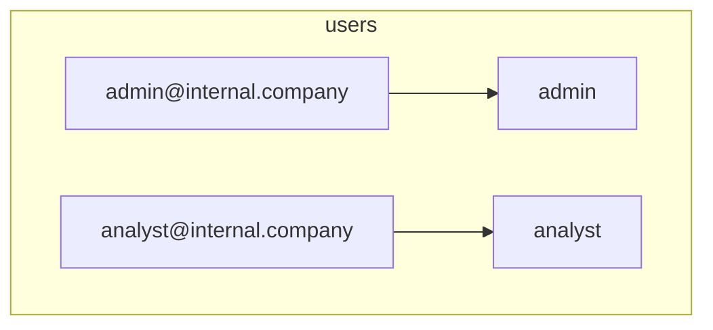

<details>
<summary>Relevant source files</summary>

The following files were used as context for generating this wiki page:

- [src/db.js](https://github.com/aanickode/access-control-service/blob/main/src/db.js)
- [src/models.js](https://github.com/aanickode/access-control-service/blob/main/src/models.js)
</details>

# Data Storage and Access

## Introduction

The "Data Storage and Access" component within this project is responsible for managing user data and role-based access control. It provides a centralized data store for user accounts and their associated roles, as well as the permissions granted to each role. This component serves as the foundation for implementing authentication and authorization mechanisms throughout the application.

## Data Models

### User Model

The `User` model represents a user account within the system. It consists of the following fields:

```javascript
export const User = {
  email: 'string',
  role: 'string'
};
```

- `email` (string): The unique email address associated with the user account.
- `role` (string): The name of the role assigned to the user, which determines their access permissions.

Sources: [src/models.js:1-4]()

### Role Model

The `Role` model defines the permissions and access levels granted to a particular role within the system:

```javascript
export const Role = {
  name: 'string',
  permissions: ['string']
};
```

- `name` (string): The unique name of the role.
- `permissions` (array of strings): A list of permissions granted to users with this role.

Sources: [src/models.js:6-9]()

## Data Storage

The project uses an in-memory data store implemented as a JavaScript object called `db`. This data store contains two main properties:

1. `users`: An object that maps user email addresses to their respective roles.
2. `roles`: An object that maps role names to their associated permissions.

```javascript
const db = {
  users: {
    'admin@internal.company': 'admin',
    'analyst@internal.company': 'analyst',
  },
  roles: roles
};
```

The `roles` object is imported from a JSON configuration file (`roles.json`) located in the `config` directory.

Sources: [src/db.js:1-10]()

### User Data

The `users` object in the `db` data store contains key-value pairs, where the keys are user email addresses, and the values are the corresponding role names.



Sources: [src/db.js:4-7]()

### Role Data

The `roles` object in the `db` data store is imported from a JSON configuration file (`roles.json`). Each role is represented as a key-value pair, where the key is the role name, and the value is an array of permissions granted to that role.

```mermaid
graph TD
    subgraph roles
        admin_role["admin"] --> admin_permissions["read", "write", "delete"]
        analyst_role["analyst"] --> analyst_permissions["read"]
    end
```

Sources: [src/db.js:8]()

## Data Access

The `db` object serves as the central data store for user accounts and role-based access control. To access or modify user and role data, you would need to interact with the `db` object directly. However, the provided source files do not include any specific functions or APIs for data access or manipulation.

It's important to note that the current implementation uses an in-memory data store, which means that any changes made to the `db` object will be lost when the application is restarted or the process terminates. In a production environment, it is recommended to use a persistent data storage solution, such as a database management system (DBMS) or a file-based storage system.

## Conclusion

The "Data Storage and Access" component in this project provides a simple in-memory data store for managing user accounts and role-based access control. It defines data models for users and roles, and stores user data and role permissions in JavaScript objects. While this implementation is suitable for small-scale or prototyping purposes, a more robust and persistent data storage solution should be considered for production environments.