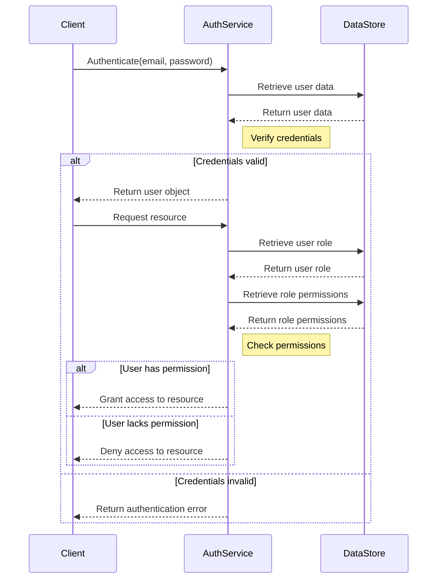

<details>
<summary>Relevant source files</summary>

The following files were used as context for generating this wiki page:

- [src/db.js](https://github.com/aanickode/access-control-service/blob/main/src/db.js)
- [src/models.js](https://github.com/aanickode/access-control-service/blob/main/src/models.js)
</details>

# Data Storage and Access

## Introduction

The "Data Storage and Access" component within this project is responsible for managing user data and role-based access control. It provides a centralized data store for user accounts, their associated roles, and the permissions granted to each role. This component serves as the foundation for implementing authentication and authorization mechanisms throughout the application.

## Data Models

### User Model

The `User` model represents a user account within the system. It consists of the following fields:

```javascript
export const User = {
  email: 'string',
  role: 'string'
};
```

- `email` (string): The unique email address associated with the user account.
- `role` (string): The role assigned to the user, which determines their access permissions.

Sources: [src/models.js:1-4]()

### Role Model

The `Role` model defines the permissions and access levels granted to a specific role within the application.

```javascript
export const Role = {
  name: 'string',
  permissions: ['string']
};
```

- `name` (string): The name or identifier of the role.
- `permissions` (array of strings): A list of permissions granted to users with this role.

Sources: [src/models.js:6-9]()

## Data Storage

The application uses an in-memory data store to persist user accounts and role definitions. The `db` object in `src/db.js` serves as the central data store.

```javascript
const db = {
  users: {
    'admin@internal.company': 'admin',
    'analyst@internal.company': 'analyst',
  },
  roles: roles
};
```

- `users` (object): An object that maps user email addresses to their respective roles.
- `roles` (object): An object containing the role definitions, imported from `config/roles.json`.

Sources: [src/db.js:3-10]()

### Role Definitions

The `roles.json` file, located in the `config` directory, defines the available roles and their associated permissions. The structure of this file is not provided in the given source files.

## Access Control

Based on the provided source files, it appears that the application implements a role-based access control (RBAC) system. Users are assigned specific roles, and each role is granted a set of permissions that determine the user's access levels and capabilities within the application.

To implement access control, the application likely retrieves the user's role from the `db.users` object based on their email address. It then looks up the permissions associated with that role in the `db.roles` object. The application can then use these permissions to grant or deny access to various features, resources, or functionalities.

However, the provided source files do not include the actual implementation details for enforcing access control or handling authentication and authorization within the application.

## Sequence Diagram: User Authentication and Authorization



This sequence diagram illustrates a hypothetical flow for user authentication and authorization based on the provided data models and data store. The actual implementation details are not available in the given source files.

Sources: [src/models.js](), [src/db.js]()

## Potential Improvements and Considerations

While the provided source files give a basic understanding of the data storage and access component, there are several potential improvements and considerations that could be made:

1. **Persistent Storage**: The current implementation uses an in-memory data store, which means that all user and role data will be lost when the application restarts. Integrating a persistent storage solution, such as a database or file-based storage, would ensure data durability and enable scalability.

2. **Data Validation and Sanitization**: The source files do not include any data validation or sanitization mechanisms. Implementing input validation and sanitization would enhance security and prevent potential vulnerabilities, such as SQL injection or cross-site scripting (XSS) attacks.

3. **Password Hashing and Security**: The user data store currently stores passwords in plain text, which is a security risk. Implementing proper password hashing and salting techniques would significantly improve the security of user credentials.

4. **Role Hierarchy and Inheritance**: The current role model does not support role hierarchies or inheritance. Introducing a more sophisticated role management system could allow for better organization and inheritance of permissions across roles.

5. **Access Control Implementation**: The provided source files do not include the actual implementation details for enforcing access control or handling authentication and authorization within the application. Adding these components would be necessary for a complete access control system.

6. **Documentation and Comments**: While the source files provide a basic structure, adding more detailed documentation and comments would improve code readability and maintainability.

These potential improvements and considerations are based solely on the information available in the provided source files and could enhance the overall functionality, security, and scalability of the "Data Storage and Access" component.