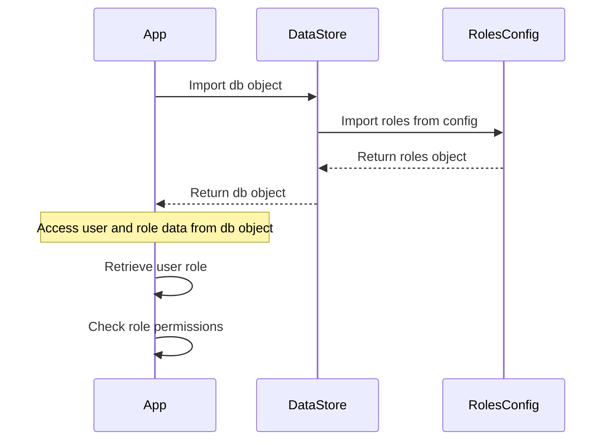

<details>
<summary>Relevant source files</summary>

The following files were used as context for generating this wiki page:

- [src/db.js](https://github.com/aanickode/access-control-service/blob/main/src/db.js)
- [src/models.js](https://github.com/aanickode/access-control-service/blob/main/src/models.js)
</details>

# Data Storage and Access

## Introduction

The "Data Storage and Access" component within this project is responsible for managing user data and role-based access control. It defines the data models for users and roles, and provides a simple in-memory data store for storing and retrieving this information.

Sources: [src/db.js](), [src/models.js]()

## Data Models

### User Model

The `User` model represents a user entity within the system. It has the following fields:

| Field | Type    | Description                  |
|-------|---------|------------------------------|
| email | string  | The user's email address     |
| role  | string  | The name of the user's role  |

Sources: [src/models.js:1-4]()

### Role Model

The `Role` model defines a role with associated permissions. It consists of the following fields:

| Field       | Type     | Description                                  |
|-------------|----------|----------------------------------------------|
| name        | string   | The name of the role                         |
| permissions | string[] | An array of permission strings for the role |

Sources: [src/models.js:6-9]()

## Data Storage

The project uses an in-memory data store implemented in the `db.js` file. This data store consists of two main objects:

1. `users`: An object that maps user email addresses to their respective roles.
2. `roles`: An object that maps role names to their corresponding `Role` objects, which include the associated permissions.

```javascript
const db = {
  users: {
    'admin@internal.company': 'admin',
    'analyst@internal.company': 'analyst',
  },
  roles: roles
};
```

The `roles` object is imported from a JSON configuration file (`roles.json`), which likely defines the available roles and their permissions.

Sources: [src/db.js:1-10]()

## Data Access

The `db.js` file exports the `db` object, which can be imported and used by other parts of the application to access and manipulate user and role data. However, the provided source files do not include any specific functions or APIs for interacting with the data store.

Sources: [src/db.js:11]()

## Sequence Diagram: Accessing User and Role Data



This sequence diagram illustrates a potential flow for accessing user and role data within the application:

1. The application imports the `db` object from the `DataStore` (`db.js`).
2. The `DataStore` imports the `roles` object from the `RolesConfig` (`roles.json`).
3. The `RolesConfig` returns the `roles` object to the `DataStore`.
4. The `DataStore` returns the `db` object, containing the `users` and `roles` data, to the application.
5. The application can then access user and role data from the `db` object, retrieve a user's role, and check the associated permissions for that role.

Sources: [src/db.js](), [src/models.js]()

## Limitations and Potential Improvements

Based on the provided source files, the current implementation has the following limitations:

- **In-memory Data Store**: The data store is an in-memory object, which means that data will be lost when the application restarts or the server is restarted. A persistent data storage solution, such as a database or file-based storage, would be more suitable for production environments.
- **Hardcoded User Data**: The user data is hardcoded in the `db.js` file, which makes it difficult to manage and update user information dynamically.
- **Lack of Data Access API**: There are no defined functions or APIs for interacting with the data store, such as creating, updating, or deleting users or roles. This functionality would need to be implemented separately.
- **Limited Role Configuration**: The role configuration is imported from a JSON file, which may not be the most flexible or scalable approach for managing roles and permissions in a larger application.

Potential improvements to the "Data Storage and Access" component could include:

- Implementing a persistent data storage solution, such as a relational database or a NoSQL database, to store user and role data.
- Developing a dedicated API or service layer for managing user and role data, with functions for creating, reading, updating, and deleting users and roles.
- Enhancing the role management system to support more complex role hierarchies, inheritance, and dynamic permission assignment.
- Introducing authentication and authorization mechanisms to secure access to user and role data.

Sources: [src/db.js](), [src/models.js]()

## Summary

The "Data Storage and Access" component in this project provides a simple in-memory data store for managing user and role data. It defines data models for users and roles, and stores this information in JavaScript objects. While this implementation may be suitable for small-scale or prototyping purposes, a more robust and persistent data storage solution, along with dedicated APIs for data access and management, would be necessary for production-ready applications.

Sources: [src/db.js](), [src/models.js]()